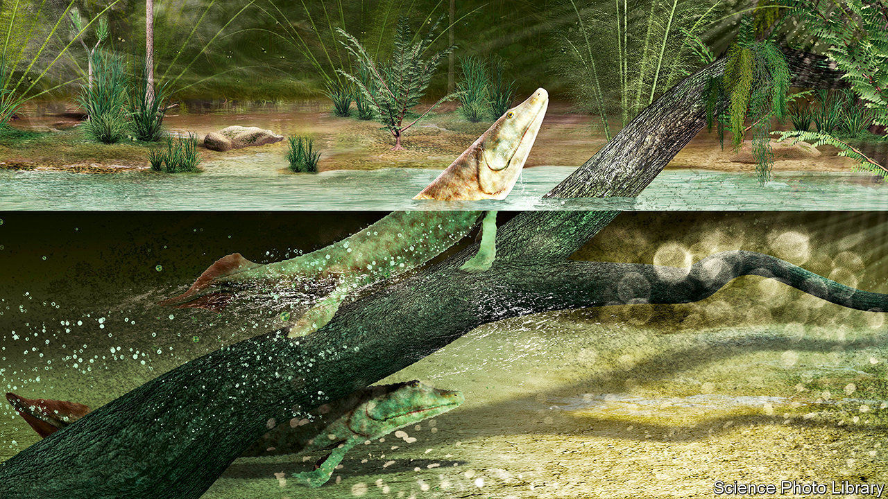
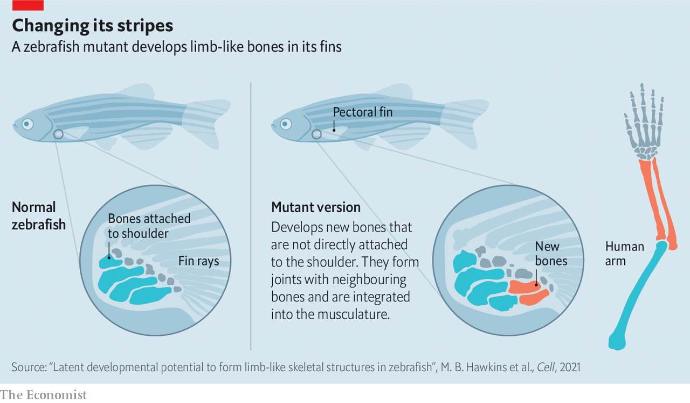

###### The origin of land animals

# A tiny genetic alteration may have let vertebrates leave the sea 

##### Getting a leg up 

 

> Feb 6th 2021 


ABOUT 370m years ago, in the latter part of the Devonian period, the ancestor of all land vertebrates stepped out of the ocean and began to take advantage of the untapped riches found ashore. This was a big step, both literally and metaphorically, and evolutionary biologists have long assumed that bringing about the anatomical shift from functional fin to proto-leg which enabled it to happen required a fortuitous coincidence of several genetic mutations. This, though, may not be the case. A paper just published in Cell, by Brent Hawkins, Katrin Henke and Matthew Harris of Harvard University, suggests the process was propelled by a single genetic change of the smallest sort possible.


The better to understand the origin of tetrapods, as land vertebrates are known collectively to zoologists, the trio were looking at what happened to zebrafish (a common subject of experiments in developmental biology because they are small, transparent and breed prolifically) when they made minor tweaks to those fishes’ genes. Searching through more than 10,000 mutated specimens they noticed that one group of mutants sported an unusual pattern of bones in their pectoral fins. Instead of having four, they had six.


Intriguingly, the additional pairs were some distance from the body, and the bones involved lay parallel with each other in the way that the radius and ulna do in the forelimb of a tetrapod (see diagram). Moreover, and yet more intriguingly, the two new bones integrated neatly with the fin’s muscles and articulated well with the rest of the local skeleton. Most intriguingly of all, however, was that this considerable anatomical shift was brought about by the substitution in a single type of protein molecule, called Wasl, of a single one of its amino-acid building blocks.

 


Wasl is a signalling protein. But it is not one which, as far as the team could tell by searching through the literature on embryonic development, had previously been associated by anyone with the process of limb formation in vertebrates. However, an experiment they then conducted on mice, which involved knocking out the gene that encodes Wasl, resulted in deformation of the pertinent bones in all four of the rodents’ limbs, not just the forelimbs. Clearly, then, this protein does indeed play a role in tetrapod limb formation.


The most recent common ancestor of zebrafish and mice predates even the Devonian. That gives lots of time for patterns of embryonic development to have changed in the lines leading to those two species—and, specifically, to have changed in the way that the fins of modern fish develop. So the fact that nowadays the mutation the team have discovered affects only the pectoral fin does not rule out the possibility of its having also stimulated, way back then, the arrival in the pelvic fin of the fishy progenitor of the mouse, of the bones now known as the fibula and tibia. It therefore looks quite possible that Drs Hawkins, Henke and Harris have found the source of the crucial change that enabled the ancestor of mice—and of human beings, too—to scramble ashore and leave the sea behind.

