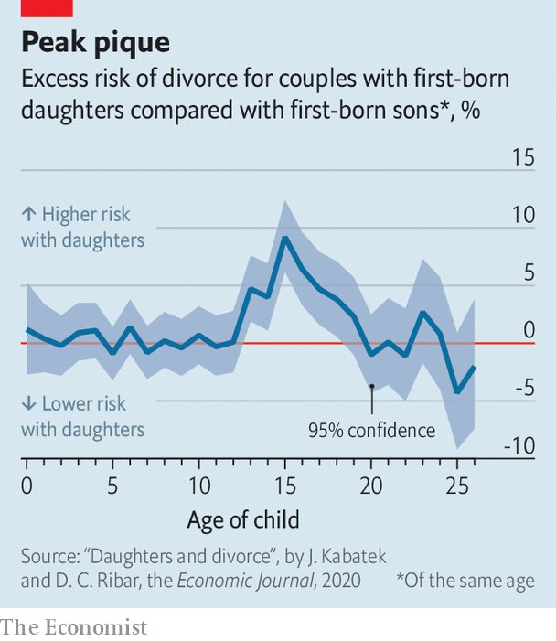

###### Daughters and divorce

# Daughters provoke parental strife 

##### But only when they are teenagers 

 

> Feb 6th 2021 


DAUGHTERS HAVE long been linked with divorce. Several studies conducted in America since the 1980s provide strong evidence that a couple’s first-born being a girl increases the likelihood of their subsequently splitting up. At the time, the researchers involved speculated that this was an expression of “son preference”, a phenomenon which, in its most extreme form, manifests itself as the selective abortion or infanticide of female offspring.


Work published in the Economic Journal, however, debunks that particular idea. In “Daughters and Divorce”, Jan Kabatek of the University of Melbourne and David Ribar of Georgia State University, in Atlanta, confirm that having a female first-born does indeed increase the risk of that child’s parents divorcing, in both America and the Netherlands. But, unlike previous work, their study also looked at the effect of the girl’s age. It found that “daughter-divorce” risk emerges only in a first-born girl’s teenage years (see chart). Before they reach the age of 12, daughters are no more linked to couples splitting up than sons are. “If fathers were really more likely to take off because they preferred sons, surely they wouldn’t wait 13 years to do so,” reasons Dr Kabatek. Instead, he argues, the fact that the risk is so age-specific requires a different explanation, namely that parents quarrel more over the upbringing of teenage daughters than of teenage sons.

 


Taken over the years, the daughter effect, though real, is small. In the Netherlands, by the time their first-born is 18, 20.12% of couples will have divorced if that child is a son, compared with 20.48% if she is a daughter—an increase in probability of 1.8%. But in the five years when the first-born is between the ages of 13 and 18, that increase goes up to 5%. And it peaks, at 9%, when the child is 15. In America, for which the data the researchers collected were sparser than those in the Netherlands, the numbers are roughly double this.


Anyone who has—or has been—a teenager knows how turbulent those years can be. Surveys confirm that teenage daughters and fathers, in particular, get on each other’s nerves. They also show that parents of teenage daughters argue more about parenting than do the parents of sons, and that mothers of teenage daughters report significantly more disagreements with their partners over money, and become more open to the idea of divorce. Earlier research has also shown that one of the most common things parents fight over is how much they should control their teenagers’ personal choices, such as how they dress, whom they date and where they work.


In light of all this, it is intriguing to note that Dr Kabatek and Dr Ribar found one type of couple who seem immune to the daughter effect: those in which the father grew up with a sister. Having seen things somewhat from a sister’s point of view may act as a sort of social inoculation. ■

