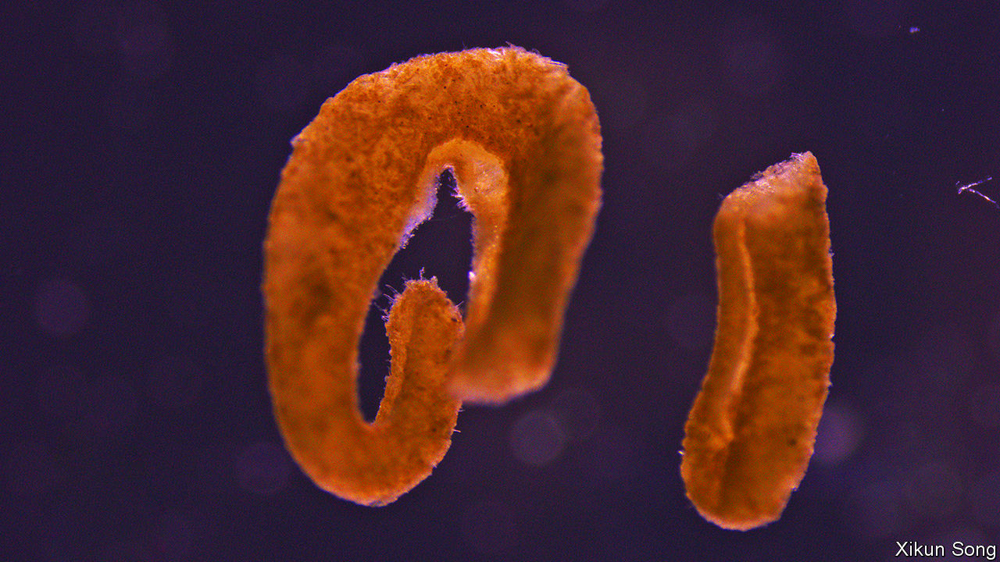

###### Marine ecology

# Deep-ocean plastic is a haven for life 

##### Surprising. But true 

 

> Feb 6th 2021 


THE OCEAN deep, where pressure is high, light absent and nutrients scarce, is often seen as a desert. But, as with other deserts, it has oases. Hydrothermal vents, methane-gas seeps and whale corpses are hot spots for marine wildlife. And observations reported in Environmental Science and Technology Letters by Song Xikun of Xiamen University, in Fujian, and Peng Xiaotong of the Chinese Academy of Sciences’ campus at Sanya, in Hainan, suggest these natural loci of biodiversity are now being joined by unnatural ones made of plastic.


Carried down slopes by submarine landslips, plastic objects accumulate in patches in the deep. Dr Song and Dr Peng had seen pictures showing sponges, corals and anemones on or near these accumulations. This led them to wonder about their ecology. So they went to have a look.


Their vehicle was Shen Hai Yong Shi, a deep-diving submarine that carries a six-person crew. This descended nine times into the Xisha trough, a feature at the bottom of the South China Sea, in search of plastic objects. Dr Peng himself was on board for three of these trips.


It was a risky business. Submerged junkyards of this sort often contain ropes and fishing nets that can entangle a submarine’s propellers. Paradoxically, that was why the researchers chose to visit in person, rather than sending a robot. People on board are able to steer and avoid these hazards more easily than a crew on a support ship who are relying on cameras to see what is happening.


To ensure their craft’s safety, the researchers collected objects only from the edge of each dump, and also collected some by dredging. In all, they obtained 33. Most were bags, bottles and food wrappers, but they picked up some derelict fishing ropes and traps as well.


As Dr Song and Dr Peng had hoped, these objects were teeming with life. When they examined their finds in a laboratory, they found nearly 1,200 individual organisms representing 49 species of crustaceans, corals, echinoderms, flatworms, molluscs (see picture), polychaete worms and fungi. They also discovered evidence that some of these species were breeding. There were egg capsules from four different types of snail, and a cocoon from a flatworm known for parasitising crustaceans.


This result suggests that accumulations of plastic are, indeed, benthic oases. Data from such depths are sparse. But 49 species is more than the 41 found in 2016 on a dead whale at the bottom of the Atlantic Ocean.


As to why organisms colonise the objects in these accumulations, the short answer is, “because they are there”. Most of the deep-ocean floor is covered with ooze, on which it is difficult to get a purchase except by burrowing. Solid objects suitable for settling on are at a premium. Whether it is a good or a bad thing that people are adding to the number of these objects, and thus to the richness of the benthic fauna, is a debatable point. What is not in doubt, though, is that even Earth’s remotest habitats cannot escape human influence. ■

