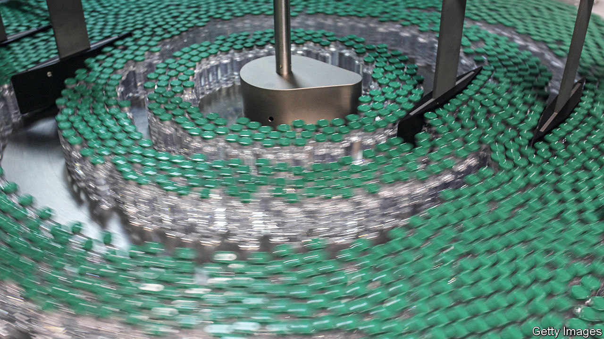

###### Vaccine manufacture

# How vaccines are made, and why it is hard 

##### Doing the do 

 

> Feb 6th 2021 


NINE VACCINES against covid-19 have already been approved in one jurisdiction or another, with many more in various stages of preparation. That this has happened within a year of the illness coming to the world’s attention is remarkable. But it is one thing to design and test vaccines. It is another to make them at sufficient scale to generate the billions of doses needed to vaccinate the world’s population, and to do so at such speed that the rate of inoculation can outpace the spread and possible mutation of the virus.


Broadly, there are two ways of making antiviral vaccines. One, tried and trusted, involves growing, in tanks called bioreactors, cell cultures that act as hosts for viruses which are then used in one way or another to make the vaccine in question. Cells grown this way can be of many types—insect, human kidney, monkey kidney, hamster ovary—as can the resulting vaccines. These may be weakened or killed versions of the virus to be protected against, or live viruses of a different and less-dangerous sort that carry a gene or two abstracted from the target virus, or even just isolated target-viral proteins. The point is that the vaccine should introduce into the body, or induce that body to make, something which the immune system can learn to recognise and attack if the real target virus should ever turn up.


In with the new


The alternative method, developed recently and employed to make the mRNA vaccines, such as those of Moderna and Pfizer, that the pandemic has stimulated the invention of, requires culturing cells only at the beginning of the process. mRNA is the substance that carries instructions about how to make a protein from a cell’s DNA to the molecular factories, known as ribosomes, which do the actual manufacturing. In the case of covid-19, the instructions in question generate spike, a protein found on the surfaces of particles of SARS-CoV-2, the virus that causes this illness. Suitably packaged and delivered, such mRNA can induce some of the body cells of the inoculee to turn out spike, which the immune system then learns to recognise. To make this type of vaccine you therefore have to generate lots of the relevant mRNA.


That process does indeed start with cells, though they are bacterial cells, rather than those of animals. But it does not end with them. The bacteria used, normally a well-understood species called E coli, have spliced into them a DNA version of the part of the SARS-CoV-2 genome which describes spike. (Confusingly, as is true of many viruses, SARS-CoV-2’s actual genes are made of RNA.) The bacteria are then allowed to multiply for a few days before being broken open, their DNA filtered out, and the DNA versions of the spike gene extracted as what is known as a DNA template.


Once purified, this template is mixed with a soup of pertinent enzymes and fed molecules called nucleotides, the chemical “letters” of which RNA is composed. Thus supplied, the enzymes use the templates to run off appropriate mRNAs by the zillion. These are extracted and packaged into tiny, fatty bubbles to form the vaccine.


Both the cell-culture and the mRNA approaches have benefits and drawbacks. The former has the advantage of being well established. Versions of it go back to vaccine-making’s origins. But keeping cultured animal cells alive and healthy is a tricky business. A whole subfield of bioengineering is dedicated to this task. Vaccine-makers who rely on live cultures constantly struggle with yields. Using this method to make a lot of vaccine, fast, is hard.


It was difficulties of this sort that Pascal Soriot, boss of AstraZeneca, cited on January 26th in defence of his firm’s failure to provide vaccine supplies which the European Union claimed it had been promised. AstraZeneca is an Anglo-Swedish company that, in collaboration with Oxford University, created one of the first vaccines to be approved. As Mr Soriot told La Repubblica, an Italian newspaper, “You have glitches, you have scale-up problems. The best site we have produces three times more vaccine out of a batch than the lowest-producing site.”

De-necking the bottles


Maximising a bioreactor’s yield is as much an art as a science. The underlying health of the cells involved matters. So do environmental conditions at the manufacturing site. That AstraZeneca has not been able to meet its own production targets shows how hard it is to predict when the right balance of biology will be found. The company says it can take six to nine months to start a production site up from scratch, and that even this timetable is possible only by working with experienced partners and at an accelerated pace. At the moment, AstraZeneca is working with 25 manufacturing organisations in 15 countries to make its vaccine.


Producing mRNA vaccines at scale has problems, too. The biggest is how to protect the mRNA molecules both from the environment they must travel through in order to reach the arm of their recipient, and from the recipient’s own body, which will attack them as they journey to the ribosomes which will transcribe them.


Protection from the environment is mainly a matter of having a strategically located set of refrigerators, known as a cold chain. Protection from the body, though, is where the fatty bubbles come in.


Production of these bubbles was a cottage industry before the pandemic. A small Austrian firm, Polymun Scientific, is one of just a handful that can make them. Their main previous use was in niche cancer treatments. Scaling up their production, which is happening right now, has never been done before and adds uncertainty to the continued supply of mRNA vaccine.


There are other bottlenecks, too. In particular, the factories in which vaccines are made must be built to a high standard, known as GMP, for “Good Manufacturing Practice”. There is currently a shortage of GMP facilities. Andrey Zarur, boss of GreenLight Biosciences, a firm in Boston that is developing an mRNA vaccine, says his company has employees whose entire job, at present, is to work the phones trying to find GMP facilities in which to make their vaccine. There is, though, nothing available. He is therefore looking to buy firms whose vaccine candidates have turned out not to work, simply in order to acquire the facilities in question.


Supplies of raw materials such as nucleotides are also tight. According to Dr Zarur, Thermo Fisher, an American chemical-supplies company, has spent $200m on a new facility in Lithuania to make these molecules, though the firm itself would not confirm this.


On top of all this, the transport and distribution of vaccines once they have been made presents yet further challenges, and concomitant potential for hold ups. Vaccines must be stored in special non-reactive glass vials. Some, such as the current version of Pfizer’s mRNA vaccine, must also be kept at extremely low temperatures, though that problem may go away soon. Drew Weissman, one of the inventors of mRNA-vaccine technology, says producers are now testing shots which are stable for three months when kept at 4°C.


Once supply chains for both cell-culture and mRNA vaccines have been scaled up, and bottlenecks unblocked, the manufacturing processes may face a different test—how quickly they can produce new vaccines to deal with new viral variants as these emerge. The continued efficacy of approved vaccines against such variants is not guaranteed, and it may be necessary to make others (see ).


Here, the mRNA approach may have an advantage. Its production systems will require a simple tweak—the dropping in at the start of a DNA template describing the new variant’s spike protein. Cell-culture systems, by contrast, will have to be rebuilt to some degree for every new variant they aim to vaccinate against.

Scale models


Producers, such as those in China, who use older-fashioned cell-culture techniques, will have to recalibrate their entire operations. Newer systems, like AstraZeneca’s, which use cells specially designed so as not to be influenced by the new version of the spike gene in the viruses they are carrying, should be able to get on track in the time it takes to start a culture from scratch—about a month. For mRNA systems, Drs Weissman and Zarur say it would take a couple of months to go from new variant to large-scale vaccine production. If variants resistant to the current crop of vaccines do evolve, then that speed and certainty in making new vaccines to combat them will be essential. ■


Dig deeper


All our stories relating to the pandemic and the vaccines can be found on our . You will also find trackers showing ,  and the virus’s spread across  and .

