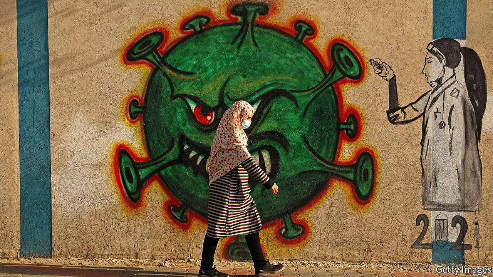

###### Viral variants and vaccination

# Will variants of SARS-CoV-2 make vaccination harder? 

##### They may do, but there are plans to deal with that 

 

> Feb 6th 2021 


VIRUSES EVOLVE through natural selection. Whenever they replicate, changes can creep into their genetic material. If advantageous, these will cause variants sporting them to prosper. One consequence is that such variants spread rapidly.


Predictably, then, new variants of SARS-CoV-2, the virus that causes covid-19, have started to appear around the world. Four are particularly worrying. One, detected first in Britain, in September, is believed to be 30-50% more transmissible than the original wild-type virus. A second, identified in South Africa a month later, has been linked to higher viral loads in throat and nasal swabs. That makes it easier for it to spread. Two others emerged in America (July) and Brazil (December). And this week a variant of the British variant has also been detected, now sporting a mutation also found in the South African variant. There is no strong evidence to suggest that any of these new variants is more deadly than the wild type, but researchers are worried about the risk of one or more of them evading existing vaccines.


The particular causes of this concern are mutations in the gene that encodes a protein called spike, which is found on the surfaces of SARS-CoV-2 virus particles. This protein is the means by which the virus gains entry to cells. B.1.1.7, the viral variant first found in Britain, has more than 20 mutations, not all of them in the gene for spike. But one which is helps lock spike onto its target on the cell surface, a receptor protein called ACE2. The variant first found in South Africa, known as B.1.351, has fewer mutations than B.1.1.7, but three of them appear to enhance resistance to antibodies that people develop in response to the wild-type virus.


This enhanced resistance has caused concern that the variants in question might be able to evade immunity people had gained from previous infections or vaccination—particularly since all vaccines currently in use are intended to provoke an immune response to spike. According to America’s Centres for Disease Control and Prevention, variants will need to accumulate multiple mutations in spike to evade vaccine-induced immunity. Nevertheless, the results of trials announced on January 28th showed that a jab made by Novavax, an American pharmaceutical firm, which was almost 90% effective in preventing symptoms of covid-19 in Britain, was only 50-60% effective in South Africa. Johnson &amp; Johnson, another American firm, found a similar result when it tested its single-dose vaccine in South Africa, the United States and parts of Latin America. Its vaccine, too, was less effective in South Africa than in the other places. That suggests B.1.351 is less amenable to existing vaccines than is its predecessor. Even so, the vaccines worked well enough to prevent serious disease in most cases.


Vaccine-makers will have to continue adapting their vaccines to keep up with mutations in coming years. This may be done by providing booster shots tailored to different variants, or by creating bivalent vaccines that work against both the original strain and a mutant. Moderna, the maker of a vaccine that has already been approved for use in several places, is planning to work on a booster that will enhance the body’s immune response to B.1.351 and could work in combination with all of the other leading vaccine candidates. Clinical trials of this approach are scheduled to start in July, and should be completed within a year. Pfizer and BioNTech, the partners who created another widely approved vaccine, say they can produce a jab adapted to new variants in six weeks. America’s Food and Drug Administration, that country’s medical regulator, has promised a “streamlined” process for authorising updated vaccines. This would be satisfied by small trials intended to make sure a modified vaccine triggers a suitable immune response, rather than the big, so-called phase-three trials required to test a completely new product.


Researchers, then, are still learning about how the new variants behave. But ultimately the best way to stop a virus from evolving is to prevent it from spreading by whatever means are available. All the more reason, therefore, to vaccinate as quickly and as widely as possible. ■


Dig deeper


All our stories relating to the pandemic and the vaccines can be found on our . You will also find trackers showing ,  and the virus’s spread across  and .

