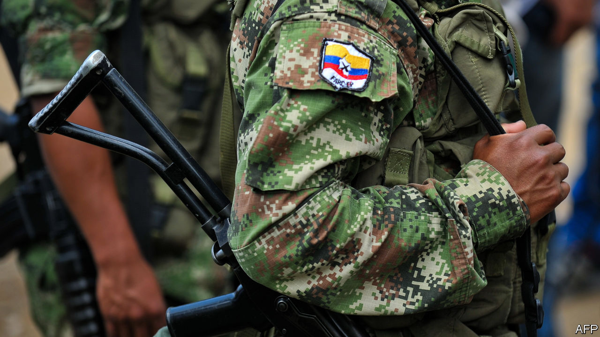

###### The terrible truth

# Colombia’s peace tribunal issues a crushing judgment against the FARC 

##### A system established to achieve “transitional justice” proves its mettle 

 

> Feb 2nd 2021 


CRITICS OF COLOMBIA’S peace deal with the FARC rebel group, which in 2016 ended a 52-year war with the government, complain that it lets the guerrillas off too easily. The fault, in their view, lies with the “special jurisdiction for peace” (JEP), an institution set up under the accord to investigate and judge crimes committed during the conflict. The Democratic Centre party, founded by Álvaro Uribe, who fought the FARC as Colombia’s president in the early 2000s and is the mentor of the incumbent, Iván Duque, claims that the JEP’s purpose is to go after government soldiers while securing impunity for FARC criminals.


On January 28th the JEP proved the critics wrong. In its first ruling since its founding four years ago, it indicted eight FARC leaders for war crimes and crimes against humanity. All were connected with the group’s practice of taking hostages and ransoming them to finance its war against the state. Among the alleged culprits are the former top commander, Rodrigo Londoño, known as Timochenko, and two leaders who are now members of Congress. Seven of the eight (one has died) have 30 working days from the ruling either to accept or deny the accusations. If they accept, the JEP will restrict their freedom, perhaps by ordering them to de-mine land or build schools in war-torn areas. If they reject the charges, the JEP’s investigative unit will seek to prove them in a trial. If the defendants are convicted, the JEP’s judges could sentence them to 20 years in prison.


The 322-page ruling reveals hitherto undisclosed details of the conditions in which the FARC kept some of the 21,396 hostages they took from 1990 to 2016. The guerrillas, who claimed to be fighting for a more just society, seized rich and poor alike. They beat and starved the hostages. Many were forced to urinate in their clothes and not allowed to clean themselves for months. Some were locked in wooden boxes barely larger than their bodies. The rebels ordered some to dig their own graves as a form of psychological torture.


The JEP’s revelations show that Colombia’s unique “transitional-justice” system can succeed. Most such tribunals have been established by international bodies, such as the UN. The JEP is the first such body for prosecuting war crimes and crimes against humanity to have been created by the warring parties through a peace accord. It adjudicates such crimes through “restorative”, rather than retributive, justice. This seeks to reconcile victims with offenders, mostly by uncovering the truth. The tribunal talked to more than 2,500 kidnapping victims. Colombia’s ordinary justice system had not done that when it tried some FARC members in absentia during the war. The JEP took testimony from the hostage-takers, who under the peace agreement are obliged to confess. Some spoke for 16 hours.


The FARC’s leaders claimed to be shocked by the gruesome accounts, says Julieta Lemaitre, the judge investigating hostage-taking. Commanders like Timochenko say they ordered good treatment for the hostages. In fact, says the ruling, the orders were merely to keep them alive. Under international law, commanders are responsible for preventing subordinates from committing war crimes. The JEP charged them as if they personally had committed the abuses.


The ruling is devastating for the FARC, now a political party. The peace deal guarantees it ten seats in Congress until 2026. So far it has not had enough popular support to win any beyond that. In a congressional election in 2018 it got just 0.5% of the vote. Last month the party changed its name to Comunes, or Common People’s party, to distance itself from its violent history. One of its core commitments is to fulfil its part of the peace agreement.


The JEP’s ruling will test that promise. If the FARC’s leaders deny the accusations the JEP would have to conduct a long trial, delaying rulings on other crimes, says Juana Acosta, a professor at the University of La Sabana in Bogotá. Worse, that would undermine reconciliation with the FARC’s victims, which depends on the guerrillas recognising the suffering they caused. A denial would also give new heart to the peace deal’s detractors, who have been disorientated by the ruling, says Jorge Restrepo, an analyst.


If the FARC leaders’ guilt is confirmed, the JEP will face a difficult decision over whether those in Congress can keep their seats. A decision to let them remain in the legislature would give new ammunition to the JEP’s critics and enrage many ordinary Colombians. “The continuity in Congress of those who are responsible for kidnapping offends us all,” says Mr Restrepo. Yet banning the FARC’s leaders from congressional seats would weaken a pillar of the peace deal: the FARC’s agreement to pursue their political aims democratically rather than by force.


In the next few months the JEP will issue rulings on mid-level commanders who had direct contact with hostages and on child-recruitment by the FARC. Perhaps later this year it will issue a finding on what role the Colombian state played in the “false-positives scandal”, in which soldiers murdered thousands of civilians, claiming that they were guerrillas killed in combat. If that ruling is as crushing as the one on hostages, former generals could be indicted in the same way as Timochenko and his fellow FARC defendants. Such a finding would change how Colombians view Mr Uribe’s offensive against the guerrillas. Now many believe it saved the country.


The JEP’s future decisions could polarise Colombians. Underlying the peace deal, however, is the notion that only the truth can heal the country and ensure that such crimes never again occur. So far, the JEP has risen to the challenge of uncovering it.■

