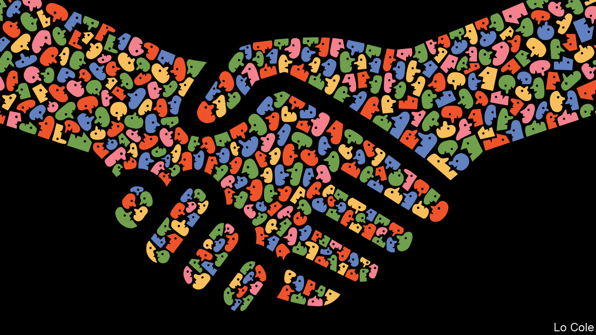

###### Bello

# Latin America needs a new social contract 

##### But it must be realistic 

 

> Feb 6th 2021 


IN MEXICO CITY and Lima covid-19 patients are once again being turned away from hospitals with no beds to spare, while in Manaus, in northern Brazil, a new variant of the virus is killing a hundred people a day. The pandemic’s recession pushed 33m Latin Americans below the $5.50-a-day poverty line last year, according to the World Bank. Governments in the region are struggling to line up vaccines. So it may seem like a strange moment to be talking of a new social contract—an abstraction.


Yet the term has become a mantra in Latin America. Both the United Nations Development Programme (UNDP) and the OECD, a group of mainly rich countries, are working on hefty reports related to the subject. That is because the pandemic has exposed long-standing fragilities. The region’s health-care and social-protection schemes are fragmented and unequal. Its economies have stagnated for the past six years, largely because of low productivity. Political systems are discredited. Citizens are angry. People sense that Latin American democracies cannot carry on like this. The question is how much and how quickly can they change.


For some on the left, a new social contract offers a mirage of turning Latin America into Scandinavia with a snap of an international bureaucrat’s fingers. Others think of a new constitution. In Chile an assembly to write one will be elected in April; it is likely to mandate more state social provision. The left in Peru also wants a new constitution, to give a bigger economic role to the state. Some people on the right fear a slide towards socialism.


Some Latin American countries, such as Uruguay and Costa Rica, have broad-based welfare states. In others, Bismarckian contributory social-security schemes, set up in the mid-20th century, have been overtaken. On average half the population works in the informal economy and is outside these schemes. Governments have offered some non-contributory benefits to these people, creating incentives to stay informal. The more sensible ideas for a new social contract stress three things: creating a floor of universal social protection; raising taxes to pay for this; and increasing citizens’ involvement in politics in ways that strengthen representative democracy.


The pandemic has highlighted the problem of informality, with workers violating lockdowns to gain their daily subsistence. Reformers argue that all Latin Americans, whatever their status in the labour market, should be eligible for taxpayer-financed unemployment insurance and basic retirement and disability pensions. That would mean reserving contributory financing for top-up insurance and pension schemes. This would encourage formal employment with lower payroll costs. Conditional cash-transfer schemes can offer a minimum income for the poorest citizens.


These changes would cost annually around 3% of GDP, reckons Luis Felipe López-Calva, the UNDP’s boss for Latin America. He thinks this could be paid for partly by increasing property taxes, which collect only around 0.5% of GDP in Latin America, compared with around 3% in Europe.


Money will be especially tight for the next couple of years, and there are many pressing needs. These include, immediately, rolling out vaccination programmes and getting schools going again. Many countries need to spend more on transport infrastructure and on education. Governments are piling up debts they will have to service. Reformers propose a plan whereby new social-protection measures and taxes and other reforms take effect in, say, three years.


There will be resistance. Take Colombia. “The upper-middle class is saying ‘enough’,” says Sergio Clavijo, a Colombian economist. He notes that the top income-tax rate has gone up steadily (to 39%) and that well-off Colombians pay a wealth tax. He argues for closing loopholes through which the rich avoid taxes and expanding the tax base (only 1m Colombians pay income tax). Both steps will take time.


With legislatures and political parties in disrepute in many countries, a broader public debate is needed to set priorities, bringing together politicians, business people, trade unions and other social and civic groups. One such exercise will start soon in Panama. “If we don’t get people together to discuss the way forward, the alternative is very chaotic, probably with a lot of discontent,” says Mr López-Calva. “This is not easy. But it’s the best way to weather the storm.”

