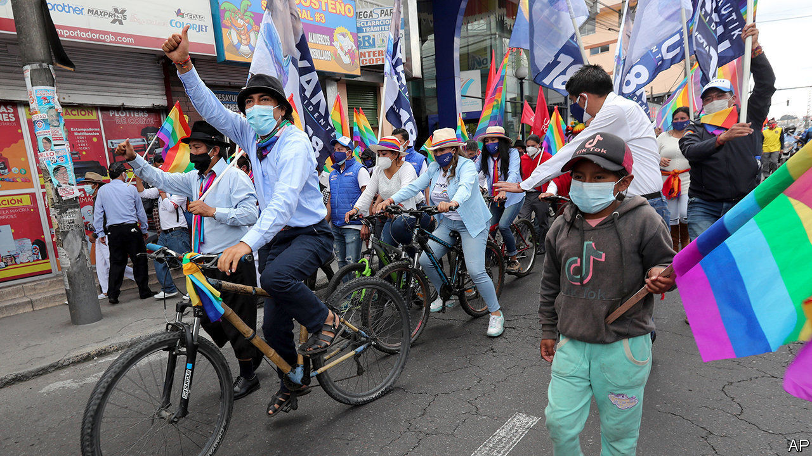
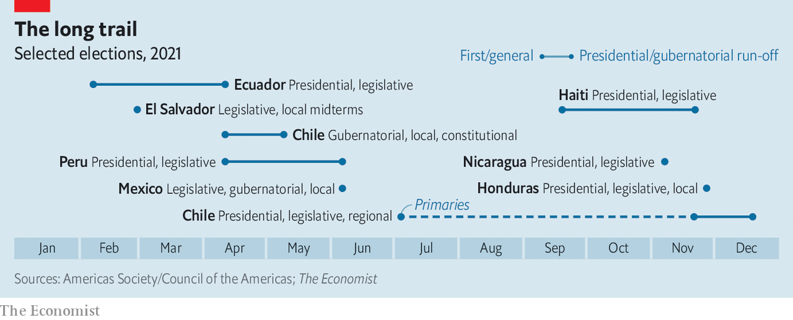

###### More mice than Mussolinis

# Latin America’s year of elections will test the region’s democracies 

##### The votes are unlikely to add new strongmen to those already in office 

 

> Feb 4th 2021 


WHEN ECUADOREANS choose a new president and legislature on February 7th, they will begin a busy political year across Latin America. Chile, Haiti, Honduras, Peru and Nicaragua are due to hold national elections (see chart). Chile will elect a constitutional assembly. Argentina, El Salvador and Mexico will hold legislative and regional votes.


They are a diverse bunch. Chile is a mature democracy. Ecuador and Peru are rowdier ones and Haiti is dysfunctional. Nicaragua’s strongman, Daniel Ortega, has stamped out democracy. Nayib Bukele may be doing so in El Salvador. Chile and Peru have managed their economies well. Argentina and Ecuador have recently defaulted on their debts.

 


Common factors cut across these distinctions. Corruption, inequality, poor public services and price rises provoked mass protests in 2019 and 2020 in Chile, Ecuador, Haiti and Peru. The pandemic quieted the streets, but raised the stress. Economies contracted and poverty rose (see ). Recovery is expected to be slow. Parties are weak and discredited almost everywhere. Elections in Central America will strain democracy. In South America, though there are worries about Ecuador, they will probably affirm it.


Who will take charge is more of a mystery than usual. There is a plethora of presidential candidates, a disturbing number of whom have criminal records. Ecuador has 16 presidential aspirants; Peru has 17. In Chile, where two people have alternated in the presidency since 2006, the race is open.


Looming over Ecuador’s election is Rafael Correa, the authoritarian left-wing president from 2007 to 2017 who last year was convicted in absentia of corruption. He is making a second attempt to install a puppet in the Carondelet Palace. Lenín Moreno, the current occupant, disappointed him by abandoning his populist economic policies and pursuing corruption cases against members of Mr Correa’s regime. Now Mr Correa is backing Andrés Arauz, a little-known economist who has said that Mr Correa will be his main adviser. Mr Arauz frightens business folk, for example by questioning Ecuador’s use of the dollar as its currency.


On the left Mr Arauz faces competition from Yaku Pérez of Pachakutik, a party that represents mainly indigenous Ecuadoreans. The split helps Guillermo Lasso, a conservative businessman who is making his third run for the presidency. Though likelier to continue economic reforms than Mr Arauz, he too has bowed to Ecuadoreans’ anti-austerity mood, promising to raise the minimum wage to $500 a month from $400.


Peruvians face greater uncertainty. The current president, Francisco Sagasti, is the fourth to hold the office since March 2018. His three predecessors were forced out either by scandals or by protests. Peru needs stability, but the aspirants to succeed Mr Sagasti (who is not running) seem unlikely to provide it. The early leader is George Forsyth, a former football goalkeeper and one-time mayor. He has made corruption his main issue, but showed his inexperience by proposing that graft cases be decided by juries “like in the movies”, which would require an overhaul of the justice system.


Mr Forsyth’s 12% support leaves room for rivals. Keiko Fujimori, the daughter of a former president now serving a prison sentence for human-rights crimes, has spent time in jail while prosecutors investigated corruption charges against her. Daniel Urresti, a nationalist, is on trial for the murder in 1988 of a journalist, Hugo Bustíos, near an army base he commanded. Candidates with less chequered pasts include Verónika Mendoza, the left’s standard-bearer, and Hernando de Soto, an economist who advocates strengthening property rights as a way to reduce poverty.


Chile’s presidential field looks less colourful. It is likely to narrow after primaries in July. The front-runners are mayors of districts of Santiago, the capital, on opposite ends of the spectrum: Joaquín Lavín, of the right-wing Independent Democratic Union, and Daniel Jadue, a Communist. Paula Narváez, a spokeswoman for the Socialist government of 2014-18, will probably be the centre-left’s candidate. In April Chileans will for the first time vote for regional governors and for members of a constitutional convention.


Chile’s temperate political culture, and the need for compromise in the constitutional convention, will push candidates in the later national elections towards the centre, says Kenneth Bunker of Tresquintos, a political-analysis platform. Mr Lavín aspires to lead a “national-unity” government. Mr Jadue would have to strike deals with centre-left parties.


Central America is more worrying. Mr Ortega, though unpopular in Nicaragua, is not budging. A victory by Mr Bukele’s New Ideas party in a congressional election will tighten his grip. The probable candidates to succeed Juan Orlando Hernández, whose re-election as Honduras’s president in 2017 is widely thought to have been unfair, offer little prospect of improvement. He is likely to back Nasry Asfura, the mayor of Tegucigalpa, the capital. In October prosecutors accused Mr Asfura of embezzling $1m of the city’s money. Yani Rosenthal, who may run for the opposition Liberal Party, was serving a sentence for money-laundering in an American prison until August.


In the messiness there are also reasons for hope. Outside Central America there are few budding strongmen. Elections channel discontent, which is better than violent protest. They offer “somewhat of a safety valve”, says Christopher Sabatini of Chatham House, a think-tank in London. But massive problems await the winners. Honeymoons will be short. ■

