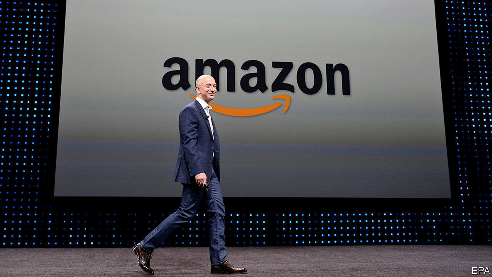
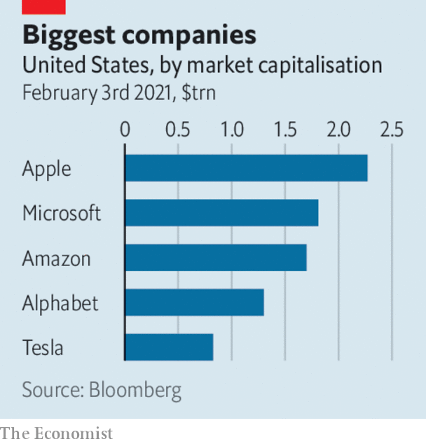

###### 

# Business this week 

#####  

 

> Feb 6th 2021 

 


Taking markets by surprise, Jeff Bezos said he would stand down as Amazon’s chief executive later this year, telling his “fellow Amazonians” in a letter that he wants to devote more time to his climate-change project, the Washington Post and other business and charity interests. Mr Bezos, who has led the company he founded since 1994, will become executive chairman. The new CEO will be Andy Jassy, who heads Amazon’s cloud-computing division, the most profitable part of the company. See .

King of the retail jungle


Amazon’s quarterly sales passed $125bn for the first time in the final three months of 2020. For the year as a whole revenues were up by more than a third to $386bn, almost $100bn more than Apple’s revenues for last year.


Google’s parent company, Alphabet, also surpassed expectations in the fourth quarter, as sales from advertising jumped by more than a fifth, year on year. Its cloud-services division, however, made an operating loss, for the quarter and for the whole year.


Following a bout of volatile trading, in which the S&amp;P 500 had its worst week since October, stockmarkets quietened down. Investors remain nervous about the co-ordinated action of a group of retail traders, through message boards such as Reddit, to drive up some share prices which hedge funds were betting would fall. Those hedge funds have incurred losses worth billions of dollars. There were other casualties from the stock-war battlefield. The share price of GameStop, one of the stocks defended by the day traders, has lost more than 80% of its value since the end of the market skirmish. See .


The effect of lower oil prices was laid bare in the annual earnings of oil and gas companies. ExxonMobil and Shell each recorded annual net losses of around $22bn last year. BP’s loss, its first in a decade, was $20.3bn. Chevron’s second-weakest year for revenues since 2000 pushed it to a loss of $5.5bn. See .


The euro zone’s economy shrank by 6.8% last year. Germany’s GDP contracted by 5%, France’s by 8.3% and Spain’s by 11%, the worst economic performance for all three countries since the second world war. The currency bloc’s annual rate of inflation jumped to 0.9% in January, ending five months of deflation. With activity curtailed by lockdown, the rise in consumer prices reflected factors such as higher shipping costs and a revision to the index’s weightings.


America’s economy was 3.5% smaller in 2020 than in 2019, though it is growing again at a faster rate than many had expected. The Congressional Budget Office, a nonpartisan agency, thinks GDP will roughly return to its pre-pandemic level by the middle of this year, even without any more stimulus. The economy, however, will lag its potential until 2025, keeping employment subdued.


Britain formally submitted a request to join the Comprehensive and Progressive Agreement for Trans-Pacific Partnership, a free-trade agreement among 11 countries, which include Australia, Canada, Japan and Mexico.


Uber expanded its home-delivery business by agreeing to buy Drizly, which supplies alcohol to your door, for $1.1bn. One estimate reckons that online sales of alcohol grew by 80% in America last year as a consequence of lockdown.


Alibaba undertook a round of dollar bond sales with the aim of raising a reported $5bn, after the Chinese e-commerce giant exceeded quarterly sales forecasts. The company’s founder, Jack Ma, has fallen foul of the authorities, to such an extent that his name has been omitted from a list of China’s entrepreneurial greats published by state media. Ant Group, a fintech firm founded by Mr Ma that is affiliated with Alibaba, is close to securing a deal with officials about restructuring its business.


McKinsey drew up a deal with 47 American states to settle claims that the consultancy firm advised Purdue Pharma to vigorously market its OxyContin painkiller, contributing to America’s opioid crisis. It is a rare instance of McKinsey being held legally accountable for its advice to clients.


General Motors’ share price retained the gains it made after the carmaker announced that it would phase out production of petrol-fuelled vehicles by 2035 and instead sell only cars and pickup trucks with zero exhaust emissions. GM is investing $27bn in electric- and autonomous-car technology, and promises that by the end of 2025, 40% of its models in America will be powered by battery.

A happy occasion


One of the winners from lockdown, Moonpig, had a successful IPO in London. The online provider of greeting cards and gifts saw its share price soar by 17% on its special day, prompting salutations of congratulations and I love yous from investors.

