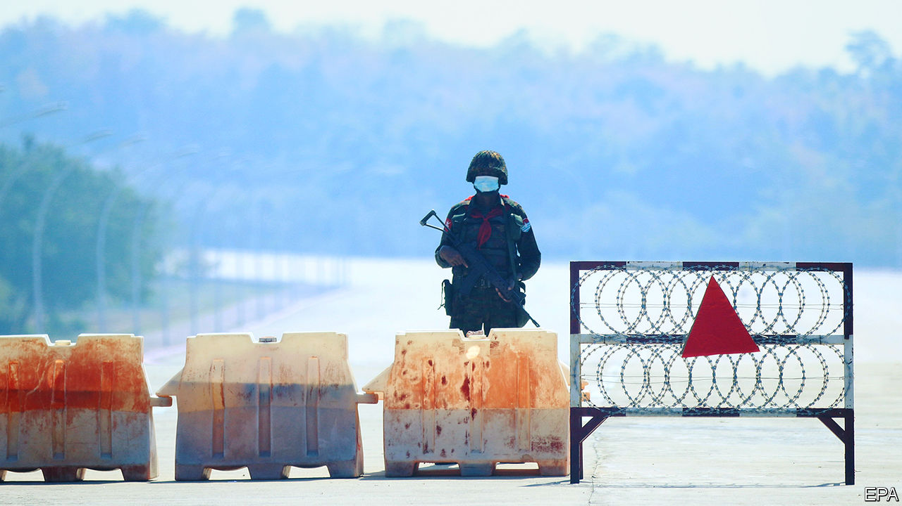
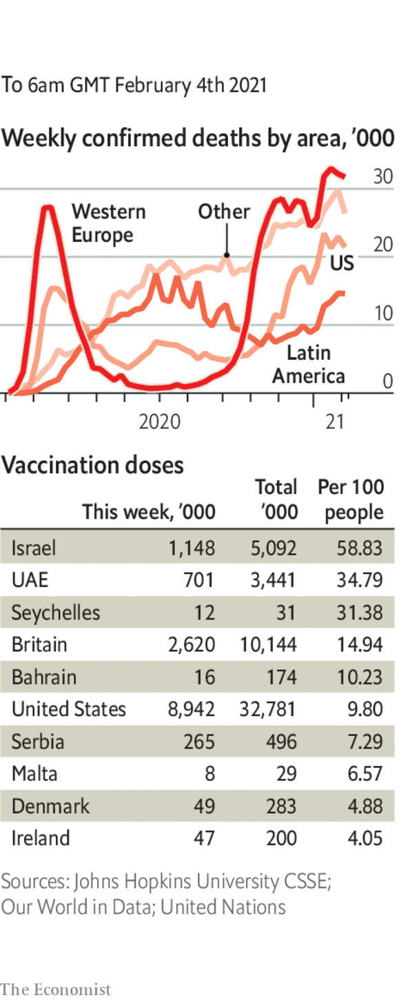

###### 

# Politics this week 

#####  

 

> Feb 6th 2021 


The army seized power in a coup in Myanmar and arrested Aung San Suu Kyi, the leader of the ruling party, the National League for Democracy. It claimed that elections the NLD won by a landslide in November were fraudulent, and that it had to intervene to ensure a fair poll could be conducted. The army said it would return power to civilians within a year. The military authorities indicted Ms Suu Kyi with the bizarre charge of importing some walkie-talkies without the proper paperwork, and the president, Win Myint, also from the NLD, with violating social-distancing rules. See .


Mori Yoshiro, a former prime minister and the head of the organising committee for the Tokyo Olympics, which are scheduled to start in July, complained about how long women talk at board meetings. The comments prompted widespread calls for his resignation. Separately, the International Olympic Committee issued guidelines to help prevent the spread of covid-19. Spectators, it said, could clap but not chant or sing.


Mario Draghi, a former head of the European Central Bank, was asked by the president of Italy to try to form a government. The current prime minister, Giuseppe Conte, has lost his majority in a spat over covid-recovery funds. Mr Draghi needs the support of one of the two big populist parties, the Northern League or the Five Star Movement. That may be tricky. See .


The European Commission took powers to block the export of covid-19 vaccines to non-EU countries, though it has not yet used them. This triggered a furious row with Britain, which intensified after the EU threatened to invoke Article 16 of the Brexit agreement, which would create a hard border between Northern Ireland and the Republic of Ireland. After across-the-board criticism, including from the Republic, the commission backed down. See .


A court sent Alexei Navalny, Russia’s main opposition leader, to prison for two and a half years. It said he had violated the conditions under which a sentence for embezzlement had been suspended. He says the original case was fabricated; and that he could not attend the parole hearings as he was in Germany in a coma after being poisoned by Russian agents. More than a thousand protesters were arrested. See .


Police in Istanbul arrested 159 students at Bogazici University who were protesting against the detention of four gay activists for depicting Islam’s most sacred site with the Pride flag. Turkey’s interior minister said the activists were “freaks”.


In Scotland Nicola Sturgeon reshuffled her ruling national-party government in the hope of galvanising it before a parliamentary election in May that is being presented as a proxy vote on Scottish independence. But the ejection of a frontbencher who disagrees with Ms Sturgeon’s independence strategy only amplified the SNP’s divisions.


In his first significant trade-policy decision, Joe Biden reinstated tariffs on aluminium imports from the United Arab Emirates, which Donald Trump had lifted on his last day in office. Mr Biden, perhaps mindful of his close election margin in the rustbelt states, says imports from the UAE hurt domestic production.


The Senate approved Pete Buttigieg as transport secretary in the Biden administration. He is the first openly gay person to be confirmed to a cabinet position in America.


Colombia’s “special jurisdiction for peace”, which investigates and judges crimes committed during the 52-year conflict between the state and the FARC guerrilla group, issued a damning indictment of the group’s leader, Rodrigo Londoño, and seven other commanders. It held them responsible for the mistreatment of hostages, which it said amounted to war crimes and crimes against humanity. See .


Brazil’s “Lava Jato” anti-corruption task-force, which has convicted dozens of businessmen and politicians since 2014, was unceremoniously disbanded. Politicians had turned against it and were joined by the populist president, Jair Bolsonaro, whose son, a senator, is being investigated for money-laundering.


Rebels opposed to the re-election of President Faustin-Archange Touadéra closed in on Bangui, the capital of the Central African Republic.


Iran’s foreign minister said the European Union should “choreograph” a synchronised return of both America and Iran to the deal under which Iran curbed its nuclear programme in return for sanctions relief. President Joe Biden has said he wants to re-enter the deal. But he has insisted that Iran must first comply with the accord’s directives.


Thousands gathered in Jerusalem to attend the funeral of an ultra-Orthodox rabbi, flouting Israel’s coronavirus restrictions. Cases and deaths have been rising in Israel, which is still leading the world in vaccination per person. Israel agreed to transfer 5,000 doses of the vaccine to the Palestinian Authority, which began jabbing health workers. See .


Tanzania is not planning to vaccinate the public against covid-19, its health minister said. President John Magufuli has said he does not think the vaccines work. Tanzanians are being urged to to use traditional medicine. See .

Coronavirus briefs

 


A non-peer-reviewed study suggested that the AstraZeneca-Oxford vaccine can reduce transmissions by two-thirds. Meanwhile, the European Medicines Agency approved the AZ jab for everyone over 18. But officials in France, Germany and Sweden are recommending that it not be offered to over 65s, and in Poland to over 60s, believing there is insufficient data to say it is effective in those age groups. Switzerland refused to license it at all.


Johnson &amp; Johnson reported that its new single-jab vaccine was 66% effective overall in preventing covid-19, and that protection increases over time. As with other vaccines, J&amp;J’s trials showed its jab has lower efficacy in South Africa, where a particularly pernicious strain of covid-19 has been observed. See .


A peer-reviewed analysis in the Lancet of Russia’s Sputnik V vaccine showed it had an efficacy rate of 91.6%.

