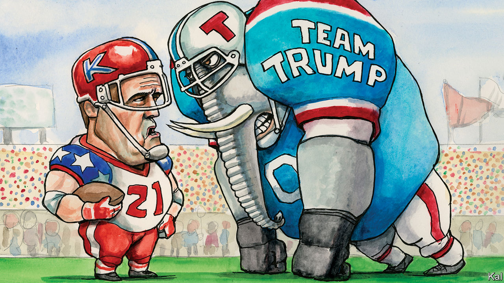

###### Lexington

# Adam Kinzinger is making a lone stand against Donald Trump 

##### A congressman from Illinois has launched the most full-throated Republican challenge to populism 

 

> Feb 6th 2021 


“PROFILES IN COURAGE”, John F. Kennedy’s ghostwritten homage to politicians who stood on principle against their own parties, is a revealingly slim tome. Even in the 19th century, from which most of Kennedy’s eight examples were drawn, the social and electoral disincentives to crossing a party line were formidable. With the introduction of the primary system in the 1970s, which made candidates accountable to their parties’ most raving loyalists, they have increased. And politicians, who mostly want to be liked even more than the rest of us, are especially averse to such pressures. Depressing as the Republicans’ capitulation to Donald Trump has been, history suggests it was on the cards.


This makes the one-man resistance to Mr Trump and all his works latterly launched by Congressman Adam Kinzinger of Illinois all the more remarkable. Mr Trump’s few Republican critics have mostly been on the way out, as Bob Corker and Jeff Flake were, or, like the Never Trumpers, already in the wilderness. A couple of others, Lisa Murkowski and Mitt Romney, have strong enough home-state brands to get away with criticising the former president selectively. By contrast, Mr Kinzinger, a 42-year-old House member whose good looks and television manner are said to have impressed Mr Trump, is in his political prime, vulnerable to the ruling Trumpists, but now all in against them.


The air-force veteran was one of the first Republicans to congratulate Mr Biden on his win and almost the only House Republican to dismiss Mr Trump’s election-fraud conspiracy as dangerous nonsense. After the insurrection it sparked (which Mr Kinzinger claims to have been forewarned of by the threats he received on social media) he was the only Republican to vote for Mr Trump to be removed under the 25th amendment. He was one of the ten who voted for his impeachment. And where the other nine, including Liz Cheney, the third-ranking House Republican, are now mostly lying low, Mr Kinzinger has expanded his critique.


In an interview this week he described Mr Trump as symptomatic of a deeper rot on the right, the politics of nihilism and grievance he encountered on entering Congress in 2011. Though nominally a Tea Partier, he unveiled McCainite views and an interest in governing. His fellow insurgents meanwhile pursued the brainless extremism (“legislative terrorism,” he calls it) of the Freedom Caucus, a precursor to Trumpism. Caucus members such as Mick Mulvaney became zealous Trump enablers. Mr Kinzinger considers their belligerent colleague Jim Jordan the de facto House Republican leader. And he has had it with the lot of them.


He says he regrets voting for Mr Trump, is glad Mr Biden won and advocates sweeping Republican reform. The angry pushback he is getting is only making him more critical. After a relation and fellow evangelical Christian accused him of being possessed by the devil, he slammed the slavishness of Mr Trump’s Christian fan base: “The devil’s ultimate trick for Christianity…is embarrassing the church”. This week he announced his intention to lead a “country first” campaign against Trumpism. “It’s time to unplug the outrage machine, reject the politics of personality, and cast aside the conspiracy theories and the rage,” he said in a promotional video.


He knows he is up against it. The Trumpists are in charge because that is what Republican voters seem to want. Yet he makes a reasonable political and stronger personal case for sticking it to them anyhow. He suggests many Republicans are backing Mr Trump for want of alternative leaders. “People need to be reminded that the Republican Party has this rich history. We used to be optimistic,” he says. He then compares the current state of Abraham Lincoln’s party to a drunk awaking after a “massive bender”. “You’re like, what the hell did I do last night? And you have a choice. You can take a delicious Bloody Mary, or actually confront your choices and become a better person.” Mr Kinzinger, a former college dropout, speaks with the authority of one who knows what it is to err. He also has logic on his side. Republicans need to expand their support, which post-insurrection Trumpism cannot do. “There’s just not enough Proud Boys or far-right fringe groups to compensate for the people we’ve alienated,” he says.


He has probably already guaranteed himself a primary challenge. But so what? he says, before pausing, gunslinger-style, to spit a glob of tobacco into an empty cola bottle. There are worse things than political failure—a truth he says he learned fighting in Iraq. “And it’s not like all I ever wanted to be was a congressman.”


However Mr Kinzinger gets on, his brave stand is already significant. It shows how beleaguered the Republican mainstream is. He is hardly a front-rank leader and pretty much out on his own. And yet his argument that the moment for a reckoning is now, when Mr Trump’s defeat and insurrection are fresh in the mind, is persuasive. The former president’s continued grip on the party is strengthening its worst elements, such as the hate-filled Marjorie Taylor Greene. It is also eroding the scope of his likeliest successors, such as Nikki Haley or Marco Rubio, to repudiate them. If they will not turn on Trumpism now, they will struggle to do so credibly later. Mr Kinzinger might even turn out to have been his party’s last best hope of a return to sanity.

A zinger from Kinzinger


He will have been a good advertisement for heroic failure if so. Unlike his Trump-beaten colleagues, with their telltale aggressive defensiveness, he exudes contentment. Embracing the possibility of failure is liberating, he says: “If you say, career-wise, I’m already dead and I’m just going to speak the truth, you may end up not getting re-elected, but you can feel pretty good about it.”


Kennedy’s exemplars must have felt a similar satisfaction in their noble, mostly failed, undertakings to limit the spread of slavery, prevent the civil war and so forth. They were also immortalised for them. That is another consolation Mr Kinzinger might hope for, as he takes his slingshot to the Goliath of Mar-a-Lago.■

