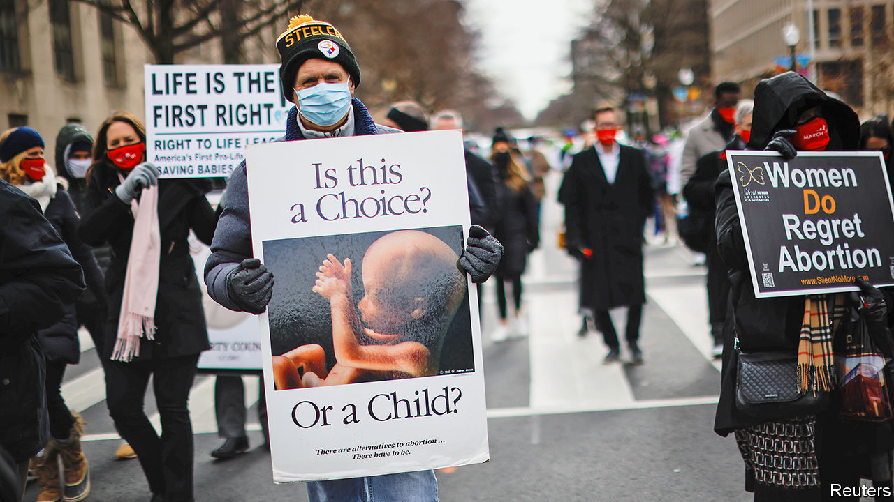

###### Roe-ing back

# How religious conservatives learned to love anti-discrimination laws 

##### Pro-life lawsuits in America are becoming more ingenious 

 

> Feb 6th 2021 


AMERICA’S ANTI-ABORTION campaigners tend not to be noisy champions of racial equality, the rights of women or the disabled. But they intend to change that. In recent months conservative states have introduced bills banning abortion on the grounds of race, sex or the diagnosis of a fetal abnormality. Last week South Dakota became the latest to do so, when the governor introduced a bill banning abortion because of Down syndrome. The aim, besides limiting access to abortion, is to push a case before the Supreme Court justices in the hope that they will use it to overturn Roe v Wade, the Supreme Court ruling of 1973 that legalised abortion.


Since Amy Coney Barrett joined the court in October, giving it a 6-3 conservative majority, such an outcome seems likelier than ever. Mary Ziegler of Florida State University reckons the end of Roe (“a question of when rather than if”), is likely to come through one of these “reason bans”, or a law banning abortions later in pregnancy. Supreme Court rulings allow abortion on demand (that is, for any reason) until a fetus is viable, at around 24 weeks. Polling suggests most Americans think it should generally be legal in the first three months of pregnancy, but not thereafter.


In November a federal appeals court upheld a ban in Tennessee on abortion on the grounds of race, sex or a diagnosis of Down syndrome (it struck down another law banning abortions as soon as a heartbeat was detected, around six weeks). The state thus became one of four to have a law banning abortion in cases of fetal abnormality and one of around a dozen to have a bar on terminations on particular grounds including sex or race. Elsewhere, courts have blocked such bans. But in some of those cases, judges have called for the Supreme Court to reconsider them. In January, when a court struck down a ban in Arkansas on abortions because of Down syndrome, two of the three judges thought the ruling failed to adequately consider “the state’s compelling interest in preventing abortion from becoming a tool of modern-day eugenics”.


The revival of reason bans as a weapon in America’s long-running abortion wars is shrewd. Such bans are potent because they are rooted in the argument that abortion can constitute discrimination against a particular group. Melissa Murray of NYU Law points out that though Supreme Court justices rarely overturn earlier rulings they are more likely to do if there is a “special justification”. In some cases, that has been the desire to correct racial injustice.


Clarke Forsythe, senior lawyer for Americans United for Life, which has drawn up many successful state-level abortion regulations, says he believes reason bans, especially in the case of Down syndrome, are both emotive and “persuasive as a matter of law”. The legal strides made in the prohibition of discrimination in America, he says, means that the anti-discrimination rationale of such bans could override the right to an abortion declared by Roe and subsequent rulings.


There is no evidence that women in America have abortions because their babies would be black, Asian or female (as the race and sex bans imply). There is evidence that they do so when the fetus they are carrying is found to have a genetic abnormality: a majority of diagnoses of Down syndrome result in an abortion. But even if it was decided a woman should be deprived of the ability to end a pregnancy for this reason, such bans are impracticable. It is “ridiculous and impossible”, says Khiara Bridges, a professor at University of California, Berkeley School of Law, to try to determine the reason for an abortion, even if a woman has received a particular prenatal diagnosis. “She may have also lost her job. There is rarely a single reason a woman has an abortion.” State-level bans may also lead to more abortions later in pregnancy as women are forced to look (and then travel) further afield for providers.


Ellen Clayton, a professor of paediatrics, law and health policy at Vanderbilt Law School in Tennessee, says one of the arguments increasingly advanced by antiabortionists, that abortion of Down syndrome babies fosters a wider atmosphere of discrimination, is “flat out wrong”. She points out that even as prenatal diagnostic tests have improved, increasing the number of such abortions, other medical advances and changing attitudes have meant people born with Down syndrome live longer, have more opportunities, and are more integrated into society than in the past.


Abortion providers, meanwhile, are concerned that the proliferation of such bans will have deleterious effects on women’s prenatal health care. Dr Colleen McNicholas, the chief medical officer for Planned Parenthood of the St Louis Region and Southwest Missouri—the last abortion clinic in the state, thanks to regulations that make it impossible for clinics to operate—says it is “ethically questionable if not unethical altogether” to offer prenatal testing without being able to offer interventions. Doctors, she says, may also find it hard to know what is allowable, since such laws are “written to be confusing”.


Yet some believe the battling sparked by such bans may not be entirely negative. The arguments that tend to dominate either side of America’s polarised abortion debate—that abortion is simply an issue of bodily autonomy on one and plain wrong in every case on the other—makes it impossible to reach any kind of consensus on how abortion laws and practices might be reformed. The introduction of issues that require a more nuanced approach might improve the debate. “Abortion rights activists’ refrain of ‘my body, my choice’ is powerful, but they should also be having conversations about ethical decisions around abortion, including on things like disability rights,” says Ms Bridges. “Otherwise, they cede such issues to the other side.”■

