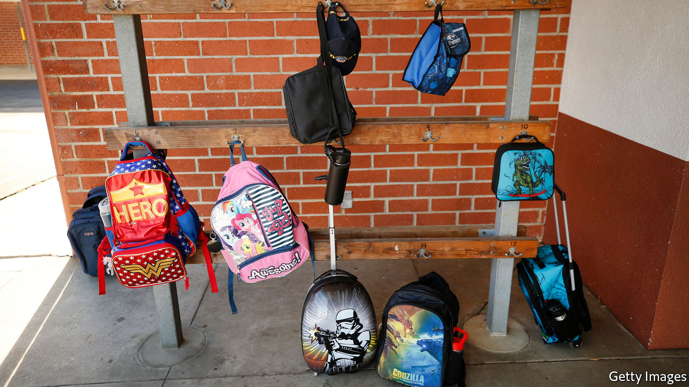

###### Vanishing act

# Large numbers of pupils are no longer enrolled in America’s schools 

##### Getting them back requires ingenuity 

 

> Feb 6th 2021 


CHILDREN ARE vanishing from public schools. New York City has lost 30,000 pupils this school year compared with the previous one, a 3% decline. Los Angeles Unified’s roster decreased by 19,233 (4%), and Boston’s by 5% (2,368 pupils). For a variety of reasons, children from pre-kindergarten to high school are disappearing from the rolls.


How worrying is this? Analyses are limited, but a deep dive into preliminary data from Massachusetts’ public schools by Thomas Dee of Stanford University and Mark Murphy of the University of Hawaii at Manoa shows that most traditional public districts in the state—274 out of 289—had enrolment declines this year in comparison with last year. Massachusetts experienced a 4% statewide loss in this academic year (37,363 pupils) compared with the year before. Not all districts lost pupils, however; charter, vocational and virtual (completely online) districts saw increases. Two virtual districts gained 611 pupils, a 21% increase over the past year, and charter districts gained 1,277 pupils, a 3% increase over 78 districts.


Some of the decline is no cause for concern. A portion of Massachusetts public-school pupils are probably attending classes out of state, while others are leaving for charter schools, private schools or homeschooling. Some families may also leave districts to move to second homes, explains Mr Dee. He found that some holiday spots like Martha’s Vineyard and Provincetown grew by 2-3%.


Other pupils are simply missing school, however. Mr Dee and Mr Murphy found that enrolment decreases were associated with smaller, whiter and poorer school districts, mostly in rural areas, where parents are unlikely to have moved to the wealthy beaches of Cape Cod. Although the analysis is preliminary, Mr Dee thinks that disengagement from schools may be more concentrated in these communities.


That echoes a concern heard beyond Massachusetts. David Monaco, head of Parish Episcopal School, a private school in Dallas, saw some pupils leave for more personalised small-group or individual schooling, though his overall enrolment remains steady. By contrast, Michael Hinojosa, the superintendent of Dallas Independent School District, where 85% of all pupils are classified as low-income, explained that while some of his pupils could be sitting at home playing video games, others are taking care of younger siblings while their parents work. “A lot of [pupils] are out there working...to support their families,” says David Vroonland, superintendent of Mesquite Independent School District, a small city near Dallas where 75% of pupils are classified as poor.


Pupils missing school are not just a worry for their families (and for the country’s future). Since America’s schools are funded on a per-person basis, the decline in enrolments also creates financial problems. Whereas some states, like Texas, are allocating school funding based on last year’s intake, schools in New York City may need to return money this year because enrolment has declined. And all schools risk losing funding next year if enrolment continues to fall.


Getting missing pupils back to school takes an extraordinary effort. Sara Bonser, superintendent of the Plano Independent School District north of Dallas, lost 6.5% of her pupils (3,883) at the beginning of the year. To find these children, her staff called thousands of families and conducted 115 home visits to get 1,279 pupils back on the books. To encourage attendance, Ms Bonser and her staff have provided support beyond the typical bounds of schooling.


One parent had a job that required leaving home at 6am, and her four children were not waking up for remote classes. Ms Bonser’s team found the mother employment closer to home so she could leave later and wake her children for school. Ms Bonser described other types of support, including allowing deadline flexibility to accommodate pupils’ work schedules and providing struggling families with food, furniture, clothing and toys. Existing district funds were reallocated so no additional money was needed for the programme. But the district’s work with one family hints at what a daunting job finding all those missing pupils will be.■

