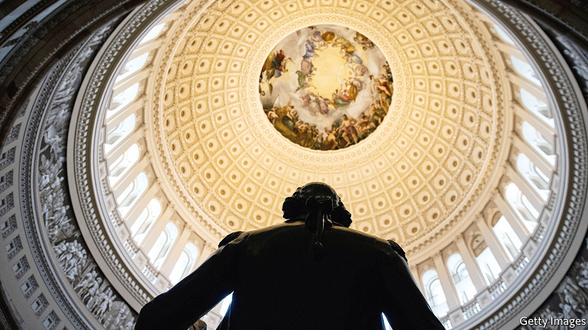

###### Stimulating talk

# Republicans test the precise meaning of Joe Biden’s talk of unity 

##### The president has ten Republican votes in the Senate for a sizeable stimulus. Does he want them? 

 

> Feb 6th 2021 


THE SYMMETRY is fearful. Twelve years ago, another freshly elected Democratic president faced an economic crisis and was forced to devote the first month of his term to crafting a stimulus measure to cushion the blow. Joe Biden’s experience then, as Barack Obama’s lieutenant, informs his calculation now. Mr Obama succeeded in getting his bill, the American Recovery and Reinvestment Act, but at considerable cost. That was not just the literal, gargantuan expense (at least for its time) of $787bn, or nearly $1trn in present dollars, but the steep political cost, too. Opposition to Mr Obama’s supposedly spendthrift measure spurred the Tea Party movement, which would eventually morph from deficit hawkery to proto-populism and eventually full-blown Trumpism.


Greater modesty is not the moral Mr Biden seems to have learned from his tutelage in the last recession. Rather, he seems worried about being insufficiently bold. The enormous stimulus plan he unveiled as his legislative priority, the familiarly named American Rescue Plan, costs $1.9trn, nearly twice as much as Mr Obama’s hotly disputed rescue measure in 2009. And it comes after Congress had already passed $4trn-worth of fiscal stimulus to counter the economic fallout from covid-19.


Having been poor practitioners of the fiscal stewardship they preach, Republicans have not yet mustered a rebuke as bellicose as in 2009. A counter-offer delivered by ten Republican senators—the number that would be needed to surmount the inevitable threat of a filibuster—costing an estimated $618bn looks modest only on a relative scale. A cordial Oval Office meeting between the group of senators and Mr Biden on February 1st was notable both for its length (close to two hours) and its anti-climactic, non-committal resolution. How the negotiations play out will be significant beyond just the haggling over a few loose hundred billion. They will also determine whether Mr Biden’s aspirations for unity and bipartisan dealmaking are workable, or mere happy talk.


The president’s opening offer is a maximalist agglomeration of Democratic ambitions—left-liberal provisions with varying levels of plausible justification. Some, like the $160bn to accelerate vaccine manufacturing and distribution, are plainly needed. So too is an extension of the federal top-ups to unemployment benefits, which would otherwise expire in March. A temporary boost to earned-income and child-tax credits, which sounds stultifying technocratic, would dent the alarming increases in poverty and food insecurity that researchers have noticed in recent months.


Some of the administration’s other priorities are harder to justify. About a quarter of the fiscal firehose ($463bn) would be aimed at disbursing a third round of direct cheques to most American households. The promised amount, $1,400, is of dubious provenance. In the waning days of his presidency, Donald Trump briefly flirted with rejecting the previous stimulus bill (worth $900bn) because its $600 cheques were too small. He favoured the bigger, rounder number of $2,000—which his own Republican allies in Congress resoundingly rejected. Seeking to make much of this own-goal ahead of critical Senate elections in Georgia, Mr Biden embraced the promise of $2,000 in total (hence a new $1,400 cheque). The president’s own economic advisers are reported to be doubtful of its merits.


Democrats have also been attached to sending an enormous cash infusion to state and local governments since the early days of the pandemic, when they (reasonably) feared huge budgetary shortfalls and the resulting vast layoffs of public workers. State and local budgets have in fact done much better than feared—dropping by only 0.7%, according to estimates by the Census Bureau—although this has not much dampened Democratic zeal to provide the funds. So much so that the $350bn on offer exceeds the total estimated shortfall in state tax collections over the first nine months of 2020 by a factor of ten. The long-held ambition of progressive Democrats to raise the federal minimum wage to $15 an hour is dutifully tacked on as well.


The Republican counter-offer treats many of these additions as an editor might treat the flabby copy of a correspondent. There is no proposed rise in the minimum wage and no bail-out for state budgets in more or less fine shape. The proposed spending on vaccinations remains the same, but the direct cheques would be more modest (only $1,000) and, somewhat unusually for Republicans, more aggressively means-tested (limited to people making less than $50,000). The plan discards Democratic proposals for more generous means-tested tax credits that are proven anti-poverty policies. The $20bn allocated to expeditiously reopen schools, which in some parts of the country have been closed for nearly a full year, is a fraction of the $130bn Mr Biden would like.


Precisely how much stimulus the economy needs after the extraordinary measures taken in 2020 remains difficult to determine. Modelling by the Congressional Budget Office projected a faster recovery than before even without any additional spending—real GDP growth is expected to be 4.6% in 2021, and the unemployment rate is projected to drop from 8.1% to 5.7%. Given that rosier trajectory and the general oddities of a pandemic-driven economic slump, the benefits of another large stimulus measure are difficult to predict. One analysis of the Biden plan by the Brookings Institution, a think-tank, suggests that it would increase real GDP by 4% over the current analysis; another respected macroeconomic modeller, the Penn Wharton Budget Model, estimates that it would contribute a mere 0.6% of growth.


Unlike Mr Obama, Mr Biden has never been mistaken for a remarkable orator. His choice of one particular word, “unity”, as the opening theme of his administration is imprecise. Mr Biden seems to mean not a return to the era of good feelings but a lower-temperature politics where the party in charge still leads but compromise is to be pursued. Some Republicans, tripping over the imprecision, have professed anger and confusion that Mr Biden is in fact pursuing conventional Democratic policies.


Yet for all that, a compromise is now discernable. Senate Democrats have already voted to start debate on a budget resolution, which would allow them to pass a compromise-free stimulus bill through a parliamentary procedure called reconciliation, by which budget bills can pass with 51 votes, avoiding a filibuster. But Mr Biden’s team appears open to accept means-testing the $1,400 cheques, which would bring the overall cost of the package down significantly. Mr Obama mustered only three Republican votes for his stimulus. Mr Biden could well improve on that. ■

