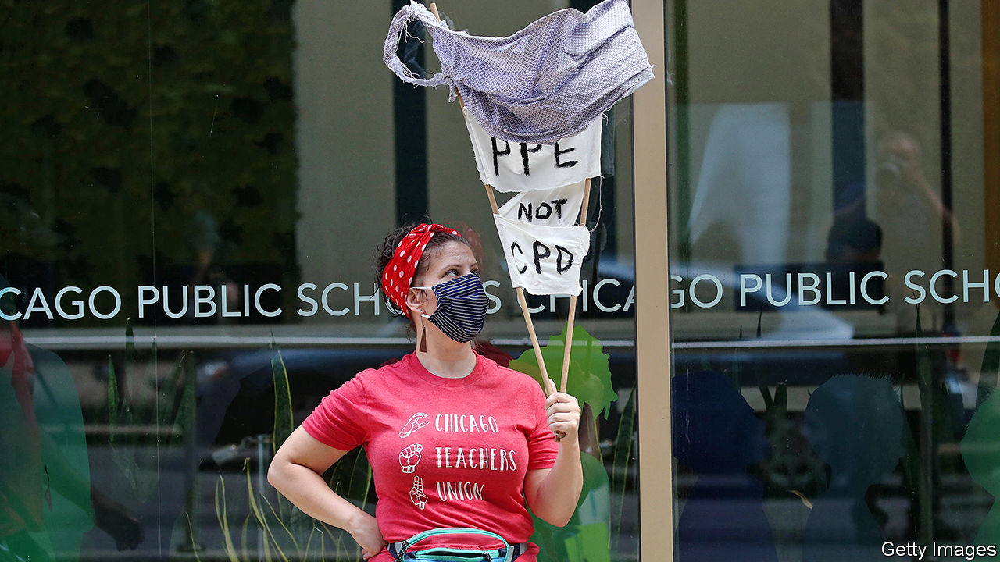

###### Class warfare

# The struggle over reopening Chicago’s schools 

##### Chicago’s teachers’ union is disruptive and strangely popular 

 

> Feb 6th 2021 


IN CITY LORE, the Chicago Teachers Union (CTU) is a mighty beast. Its 25,000 members have frequently shut down America’s third-largest public-school system. The most recent strike, late in 2019, doubly pleased the 84-year-old group. An 11-day shutdown helped to get teachers a generous five-year pay deal and dealt a blow to Lori Lightfoot, the recently elected mayor. She had vowed that her debt-ridden city would never fund such a “bail-out” for teachers, yet the union forced her hand.


Ms Lightfoot is a Democrat, but she has little love for militants at the CTU. The union had endorsed her rival in the run-off to be mayor. Its members snipe that she and her school director, Janice Jackson (who earlier served Rahm Emanuel, who was even more reviled by many teachers), are “neo-liberals” who supposedly do the bidding of wealthy Chicagoans. Suspicion has only grown since the epidemic abruptly ended in-class teaching in March. The city first tried to order a partial reopening of schools in September, only to be blocked by the union, which called it unsafe for its members to return to their workplaces.


Both sides agree that the effects of home-learning are grim for over 300,000 children, many of whom have lost almost a year of education. Ms Lightfoot says pupils are “falling woefully behind” and wants them back at school; the union talks more of how to do better with remote study. Shutting schools hits hardest in poorer African-American and Hispanic neighbourhoods, south and west of the city, where crowded homes, wobbly wifi and a lack of laptops may make decent distance-learning almost impossible. After the worst infection rates fell from a November peak, Ms Jackson has tried again to get the youngest children back to class. A few trickled in last month. Children aged up to 14 were supposed to follow this week.


The city says teachers will lose pay if they fail to appear in class. In-person teaching looks relatively safe now that everyone puts on masks. The city has spent $100m retrofitting buildings, installing screens and better ventilation, and taking other precautions. Meanwhile hundreds of nurseries and private schools, besides over 90 Catholic-run ones, and others in the suburbs, have been open for long spells with no ill effects. Plenty of studies, including a report last week from the Centres for Disease Control, say younger children in schools have not been virus spreaders.


But again the CTU has balked. This week its leaders staged “teach-ins” at desks in deep snow outside schools. It wants all teachers vaccinated first, which could take months, and says the city’s protective gear, promises of tests and other resources are not up to scratch. It worries that schools lack space for social distancing and wants committees with powers to quickly close them again if local infection rates rise. It fears new strains of the virus, too. In late January 71% of its members, urged by its leaders, voted to walk off the job rather than be forced back in.


A strike would look awful, both for the union and the city, so negotiations to avert one have gone on all week. CTU intransigence looks mostly to blame for the prospect of closure. But as Harry Katz, an expert in labour disputes at Cornell University, points out some teachers are genuinely fearful and the union’s job is to give them a voice. “It’s a mess; health and safety are really difficult to get right,” he says.


It is notable, too, how parents shape the debate. The union, called Local 1 at its founding in the 1930s, has repeatedly disrupted school life over generations, yet remains broadly supported in an overwhelmingly Democratic city. That may reflect class solidarity. Racial and social divisions also play a part. A survey of parents in December found only around one-third of Hispanics and African-Americans (who together account for the vast majority of all pupils) were ready to send their children back. In contrast, some two-thirds of white ones would do so.


What explains the gap? Non-whites may have been likelier to have seen covid-19 deaths at close hand, so perhaps fear health risks more. Wealthier whites, in turn, may be more anxious about the long-term costs of missed education, especially if they see others—at private schools—already back in class.■

