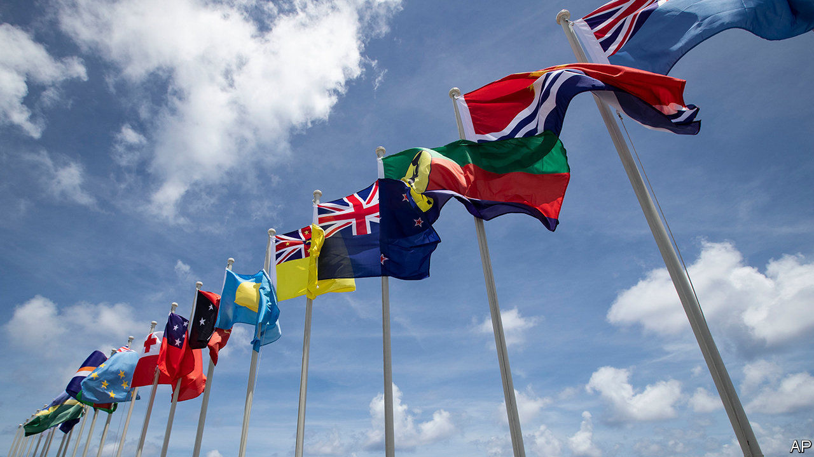
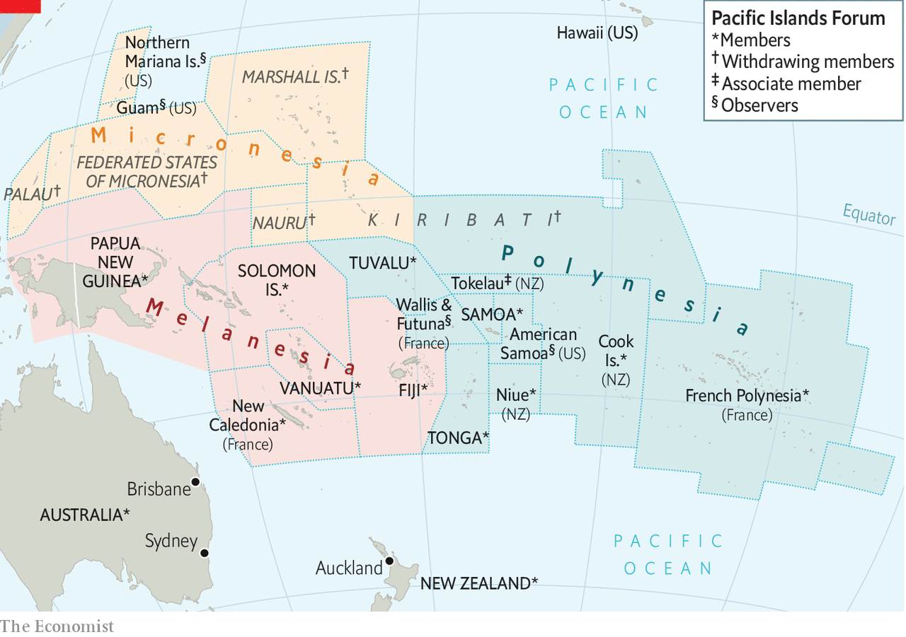

###### Palm-fringed fury

# A Zoom call sets off a diplomatic dust-up in the Pacific 

##### Micronesians complain that the Pacific Islands Forum treats them as second-class countries 

 

> Feb 13th 2021 


IT WAS YET another Zoom meeting gone horribly wrong. The annual shindig of the Pacific Islands Forum (PIF), the main regional organisation for the far-flung countries of the Pacific, could not take place in person this year, owing to covid-19. Instead, its members chose a new secretary-general in a video conference. When a former prime minister of the Cook Islands, Henry Puna, squeaked into the job by a single vote, five of the forum’s 18 members threatened to withdraw from the body in protest.


The five dissenters are the PIF’s Micronesian members: Kiribati, the Marshall Islands, the Federated States of Micronesia (FSM), Palau and Nauru. They insist that a gentlemen’s agreement requires rotation of the top job among the three main regions of the Pacific: Melanesia, Polynesia and Micronesia (see map). Since the outgoing secretary-general was Melanesian, and her predecessor was from Polynesia, the Micronesian candidate, Gerald Zackios, had widely been considered next in line. Yet on February 4th, with Australia’s encouragement, the forum’s members disregarded the convention to award Mr Puna the job by nine votes to eight.


The Micronesians are furious. Palau announced it was shutting its embassy in Fiji, where the PIF’s secretariat is. Then on February 9th the five Micronesian countries declared that they would “initiate the process to formally withdraw from the Forum”, although the final decision will be up to national governments.

 


Micronesians have long feared marginalisation in Pacific diplomacy. The PIF began life in 1971 as the South Pacific Forum, an organisation of Pacific countries mostly south of the equator. At the time most of Micronesia, to the north, was still, in effect, an American colony (technically, America administered the area on behalf of the UN). All five Micronesian countries had joined the forum by 1995, but only in 1999 did it drop the word “south” from its name.


Moreover, even by Pacific standards the countries of Micronesia are small. All five put together muster a population of barely 300,000, not only vastly less than PIF’s giants, Australia (25m), Papua New Guinea (8.6m) and New Zealand (4.9m), but also considerably less than Fiji (900,000) or the Solomon Islands (670,000).


The PIF has never been a closely integrated bloc. There is little trade or tourism among its members. Their most important ties are to the various countries of the Pacific rim rather than to one another. Although Jules Dumont d’Urville, a French explorer, divided the Pacific into three regions in the 1830s, contemporary economic realities have in effect reduced it to two.


The northern Pacific relies chiefly on America as a source of aid and a place to migrate to, whereas the south has closer ties to Australia and New Zealand. In the northern Pacific most flights go to Guam, an American territory, or Hawaii, as well as to China, Japan and Taiwan in search of tourists. In the south they tend to connect to Auckland, Brisbane or Sydney. Australia and New Zealand are the biggest contributors to the PIF’s budget.


Micronesia straddles this divide: the two southernmost Micronesian countries, Kiribati and Nauru, have strong ties to Australia. Nauru has earned most of its foreign exchange over the past decade by hosting a detention centre for Australia’s unwanted asylum-seekers. Kiribati, a country of some 120,000 people spread across an area of ocean bigger than India, uses the Australian dollar as its currency. 


That may undermine the Micronesians’ united stance. So may geopolitics. Australia and America are both anxious about China’s expanding influence in the Pacific. One of the ways they hope to curb it is by promoting Pacific unity. Guam, the Northern Marianas and American Samoa, America’s three remaining territories in the Pacific (as opposed to Hawaii, a state), became associate members of the Forum in 2011. Already David Kabua, president of the Marshall Islands, has said he would prefer to “review” membership rather than pull out of the Forum. A few more Zoom calls may yet patch things up. ■

