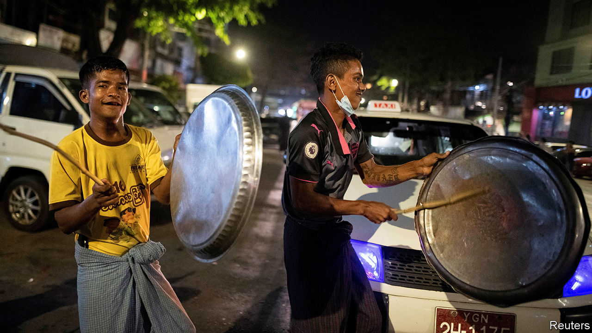

###### Don’t putsch me

# Myanmar’s generals face growing protests against their coup 

##### Many demonstrators fear a violent crackdown 

 

> Feb 10th 2021 


IT WAS DIFFICULT to hear the commander-in-chief over the din. Every night since the army toppled Myanmar’s civilian government on February 1st, people all over the country have banged pots and pans at 8pm, turning a traditional ritual to cast out evil spirits into a political protest. On February 8th, at 8pm, the head ghoul made his first televised address since the coup. Those who were not drumming kitchenware or slapping the image of the general on their TV screens with their slippers would have heard Min Aung Hlaing trying to reassure the public. There would be no change in government policy, he said, and elections would be held in a year. His interim government would be “different”, he pledged, from the oppressive junta that had preceded Myanmar’s ten-year experiment with democracy.


His audience is not convinced. Just hours earlier the army’s Orwellian “True News Information Team” had warned that action would be taken against “wrongdoers” who “disrupt the state’s stability”. But its pleas for “discipline” are falling on deaf ears. Tens of thousands of Burmese have thronged the streets in cities big and small, day after day, since February 6th, in the biggest protest movement in a generation. They are clamouring for the release of Aung San Suu Kyi, the leader of the National League for Democracy (NLD), the erstwhile ruling party. To justify the coup, the army claimed, without evidence, that the election in November at which the NLD won a second term by a landslide was marred by “terrible” fraud. 


Many of the demonstrations have the air of a carnival. On February 10th young women paraded around central Yangon wearing Disney princess outfits. Another group carried a coffin with a picture of the commander-in-chief. Placards full of obscenities abounded. Shops have sold out of balloons in the NLD’s trademark red.


Yet a current of foreboding is charging the atmosphere. The previous junta crushed dissent ruthlessly. Htay Win, who runs a tea shop in Yangon, took part in protests in 1988 and 2007. Both times the army shot into crowds, killing hundreds. “I think 100% that the military is going to crack down on us very soon,” he says. 


General Min Aung Hlaing’s assurances notwithstanding, agents from the feared intelligence service are knocking on doors, prompting many activists and journalists to go into hiding. Some 200 people have been arrested, according to the Assistance Association for Political Prisoners, a human-rights group. Ninety districts, including all of Yangon, the largest city, and much of Naypyidaw, the capital, have imposed curfews and restricted gatherings to no more than five people, in effect criminalising public assembly. 


The authorities have also begun trying to disperse the protests. Police have fired tear gas, water cannon and rubber bullets into crowds. Videos on social media showed police beating protesters with truncheons in Mandalay, a big city. Three protesters are being treated for wounds from rubber bullets. Two people in Naypyidaw were shot with what seems to have been live ammunition; one, Mya Thwe Thwe Khine, is on life support.


So far, the protesters seem undeterred. Their numbers are swelling with people from all walks of life: teenagers, labourers and professionals. Teachers, firefighters and health workers across the country are on strike. Civil servants are reportedly resigning en masse, among them the entire staff of the Ministry of Welfare. On February 10th a handful of officers from the police force, which is under the command of the army, broke ranks and joined the protesters. The next day, dozens of police officers from Kayah state declared their opposition to the coup. 


General Min Aung Hlaing may “hope the protests exhaust themselves” and that Burmese “settle for less than what they’re demanding right now”, says Aaron Connelly of the International Institute for Strategic Studies, a think-tank in Singapore. But with the bureaucracy in turmoil and some foreign businesses leaving the country, “it is very difficult to see how they get back to some kind of status quo”, says Kim Jolliffe, another analyst. Young people, in particular, are more educated, organised and connected than the previous time protests convulsed the country, in 2007. They are unlikely to back down meekly, Mr Jolliffe thinks. President Joe Biden’s announcement on February 10th that America would impose sanctions on the coup leaders is another blow to the generals.


The coup, naturally, has hardened misgivings about the prominent role the army already took in public life. Esther Ze Naw, a 27-year-old activist, wants not only a return to civilian rule but also an overhaul of the constitution, which the generals wrote to entrench their own power. “If we cannot abolish the military regime,” she says, “then full democracy will not be created.” A prominent 22-year-old activist speaks of “revolution”. If non-violent methods of protest fail, he says, he will take up weapons. “I think Min Aung Hlaing expected this coup to be a fait accompli,” says Mr Connelly. “It’s not been that at all.” ■

