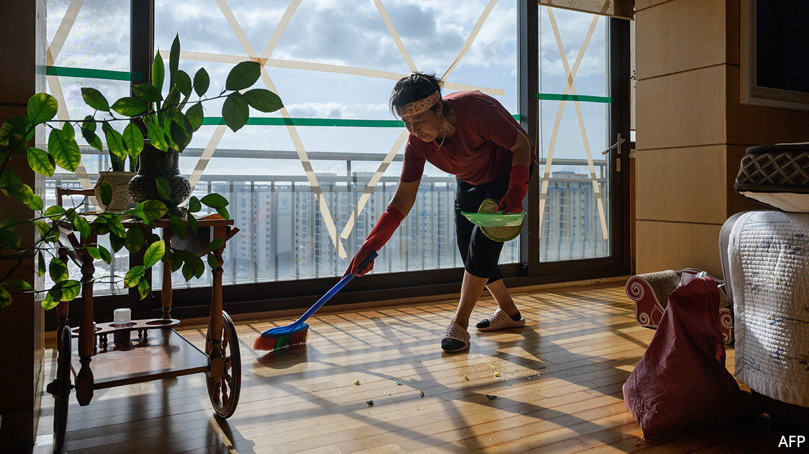

###### Hell is other people

# South Koreans are being driven mad by noisy neighbours 

##### And there is not much they can do about it 

 

> Feb 13th 2021 


THE LOUD music that his neighbours keep playing is fairly easy to deal with, says Yoo Seung-joo, a 21-year-old who lives in a block of flats in Seoul. “I just call the security guard to tell them to keep it down and that usually works.” But there is a more delicate problem. “At least once a week I’m woken up at 5am by loud sex noises.” The recurring disruption to his sleep is extremely wearing, but he feels too embarrassed to raise it with the security guards, let alone his parents, with whom he shares the flat.


Mr Yoo is not the only South Korean suffering from noisy neighbours. In a country where around two-thirds of people live in sound-carrying high-rise apartment blocks, ”noise between floors” is such a well-established problem that there is a national centre dedicated to dealing with it. The centre registers complaints and offers mediation through a range of committees to prevent lawsuits and perhaps even patch up neighbourly relations. 


The pandemic has given the noise mediators more work. Although South Korea never imposed a lockdown, the government recommended early last year that people work from home whenever possible and avoid going out to prevent the spread of covid-19. For those stuck in cramped flats at all hours, opportunities for being bothered by loud neighbours have proliferated. The noise centre registered 60% more complaints in 2020 than in 2019. 


Resolving them is not easy, not least because large numbers of people seem to be driven mad by the mere existence of their neighbours. Nearly two-thirds of the complaints the centre received last year were related to children running or adults simply walking in the flat upstairs. Total silence being an unreasonable expectation, mediation often ends with people being told they have to put up with the noise, says a lawyer representing those who wish to take their complaints to court. Even if they win, compensation is paltry.


The government, which last mandated thicker floors in new buildings in 2013, is considering requiring them to be thicker still. But that will not help residents of older flats. With few options to settle matters, long-suffering apartment-dwellers sometimes take them into their own hands. Many websites recommend effective ways to take revenge on noisy neighbours, for instance by blasting bass-heavy music towards the ceiling or by banging rubber mallets against the wall to create noises that can “shake the skull”. 


Not everyone takes this advice quite as literally as the man sent to prison in September for assaulting his neighbour with a rubber mallet after a noise dispute. But many resort to desperate measures. Kwon Seo-woon, who suspects her upstairs neighbours practise basketball and golf in their apartment, says bashing the hoover against the ceiling has worked on occasion. Lee Sun, who feels tormented by the noise of her neighbours’ children, says she is considering putting up a notice in the lift to shame them publicly. Mr Yoo says he has tried playing Buddhist chants and the national anthem through the ceiling at full volume. Though effective at shutting up the neighbours, the approach has its drawbacks: “It’s basically unbearable to listen to for any length of time.” 


The number of noise complaints will probably fall along with the covid-19 caseload. But pandemic or not, it seems certain that there will always be a healthy market in South Korea for thick carpets, fluffy slippers and noise-cancelling headphones—if not rubber mallets. ■


Dig deeper


All our stories relating to the pandemic and the vaccines can be found on our . You can also listen to , our new podcast on the race between injections and infections, and find trackers showing ,  and the virus’s spread across  and .

