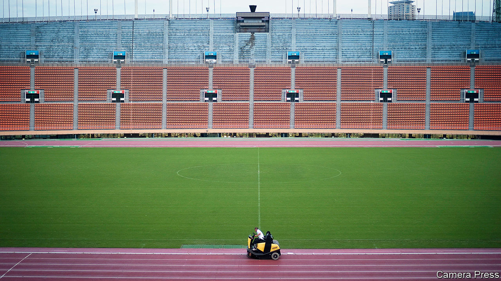

###### Olympic gory

# The obstacles to holding the Tokyo Olympics in July are daunting 

##### Most Japanese would prefer to postpone the games again, or cancel them 

 

> Feb 13th 2021 


THE RED digits on a clock outside Tokyo Station tick off the seconds until the Olympic games begin, on July 23rd. Yet the closer the date gets, the greater the uncertainty about whether the games will go ahead at all. The clock has, after all, already been reset once: as the covid-19 pandemic swept across the world last year, they were delayed until this year. Organisers spoke of the Olympics as a symbol of the light at the end of covid’s tunnel. With the torch relay, the official start of the festivities, set to begin on March 25th but with the disease still rampant, another decision looms. 


It is a more complicated choice than it was last year. Covid-19 is better understood and more effectively controlled than before, making the games, at least without massed spectators, appear tantalisingly feasible. But holding them comes with big risks. An Olympic outbreak would symbolise hubris and incompetence, and could provoke a crisis for the prime minister, Suga Yoshihide, whose approval ratings are already sagging. The alternative is also unpalatable: the International Olympic Committee (IOC) has, at least so far, ruled out another postponement, meaning that if the Tokyo games are not held this year, they will probably be cancelled altogether. “They have presented [the games] as a symbol of victory over coronavirus, so if they cancel, it becomes a symbol of the Japanese government’s failure,” says Sone Yasunori of Keio University. “Both options are quite terrible.”


The reasons to cancel the games are obvious. The pandemic is still raging around the world, with nearly 300,000 new cases recorded every day. Japan itself is in the midst of a stubborn third wave that forced the government to extend a state of emergency until early March. Although vaccination campaigns have begun in many countries, even the most optimistic estimates do not foresee immunity becoming widespread enough by the summer to guarantee a virus-free event. In Japan the first jabs have yet to be administered. Some public-health experts say it would be mad to go ahead. Even some athletes agree. As Niiya Hitomi, a Japanese track-and-field star, put it: “To be honest, I think life is more important than the Olympics.”


The Japanese public, predictably, has soured on the idea of hosting tens of thousands of athletes, journalists and other hangers-on from around the world, each potentially a vector for the virus. When polled in 2019, nearly 90% of Japanese were looking forward to the Olympics; recent polls show that 80% now oppose holding the games this year (roughly 40% favour cancellation, while another 40% want another postponement).


Spiralling costs have added to the misgivings. The tab had already ballooned from a projected $7.3bn to an official estimate of $12.6bn, but government’s own auditors put the true cost at over $20bn. Postponement and virus-prevention measures will add another $2.8bn to the total. The president of Tokyo’s organising committee, Mori Yoshiro, an 83-year-old former prime minister, added to the event’s problems earlier this month when he suggested that women talk too much in meetings, prompting a storm of public indignation. Japanese media are reporting that he will soon resign. 


Yet though the Japanese people bear most of the risks of the games, the choice is not theirs alone. Japan’s top leadership remains committed: Mr Suga told a recent virtual gathering of the World Economic Forum that Japan is “determined to deliver hope and courage to the world”. So is the IOC: Thomas Bach, its president, has said there is “no plan B” to holding the Olympics in Tokyo this year. Myriad stakeholders, from national Olympic committees to corporate sponsors to television networks, have an interest in seeing the games happen, even in a limited form. Many athletes would welcome the chance to compete. Many Japanese business leaders believe even a circumscribed Olympics would be better than cancellation, economically speaking. Big sporting events elsewhere offer hope that the games can proceed: just this week, America’s National Football League crowned a new Super Bowl champion, while the Australian Open, an international tennis tournament, got under way, despite a series of covid-19 scares.


The Olympics, however, present a challenge on a different scale. Some 1,200 players, staff and officials visited Australia for the Open. More than 11,000 athletes from some 200 countries are booked to compete in Tokyo, with many more officials, coaches and reporters tagging along. Organisers must figure out how to keep athletes healthy, especially in close-contact sports. Outbreaks have already disrupted sumo and rugby tournaments in Japan this year. If top contenders are infected, it would threaten not only their health, but also the integrity of the competition. Organisers will also have to work out how to welcome fans, if they are allowed to attend at all. At the moment foreign spectators are unlikely, though some local ones may be permitted, as they have been in recent months at Japanese football and baseball games.


Plans released by the organising committee this month offer hints of what such an event might look like. Those attending would be subject to constant testing and rigorous restrictions on movement. What spectators there are would be allowed to clap, but not sing or chant. Hugs and handshakes should be avoided. The Japanese government’s covid-19 tracking app, COCOA, would be deployed to try to stop the spread of any infections. (It has problems of its own: the health ministry recently admitted that for more than four months, a bug prevented the Android version of the app from notifying users who came into close contact with individuals who tested positive for covid-19.)


The fate of the games, like so much else, will depend on how the pandemic progresses. In private, some sources close to the government presume that holding them as scheduled will prove impossible. They wonder about the next unclaimed summer slot—in 2032. Other sources think that the obstacles will seem less daunting once the winter outbreak ebbs and vaccines start flowing. The public, they reckon, will come around. Either way, Japan will probably twist and turn to avoid making a unilateral decision, lest it be seen as denying the world. Last year’s postponement came only after Australia and Canada, among others, announced they would not send any athletes. In late January, by contrast, the head of Australia’s national committee declared: “The Tokyo Games are on. The flame will be lit on July 23rd 2021.” If any athletes do indeed make it to the starting line, that in itself will be a feat worthy of a medal. ■


Dig deeper


All our stories relating to the pandemic and the vaccines can be found on our . You can also listen to , our new podcast on the race between injections and infections, and find trackers showing ,  and the virus’s spread across  and .

