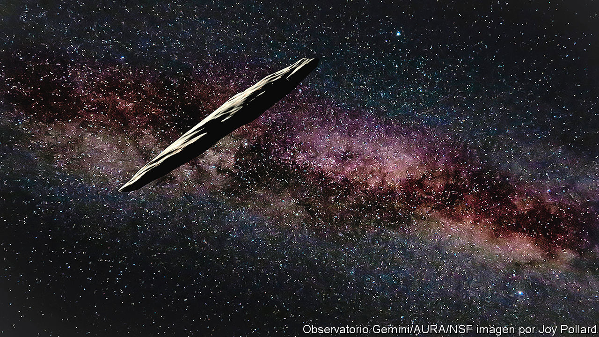
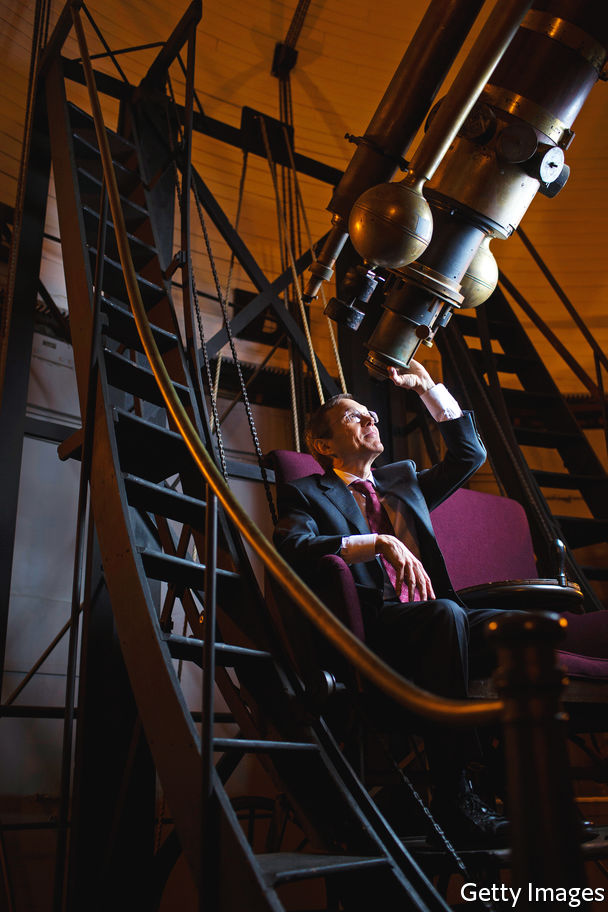

###### Black-sky thinking

# A distinguished astronomer sees evidence of extraterrestrial life 

##### And takes on his fellow scientists 

 

> Feb 13th 2021 


Extraterrestrial. By Avi Loeb. Houghton Mifflin Harcourt; 240 pages; $27. John Murray; £20


THE OBJECT came hurtling in from deep space, from the direction of Vega, a star 25 light-years away. It crossed the orbital plane of the solar system, within which the Earth and the other planets revolve around the sun, on September 6th 2017. Now under the influence of the sun’s gravitation, the object accelerated to around 200,000mph as it made its closest approach to the star on September 9th. Its trajectory then took it out of the solar system. A month after the object had arrived, it was well on its way back to interstellar space, moving towards the constellation of Pegasus. 


As it catapulted past the sun and began to head off, no one on Earth had any idea of the object’s existence. Astronomers at the Haleakala Observatory in Maui only discovered it on October 19th; it was hidden in the data collected by their network of telescopes, as a point of light that travelled too fast to be trapped by the sun’s gravity. They gave it a name: ‘Oumuamua.


In the weeks after this discovery, astronomers quickly confirmed that ‘Oumuamua (which loosely means “scout” in Hawaiian) was the first interstellar object recorded as having passed through the solar system. Initially it was thought most likely to have been an asteroid or a comet; but as 2017 drew to a close, the available data continued to puzzle scientists. Their analyses indicated that ‘Oumuamua was small (around 400 metres long) and shiny (perhaps ten times shinier than any asteroid or comet seen before). It seemed to have an elongated, cigar-like shape, at least five to ten times longer than it was wide. (Later it was generally deemed to have been flatter, like a pancake, as in the impression in the picture.) Astronomers had never seen anything like it. 


In addition to these physical peculiarities, ‘Oumuamua had travelled along a path through the solar system that could not be explained by the gravity of the sun alone. “This, for me, was the most eyebrow-raising bit of data we accumulated over the roughly two weeks we were able to observe ‘Oumuamua,” writes Avi Loeb, an astronomer, in “Extraterrestrial”, his account of the interstellar visitation. “This anomaly about ‘Oumuamua…would soon lead me to form a hypothesis about the object that put me at odds with most of the scientific establishment.”


For, after studying the available evidence, Mr Loeb concluded that the simplest explanation for the exotic strangeness of ‘Oumuamua was that it had been created by an intelligent civilisation beyond Earth. 

More things in heaven and Earth


By definition, scientists are meant to follow wherever the evidence leads them. Personal biases and prejudices can cloud the judgments of those seeking to understand the rules of nature—but the methods of modern scientific research, developed over hundreds of years and keenly honed in the past century, seek to reduce the impact of subjective human factors that could otherwise impede progress. 


Observations and data are the material on which scientists build their hypotheses. Those hypotheses are then ritually torn apart by other scientists and—if they can withstand sustained critiques and are not contradicted by further evidence from the real world—they might lay claim to being true. In science, changing your mind in the light of fresh information is seen as a good thing. If a new conjecture gathers supporting evidence and eventually supplants years of previous thinking on a topic, scientists are duty-bound to abandon the defunct ideas and embrace the new ones. The more radically an idea diverges from the mainstream, however, the greater the scrutiny it will inevitably face. Carl Sagan, an American astronomer, once summed this up: “Extraordinary claims require extraordinary evidence.”


That is the theory, at least. But like any profession, the path of scientific research can be influenced (both positively and negatively) by fashions and personalities, which can also determine who receives funding and which ideas get heard. Take the search for extraterrestrial intelligence, commonly known as SETI. Since the 1960s astronomers have been listening to the skies for any signs of radio signals sent out by technologically capable life beyond Earth. For most of its existence, though, SETI has been marginalised, dismissed as a lesser use of time and resources than the more prestigious study of black holes, subatomic particles, stars, galaxies and other “real” physics. The steadfastly radio-silent skies have not burnished SETI’s image as a discipline to be taken seriously. 

 


Mr Loeb says he has always found the hostility to SETI bizarre. Modern mainstream theoretical physicists, he points out, accept the study of spatial dimensions beyond the three (length, breadth and depth) with which people are familiar. Experimental evidence for these dimensions, however, does not exist. Similarly, many leading cosmologists think that this universe is one among an infinite number of others that exist together in a “multiverse”. But, again, experimental evidence for that proposition does not exist. String theory, the putative “theory of everything” that is meant to bind together the physics of the cosmos with that of subatomic particles, is considered scientific even though there is no direct evidence to prove it is real.

E.T. go home


Compared with these abstract theories, the notion that there could be life elsewhere in the universe, when it is known to exist on Earth, should not seem so radical a subject of study. Mr Loeb thinks resistance to it comes from two sources. First, the “laughable” popular narratives in which aliens lay waste to Earth’s cities and possess superhuman wisdom. He is no fan of science fiction that ignores the laws of physics.


But the more important reason, he says, is a conservatism within science, which is sustained by the desire of individual scientists to keep risk low and funding high:


The fact that accusations of conservatism in mainstream science are being levelled by an astronomer situated at the very heart of the scientific establishment may seem ironic. Mr Loeb has, after all, spent most of his career at prestigious American institutions, including a recent spell as the head of the astronomy department at Harvard University. He is also chairman of the board on physics and astronomy of the US National Academies. 


His prominent status in astronomy circles has ensured that Mr Loeb’s radical hypothesis has attracted widespread attention. All the same, and as he reports in his book, it would be “putting the matter mildly” to say that his idea has been met with disapproval by his scientific colleagues. Writing in Nature Astronomy in July 2019, a research team assembled by the International Space Science Institute concluded that it had found “no compelling evidence to favour an alien explanation for ‘Oumuamua”. It dismissed Mr Loeb’s theory as one not based on fact.


This is not his first brush with scientific celebrity. In 2016 he was the astrophysical brain behind Breakthrough Starshot, a $100m project funded by Yuri Milner, a Russian tech billionaire, the goal of which is to dispatch a fleet of tiny probes called Starchips to Alpha Centauri, the nearest star to the sun. They are to be equipped with cameras able to relay any signs of life they might find back to Earth.Mr Loeb worked out that it might be possible to accelerate a Starchip to around 20% of the speed of light if it were fitted with an ultra-thin sail and a 100-gigawatt laser were directed towards it for a few minutes. So launched, the Starchips would in theory make the 4.4-light-year journey to Alpha Centauri in between 20 and 30 years.


The Breakthrough Starshot project was announced a year before the discovery of ‘Oumuamua. The hunt for life elsewhere may well have been on Mr Loeb’s mind when he was contemplating the object’s most intriguing anomaly: the weird way it had moved past the sun.


In June 2018 scientists reported that ‘Oumuamua’s trajectory had deviated slightly from the one it might have been expected to follow if it had been determined purely by the sun’s gravitational attraction. As it passed the sun the object was pushed away by an unexplained force. Comets sometimes behave like this when they get close to the sun, but in their case the force is easy to explain: a tail of dust and gas is ejected from the ball of ice as it is heated by the sun, which gives the object a rocket-like push. Yet no such tail was detected near ‘Oumuamua.

Sailing close to the sun


Mr Loeb had another hypothesis: perhaps sunlight was bouncing off the object’s surface like the wind off a thin sail. A thin, sturdy, light sail, of the sort that he had himself proposed for the Breakthrough Starshot project, would be technically feasible for a more advanced civilisation. In any case, such a sail could not occur naturally; it would have to be engineered by intelligent beings.


He may or may not be right about ‘Oumuamua. But that hardly seems to make much difference to what is ultimately the mainthesis of his book. Conservatism may not be unique to astrophysics, he argues, but it is “depressing and concerning” given the huge number of anomalies still perceived in the universe. Mr Loeb is surely correct that scientists studying the vastness of the cosmos should entertain risky ideas more often, for the universe is undoubtedly more wild and unexpected than any extremes conjured by the human imagination. “Extraterrestrial” considers the possibility of intelligent life elsewhere, but its core message, an update to Sagan’s maxim, is aimed squarely at life on Earth: “Extraordinary conservatism keeps us extraordinarily ignorant.” ■


Dig Deeper


The search for life elsewhere in the universe is  and may even . In addition to our coverage, learn about Avi Loeb, , in our sister publication, 1843, and read our review of his book, .

