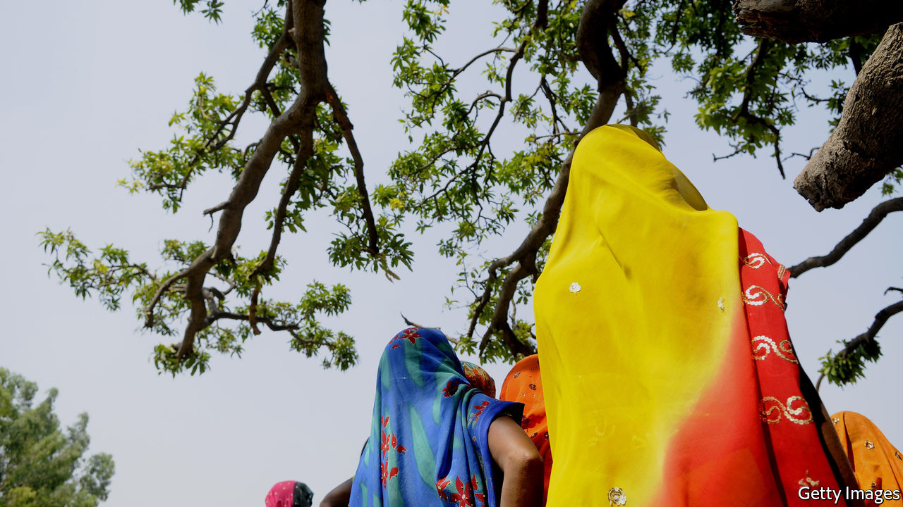

###### Death traps

# “The Good Girls” shows the costs of caste and poverty in India 

##### Sonia Faleiro investigates the opaque deaths of two teenage girls 

 

> Feb 13th 2021 


The Good Girls. By Sonia Faleiro. Grove; 352 pages; $26. Bloomsbury Circus; £16.99


AT THE END of May 2014 a photograph went viral on Twitter. It showed two girls hanged on a tree in Uttar Pradesh, in India. Their relatives were refusing to hand over the bodies to the state authorities, who they believed would never deliver justice for Padma and Lalli, inseparable cousins aged 16 and 14.


Like millions of others, Sonia Faleiro was horrified two years earlier by a gang rape on a bus in Delhi, where she grew up. That crime triggered protests and, ultimately, changes in policy. She set out to investigate what rapidly became the country’s most high-profile case since then.


The outrage in Delhi showed that, in India, “the wheels of justice move only under pressure from the powerful”. Violent crime was unremarkable; Uttar Pradesh, India’s “murder capital” and most populous state, recorded 12,361 abduction and kidnap incidents in 2014. But the low-caste Shakya family would not let their loss be dismissed by police whom they saw as inept and corrupt, and who were dominated by the Yadav caste then running the state government. The family eventually filed official allegations against three local brothers and two policemen. Amid the furore, all five were taken into custody.


International coverage followed the domestic kind. Television crews swarmed into the girls’ village of Katra Sadatganj; politicians’ helicopters landed among its tobacco and mint crops. Narendra Modi was sworn in as prime minister two days before the girls were found, but the “good days” that he promised seemed remote in a place where most households lacked running water and electricity. Forbes magazine’s latest global power list included several Indian women; meanwhile, two girls hung like “dangling puppets” in fields that were their only toilet. The gulf between India, nascent superpower, and its rural population—two-thirds of the total—was glaring.


After police bungling and a botched post-mortem, the Central Bureau of Investigation took over the case. They found no proof of rape. The family’s eyewitness accounts—describing four Yadav men snatching the girls—were contradictory. Ms Faleiro, previously the author of an acclaimed book about Mumbai’s dance bars, asks probing questions. Why had Lalli’s father bought a phone for Padma that auto-recorded calls? Where was his own phone, which held evidence of a conversation between Lalli and a local youth who now stood accused of rape and murder? Why were the girls’ bodies unmarked?


The truth that emerges underscores “the powerlessness of the poor” and the stranglehold of the caste system and honour codes. If the Delhi case highlighted the dangers of public spaces, the hangings showed that “an Indian woman’s first challenge was surviving her own home”. Asked how he might have defended the girls’ tainted reputations, Lalli’s father replied, “We would have killed them.” Mr Modi emphasised women’s safety, yet took a fortnight to acknowledge the girls’ deaths.


Ms Faleiro’s pithy, cliffhanging chapters fuse true crime with big-picture analysis, blending data with interviews and detail. The result is a sobering portrait of a country where progress has been undermined by inequality, short-termist politics and Mr Modi’s divisive Hindu nationalism. It is a powerful indictment of a society failing its most vulnerable members. ■

