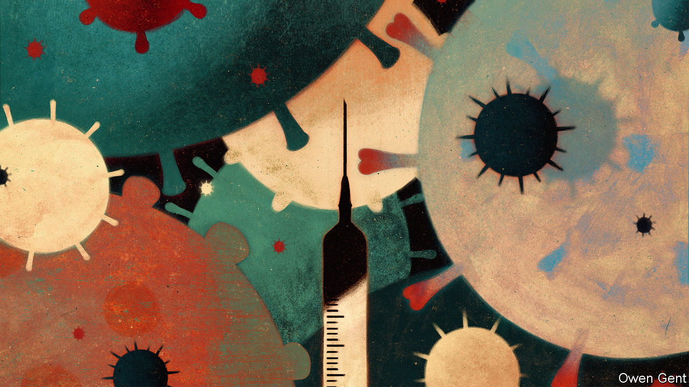
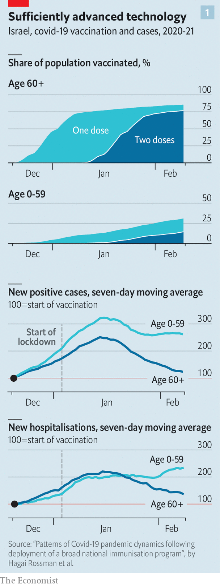
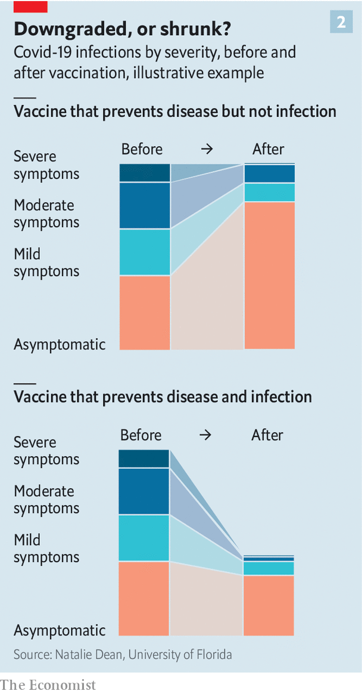

###### Vaccine efficacy

# When covid-19 vaccines meet the new variants of the virus 

##### A lot depends on blocking transmission not just disease 

 

> Feb 13th 2021 


ON FEBRUARY 1ST researchers around the world saw the tweet for which they had been waiting: “We say with caution, the magic has started”. Eran Segal, a scientist at the Weizmann Institute, had been posting regular updates on the course of Israel’s covid-19 epidemic since its mass vaccination campaign had begun six weeks earlier. By February 1st he was seeing the number of hospitalisations dropping significantly among the over-60s—a cohort in which the number vaccinated had reached 70%, seen as a crucial level, three weeks before. After an expected but still somewhat nail-biting lag, the vaccine was doing its thing.


By February 6th about 85% of the over-60s in Israel—and 40% of the general population—had received at least one dose of the Pfizer/BioNTech mRNA vaccine (or in a few cases the Moderna mRNA vaccine) and 75% of the over-60s had received their second dose, too. In that age group hospital admissions for covid-19 were about two-thirds what they had been at their peak in January and still falling (see chart 1). At the same time, the country as a whole was seeing its caseload rise.


The vaccine was not the only thing which arrived in Israel late last year. So did B.1.1.7, a highly contagious variant of SARS-CoV-2, the virus responsible for covid-19, which was first identified in Britain in September. It set about filling up hospital wards in Israel just as it has done in Britain, Ireland and Portugal. Despite an extended lockdown it is still doing so.

 


It is no surprise that SARS-CoV-2 has evolved new biological tricks over a year spent infecting more than 100m people. But the near simultaneous arrival of not just B.1.1.7 but also B.1.351, which is now the dominant strain in South Africa, and P.1, a variant first seen in Brazil, is making the roll-out of mass vaccination more complicated and more confusing than might have been hoped when the first evidence of safe, effective vaccines became available last November. How fast the various new variants can spread, how well today’s vaccines work against them and how soon new vaccines better attuned to them—and to the other variants which will turn up over time—become available will determine the course of the pandemic.

Testing the bounds


As of February 10th at least nine vaccines had been authorised for use in one or more countries. The Pfizer/BioNTech vaccine, first out of the gate, has now been authorised for use in 61, as well as for emergency use by the WHO. The number of doses administered, 148m, now exceeds the number of confirmed covid-19 cases recorded over the entire course of the pandemic. All of the vaccines appear very good at preventing severe cases of covid-19 of the sort that lead to hospitalisation and/or death; in trials which compared the vaccinated with control groups the efficacy with which the various vaccines prevented these outcomes was 85-100%.


Their efficacy against all symptomatic cases of the disease found in trials has been lower, ranging between 66% and 95%. Some of that range is down to intrinsic differences between the vaccines. Some is down to trials being done according to different protocols and in different populations, sometimes against different variants of the virus. It is hard to disentangle such effects. The general message, though, is fairly clear. The vaccines make serious cases of all sorts very rare, and mild-to-moderate cases caused by the original strain of the virus a lot rarer than they would be otherwise.


That is undoubtedly good news; it lessens the death toll, the suffering and the strain on hospitals. But the situation is not perfect. For one thing mild and moderate cases can be worse than they sound. Many cases of “long covid”, a debilitating form of the disease in which some effects last for months, follow original infections that were not severe enough to require hospital admission. It is not yet clear whether long covid is less likely in people who have been vaccinated.

 


What is more, this pattern of effects does not reveal what the vaccines are doing about transmission. As Natalie Dean, a biostatistician at the University of Florida, points out, there are two ways one can imagine a vaccine bringing about the pattern of protection the covid-19 vaccines have been seen to provide (see chart 2). In one of them the same number of infections occurs as would occur otherwise, but the consequences of these infections are systematically downgraded. Thus almost all of the infections which would lead to severe cases lead to moderate or mild cases, and many of the infections that would have led to moderate or mild cases produce no symptoms at all.


The alternative is that the total number of infections is being reduced, but the ratio of severe to mild to asymptomatic cases stays roughly the same. The already low number of deaths and hospitalisations shrinks to something hardly there. The number of mild cases is similarly deflated (although, since bigger, remains palpable). And so is the number of asymptomatic cases. Indeed, the main difference between the two scenarios is that in one the asymptomatic cases rise, and in the other they fall.

The passing game


In the real world there is almost certainly a bit of both going on: lower infections overall and a lessening of the symptoms that follow, with different vaccines offering different profiles. But considering the two extremes is still instructive. Vaccines which do little more than downgrade the symptoms will be doing relatively little to stop the spread of the virus. Honey-I-shrank-the-infections vaccines, on the other hand, will be making a big dent in the epidemic’s now infamous R number—the number of new infections to which each infection gives rise. If you imagine reducing what are known as “non pharmaceutical interventions”—masks, social distancing, shelter at home orders and the like—that difference would begin to matter a lot.


Some people will not be vaccinated, either because of pre-existing conditions which make it dangerous for them, because there isn’t enough vaccine for everyone, or because they choose not to (see ). If the vaccines are basically downgrading symptoms, then these unvaccinated people will be at risk. If they are making the virus less transmissible that risk will be lessened.


A covid-19 vaccine that is highly effective in preventing transmission will, therefore, be particularly useful. According to a model by Imperial College London, all other things being equal, a vaccine that blocks 40% of infections and thus prevents 40% of disease would have a similar impact on the number of covid-19 deaths as a vaccine that got rid of 80% of disease but left infection untouched.


Epidemiologists are waiting with bated breath for results that will tell them how good existing vaccines are at reducing asymptomatic infections and infectiousness. Data from Israel suggest that the viral load in swabs from infected individuals is lower if they have been vaccinated. Clinical trials of the Oxford/AstraZeneca vaccine suggest that the jab may halve infections as detected by PCR tests. Such results suggest that covid-19 vaccines are likely to reduce overall transmission of the virus. But understanding quite how much transmission is blocked—and the degree to which some vaccines are better at blocking transmission than others—will take months.


And then there is the further complication of the new variants. Vaccines seem to have no particular problem with B.1.1.7. It just complicates things by running through the unimmunised parts of the population that bit faster. B.1.351, which has now been found in more than 30 countries, is of greater concern. At least three vaccines—those from Oxford/AstraZeneca, J&amp;J and Novavax—have been found to be less effective at stopping it from causing disease than they are against variants elsewhere. There is increasing evidence that P.1, now also reported in a number of countries beyond Brazil, also appears to be better at avoiding immunity created by prior infection and by some vaccines.


Countries that have already vaccinated a lot of people could be brought back to square one by the spread of such variants. Britain, where 13m people had been vaccinated as of February 10th, and millions more have been infected and thus have some immunity (British studies have found reinfection very rare for at least five months), is trying hard to keep B.1.351 from making inroads in the population. Health authorities are mass-testing neighbourhoods where cases of B.1.351 have been spotted and are doing particularly meticulous contact tracing when a case is found. Border controls have been tightened.

Eking out an advantage


Not all such new variants can be spotted and stopped at borders. Mutations can arise anywhere—sometimes the phone call is coming from inside the house. But there may be a limited range of mutations about which people need to worry. The new variants all differ from the original virus and from each other in various ways. But P.1 and B.1.351 both share a particular mutational quirk—technically called E484K but mercifully nicknamed Eric or Eek—which makes a specific change to the spike protein on the outside of the virus. Eek has now been found in some isolates of B.1.1.7. too. Researchers are beginning to think that the change Eek represents is what allows those variants to infect people even if they have been vaccinated or previously infected.


It would be great if there were no vaccine-resistant strains. But given that there are, the possibility that they are all using the same trick offers a bit of comfort. It suggests that Eek may be the best way for new variants to avoid immune responses capable of dealing with the original strain, or at least the way evolution can most easily find. If the variants have all converged on the same trick, tweaking vaccines to protect against one may protect against all—and against any later variants to which natural selection teaches the same ruse. If the virus had found a whole panoply of ways by which to avoid existing immune responses things would look a lot worse.


Whether or not Eek turns out to be crucial, new ways of broadening immunity are on their way. Some vaccine-makers are developing booster shots designed to help people vaccinated with earlier versions of their jabs deal with new variants. Others are developing vaccines intended to work for multiple SARS-CoV-2 variants straight away. On February 3rd GlaxoSmithKline and CureVac, a German biotech company with an mRNA vaccine in late-stage clinical trials, added their names to those developing such “multivalent” vaccines.


Tweaked covid-19 vaccines will not be required to go through large scale clinical trials to prove their efficacy, any more than updated seasonal flu shots do; small trials that look for markers of immunity in the blood may suffice. Britain’s National Health Service, which should be able to vaccinate all adults who choose to be jabbed by the end of the summer, is already starting to make plans for a round of covid-19 booster shots aimed at new variants in the autumn. Increased surveillance may yet provide advance warning of which variants need to be dealt with by subsequent tweaks. It will take luck, diligence and hard work, but the magic that started at the beginning of this year may be made to last for many years to come.■


Dig deeper


All our stories relating to the pandemic and the vaccines can be found on our . You can also listen to , our new podcast on the race between injections and infections, and find trackers showing ,  and the virus’s spread across  and .

