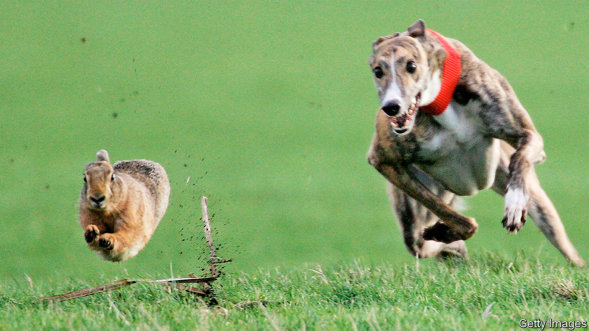

###### Rule-breaking

# A secret world of illicit fun 

##### Many Britons are breaking the rules in many different ways 

 

> Feb 13th 2021 


ALEX, A CRYPTO-CURRENCY trader in east London, is a party animal. For a while covid-19 put a brake on his hedonism, but during this lockdown the boredom got too much, so he has started attending cocaine- and spirit-fuelled parties once more. At the last bash, in January, there were 40-50 people. He is not surprised it was so well-attended: his friends, he says, are “a bunch of degenerates…Liberal progressive people don’t give a toss anymore.” One such soirée was so raucous that it exploded onto the street, where two guests scrapped. Alex says the neighbours did not call the police because they host similar gatherings.


When the pandemic began Britons embraced a wholesome 1950s-style of living. Sales of board games and bicycles soared, while social-media feeds were swamped with photos of homemade sourdough bread. Most people may have stuck to such blameless pastimes. In a survey by Ipsos MORI in January, 78% of Britons claimed to follow the government’s rules.


But Robert Dingwall, professor of social sciences at Nottingham Trent University, reckons a parallel society is emerging. It is, he says, “very much like eastern Europe in the old days... not entirely secret but carefully organised so not to come to the attention of the authorities.”


Despite an £800 ($1,100) fine introduced in January for anyone attending a gathering of more than 15 people, police regularly break up large house parties. Last month, a raid on an upmarket party in Knightsbridge saw two officers injured as attendees fled. Security-conscious promoters are doing their best to avoid unwanted publicity. Some use Telegram, a secure messaging app, to advertise exclusive parties. “No photos or videos,” read one flyer for a party held on February 6th with an entrance fee of £10. Cannabis cafés and poker clubs have also been shut down.


Sport has gone underground, too. Across Britain, youths have been scaling fences to break into skateparks—often abusing officials who try to stop them. But skaters are also disappearing into the shadows, says an enthusiast, by building their own skateparks in wasteland and woodland areas, some from concrete. Amateur footballers have broken into pitches for kickabouts. On January 31st police stopped a football game involving more than 20 people in Dartford, Kent. Meanwhile, police in Shropshire say car races are taking place on farmland. Hare-coursing—setting greyhounds to chase hares, which is illegal—is all the rage in the Midlands. In January, a large gathering was broken up by police in Peterborough and fines were issued.


Another marginal pursuit that has flourished during lockdown is group sex in outdoor locations, or dogging. Locals who live near notorious sites have reported increased activity in lockdown; in Birdlip, a Gloucestershire village, there was even a report of goings-on at lunchtime. On February 4th, Police Scotland dispersed over 50 doggers from a Paisley car park; which, given the chilly northern temperatures, showed an impressive level of commitment. It is such a problem in Hampton-in-Arden, a West Midlands village, that a security gate has been installed to close off a popular lane. “It is just not what you’d expect from an affluent village in Solihull,” says a councillor. ■


Dig deeper


All our stories relating to the pandemic and the vaccines can be found on our . You can also listen to , our new podcast on the race between injections and infections, and find trackers showing ,  and the virus’s spread across  and .

