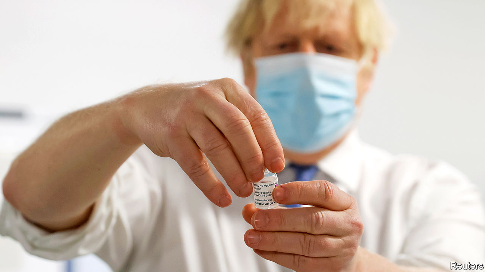

###### Hands on

# Boris Johnson’s NHS prescription: more control, less competition 

##### The government sets out its plan for the first major health-service legislation in a decade 

 

> Feb 13th 2021 


ONCE UPON a time, an ambitious young Tory MP could write columns mocking bien-pensant pieties about the health service—dinner-party attendees who thought “how maahvellous it was that the duke and dustman were treated alike in our glorious New Jerusalem, watching the same TV, eating the same spotted dick, attended by the same starch-bosomed nurses.” When that was written, in 2004, Tories liked to flirt with the idea of adopting the social-insurance systems seen in much of Europe. At the very least, they would argue, the health service’s internal market ought to be sharpened to raise standards and cut costs.


Now that MP is the prime minister, he treats the NHS with rather more reverence. The health service is, Boris Johnson says, “the beating heart of this country...It is powered by love.” His government’s prescriptions for it also differ. A white paper, due to be published as The Economist went to press but leaked beforehand, sets out plans for the first major NHS legislation in a decade. They would put the final nail in the coffin of the internal market—competition will no longer be the “organising principle” of the health service—and would give ministers more direct control over the NHS.


The country’s current rulers believe they express the will of the British people, and are therefore justified in grabbing power from any institution that gets in their way, whether the EU, the courts or bureaucrats in the civil or health service. But politicians mess with the NHS at their peril. Although health outcomes are below par for the rich world, Britons love the health service with a deep and abiding passion. This gives medics enormous power.


The fate of the last politician to try to reform the health service serves as a warning. In 2011 Andrew Lansley, health secretary in the Tory-Lib Dem coalition, set out to abolish almost all national and regional management by extending the use of market mechanisms, and to take oversight of the system out of political hands. Although the legislation he promoted eventually passed, it met strong opposition. Mr Lansley was sacked, and the officials put in charge of the NHS largely ignored the changes his legislation sought to introduce.


The Conservative Party has taken a more cautious approach to the health service of late. At the general election in 2019, Mr Johnson promised the NHS lots of money to build hospitals and hire nurses. There was no mention of traditional Tory cost-cutting demands. The reforms in the new white paper are happening partly in response to the requests of NHS bosses.


Although the internal market helped cut waiting times, there is not much evidence it improved the quality of care. And the split between purchasers (mostly GPs) and providers (mostly hospitals) makes the health service unwieldy. As the population ages, fewer patients go to hospital for a single operation, and more need care for a complex set of problems. The hope is that integrated care, of the sort pioneered in Singapore and by Kaiser Permanente in America, will serve them better than the fragmention of an internal market.


Integrated care’s introduction to the NHS has been driven by Sir Simon Stevens, the health service’s boss, who has brought purchasers and providers together to plan care for areas covering 1m-3m people. The white paper suggests sweeping away remaining barriers, such as procurement rules and regulation, and giving the centre powers to overcome local resistance.


Health wonks mostly approve of the direction of travel. Worries, where they exist, are about details. The most concerning, says Nigel Edwards of the Nuffield Trust, a think-tank, is that the proposals may end up creating unaccountable local monopolies. Jeremy Hunt, a former health secretary, suggests setting up a body along the lines of Ofsted, which inspects schools, to guard against this; others would like more performance data published so that officials can be held to account.


But while those in the business mostly approve of the first part of the government’s plans, they do not like the second. Mr Lansley’s reforms created a clear division between politicians and the NHS. The government sets the priorities and appoints the boss; the technocrats are left to work out the details.


Nicholas Timmins, a historian of the health service, thinks the set-up has led to more consistent policymaking: “There have not been endless announcements in recent years, ‘Oh well, we’re going to spend £40m ($55m) on dementia or £60m on cancer because the minister needs to say something.’” Supporters of the NHS’s independence point out that organisations under ministerial control—such as Public Health England and the test-and-trace system—have not had successful pandemics. The NHS has done a better job.


The white paper would put the government back in control, giving it, among other things, the ability to abolish or alter the arm’s-length bodies that make up the health service without new legislation. The political rationale is that since the state spends more than £160bn a year on health care, around 7% of GDP, ministers (or, as they prefer to put it, taxpayers) should have more say over how it is run. A cruder explanation is that the government is annoyed that Sir Simon runs rings around it, whether in funding negotiations or questions of data access, and gets credit when things go well. Politicians also like to be able to influence decisions that matter to voters—over, for instance, the fate of an inefficient hospital in a marginal constituency. Shutting it may be the right decision for health care, but the wrong one for a government clinging to power.


Knowing how fraught any legislative process involving the NHS can become, the government has played down the significance of these new powers. Mr Johnson will be loath to get into an argument with medics, so he will hope they do not rally to the defence of the officials who run the health service. At times, the NHS really is powered by love. But it can also run on anger—a frightening prospect to any politician, especially one who came to power posing as its protector. ■

