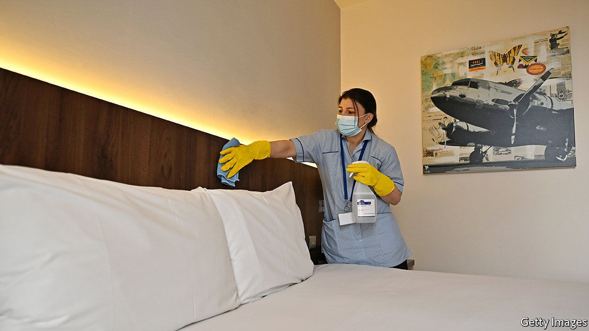

###### Grounded

# Britain’s belated quarantine scheme 

##### The punishment for breaking the new rules is up to ten years in jail 

 

> Feb 10th 2021 


BY FEBRUARY 15th last year, only nine cases of covid-19 had been confirmed in Britain. On that day, the Times reported that the government’s existing flu pandemic strategy suggested closing the country’s borders would be pointless since it would probably hold back the virus by only a couple of weeks. “What we are seeing are the droplets before the wave,” a government official said then. Exactly a year on, as the country’s tally of cases edges over 4m, the flood defences are finally going up.


From February 15th, residents arriving from a list of 33 countries deemed especially risky will have to spend ten days in quarantine (non-residents are banned entirely). They will be charged £1,750 ($2,425) each for the privilege of being locked up in an airport hotel. Other incomers also face a beefed-up regime: “travel corridors” that allowed arrivals from low-risk countries to dodge quarantine have been scotched; three covid tests—one before departure, two in isolation—are mandatory. The idea is to minimise transmission of new variants of covid-19, such as the South African strain which public-health officials believe has yet to take hold in Britain.


Penalties for non-compliance are draconian—fines of up to £10,000 for those who flout test or quarantine rules and fines or prison sentences as long as ten years for anybody who attempts to conceal their arrival from one of the highest-risk countries. That may deter would-be rule-breakers, even though such a sentence is unlikely ever to be passed and would lie in the gift of judges, not ministers.


Yet, as with the government’s warning last year that vandals who desecrate war memorials could spend a decade in jail, they are not the intended audience. Like that proposal, this one is extremely popular: according to YouGov, a pollster, about two-thirds of Britons think the proposed penalty for misleading border officials is about right or not tough enough. Ministers want to undermine the impression that, compared with countries like Australia and South Korea, they have taken a laid-back approach to the border. The Scottish government will use devolved powers to insist on hotel stays for all incomers. They will not find chocolates on their pillows. ■


Dig deeper


All our stories relating to the pandemic and the vaccines can be found on our . You can also listen to , our new podcast on the race between injections and infections, and find trackers showing ,  and the virus’s spread across  and .

