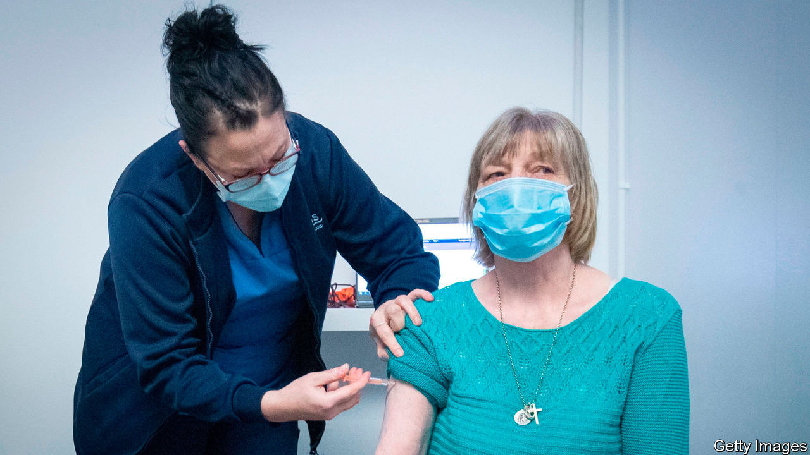
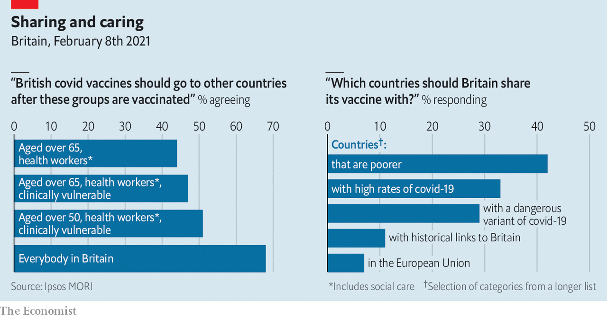

###### Exporting vaccine

# Britons are keen to share their vaccine supplies 

##### Our poll shows people want poor countries to get priority 

 

> Feb 13th 2021 


BRITAIN EMBARKED on a vaccine shopping spree last year, securing 367m doses of seven potential candidates. Since three have been approved and two delivered good late-stage trial results, ministers are in the fortunate position of weighing up whether to share the stash. Liz Truss, the trade secretary, says Britain can’t be a “vaccinated island”.

 


Polling by Ipsos MORI for The Economist shows that the public is enthusiastic. More support than oppose—47% to 32%—exporting vaccines once everyone over 65, health workers and the clinically at-risk have been vaccinated; 51% would support doing so when those over 50, plus those other groups, have had the jab. The government reckons it can give the latter group the first dose by May. When people were asked whether vaccine should be given away or sold, the most popular option was to give it to poor countries and sell it to rich ones; asked which countries should be given priority, most went for poor ones. Only 7% said the EU should be given priority.


Dig deeper


All our stories relating to the pandemic and the vaccines can be found on our . You can also listen to , our new podcast on the race between injections and infections, and find trackers showing ,  and the virus’s spread across  and .

