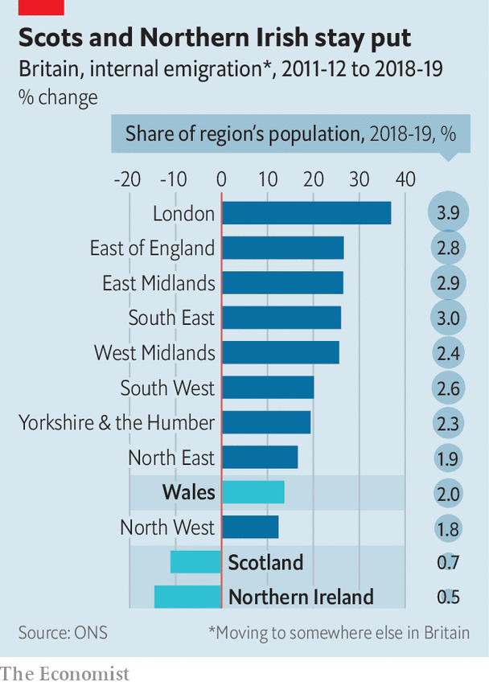
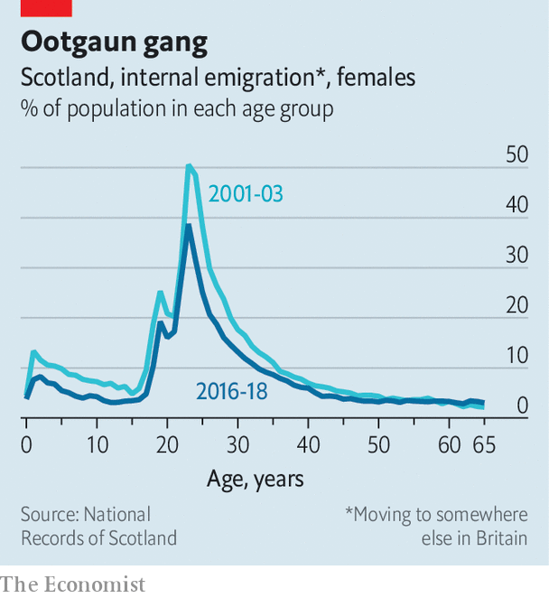

###### No place like home

# Migration between England, Scotland and Northern Ireland is falling 

##### That could weaken the union 

 

> Feb 13th 2021 


IN THE EARLY 1990s Tennent, a Scottish brewer, ran a television advert designed to play on the homesickness of migrant workers in London. A Scottish office drone, yearning for the pubs of his homeland, endures crowded Tube trains, argumentative Cockneys and foreigners as the song “Caledonia” plays in the background.


Many young Scots at the time emigrated to the rest of the United Kingdom in search of work or excitement. “I was desperate to travel to London,” remembers Melanie Hill, who graduated from Strathclyde University in 1993 and now works for ScottishPower, an energy company. In 1987, the peak year of emigration, 65,000 people—one in every 78 Scots—left for England, Northern Ireland or Wales. But the flow has slowed, as have the other streams that carry people between the four nations.


Unlike America, Britain has not experienced an overall decline in internal migration. Before covid-19 struck, movement between most of the UK’s 12 regions (nine of which are English) was growing, as the economy and the housing market recovered from the financial crisis. Two exceptions stick out, however. Northern Ireland and Scotland, which anyway send the smallest proportions of their residents to other parts of Britain, are holding onto even more of them (see chart). In 2018-19 Scotland lost just one in 146 people.

 


Patterns of study have a lot to do with this. In the 1994-95 academic year 6.2% of Scots studying full-time for a first degree attended English universities, and 2.8% of English students were in Scotland. In 2019-20 the proportions had fallen to 4.4% and 1.6%. The proportion of Northern Irish students studying in Scotland has dropped even more sharply, from 14.5% to 8.1%.


Jim Shannon, a Democratic Unionist Party MP, suggests that some Northern Irish people might have been put off by Scotland’s burgeoning independence movement; nobody is hotter for the union than an Ulster Protestant. But the widening gap in tuition fees is probably more important. Northern Irish students pay £4,395 ($6,062) a year to study in their own country, while Scots generally pay nothing if they stay in Scotland. Both are liable for £9,250 a year if they study elsewhere. The demographic effect in Scotland was not an accident: the Scottish National Party cut tuition fees partly in order to discourage students from leaving.


After graduating, Scots have good reasons to hang around. Charlie Ball of Jisc, an education outfit, points out that the cull of civil servants after the financial crisis was milder in Scotland than in England or Wales, so there are more secure jobs. Glasgow, which used to send many people to England, has become a confident, successful city. Linda Murdoch, who runs the University of Glasgow careers service, says it is quite hard to persuade graduates even to go to Edinburgh.


If young Britons are less likely to cross the kingdom’s internal borders to study, they are also less likely to meet people from the other countries, fall in love with them, and have children with them. Since 1997 the proportion of Northern Irish babies born to a mother from England, Scotland or Wales has fallen from 7.3% to 4.8%. There has been a smaller decline in Scotland over the past decade.


Britons are also less likely to take trips to other bits of the kingdom. According to Visit Britain, which organises large surveys, English people accounted for 57% of all British tourist trips to Scotland in 2011, measured by number of nights. Since then Scots have toured their own country more and the English have made fewer trips there; in 2019 English people accounted for 50% of the total. Scotland is just as beautiful as it always was. But people often travel to see friends and attend weddings. If they know fewer people in another country from university or work, they have less reason to go.

 


If England, Northern Ireland and Scotland are all becoming more insular, Wales has the opposite problem—a brain drain. Dawn Bowden, who represents Merthyr Tydfil and Rhymney in the Senedd, says that young people in her constituency who do well at school want to spread their wings. Welsh students pay roughly the same fees everywhere, and get a bigger maintenance grant if they study in London. Over the past few years the number of Welsh teenagers who apply to study in Wales has fallen.


Meanwhile, Ms Bowden says, South Wales has seen an influx of English workers who commute to jobs in Bristol—something that may have increased since 2018, when tolls to cross the Severn river were abolished. She is relaxed about this cross-border traffic. South Wales and the west of England have a long history of migration to and fro, she says. Besides, she also moved to Wales from Bristol.


In one way, the growing insularity of Northern Ireland and Scotland is a good sign. It reflects the success of their major cities, which ought to recover when Britain gets on top of covid-19. But it might hurt them in the end. Scotland in particular is about to experience a nasty demographic crunch: the country has 382,000 25- to 29-year-olds but only 282,000 15- to 19-year-olds. Westminster will not allow Edinburgh to run its own immigration policy. It might have cut itself off from the rest of the United Kingdom just as it would most benefit from a bit of ebb and flow.


The lack of mixing is also a bad omen for the United Kingdom. Many English are already ambivalent about the union—a recent poll for the Sunday Times found less than half would mind if Scotland left, and less than a third would be upset by Irish reunification. The more the nations grow apart, the less they are likely to care. ■

