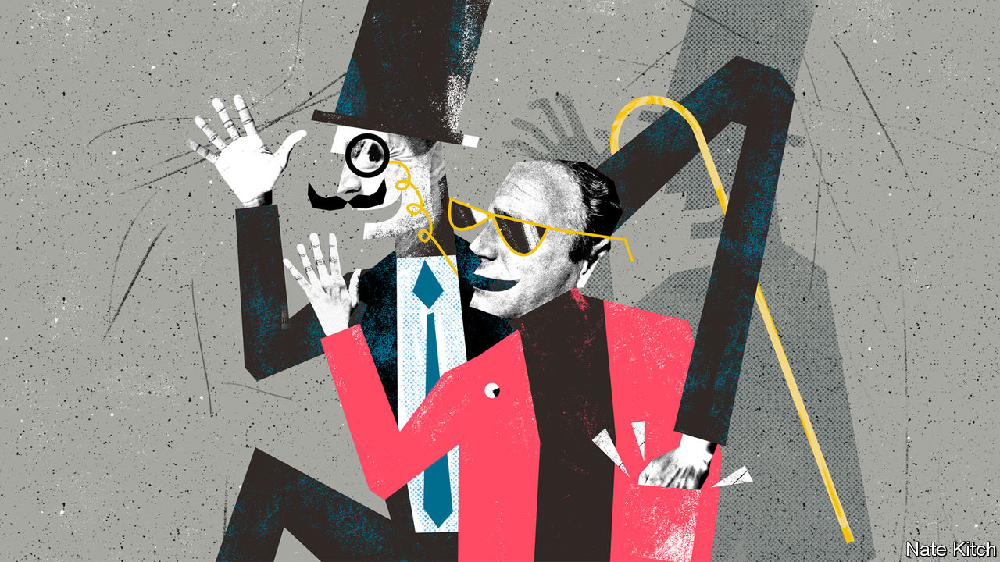

###### Bagehot

# The British establishment is the world’s most open—for a price 

##### Rich foreigners get a warm welcome, whatever the source of their money 

 

> Feb 13th 2021 


SOMETIMES FICTIONAL characters are so vivid that they cannot be confined to the page. Augustus Melmotte began life as a villain in Anthony Trollope’s 1875 masterpiece “The Way We Live Now”. Seventy years later he escaped into the real world in the form of Captain Robert Maxwell, a Czech war hero whose extraordinary rise and fall is the subject of a new book (see ).


Melmotte is a large man with heavy eyebrows and a “wonderful look of power about his mouth and chin”. Nobody knows where he came from, and nobody knows why he’s so rich, though there are rumours of chicanery in Paris and Vienna. But none of this is a barrier to his social ascent. He sets up a company that promises to build a railway linking Utah with Mexico and throws lavish parties at his rented house in Grosvenor Square. The Emperor of China comes to dinner along with various ministers and “a prince of the blood royal”. He swiftly becomes a Conservative MP for the plum seat of Westminster.


Melmotte and Maxwell are doppelgangers all the way down to the heavy eyebrows. But the most important similarities between the two lie not in their physiognomies but in the way they are treated by British society. The real target of Trollope’s novel is not the monstrous Melmotte but the even ghastlier “we” of the book’s title—the Lords and Ladies Monogram with the grandest of pedigrees and the basest of motives. Impoverished aristocrats promise to marry Melmotte’s daughter for “half a million down”. Dissolute young men who know nothing about either railways or Utah accept well-paid seats on his board. The Conservative Party takes him up in return for “fiscal assistance” and, as a newly minted MP, he enters Parliament on the arm of the prime minister. And they do all this while privately despising the newcomer who doesn’t understand the secret codes that hold British society together. (A particularly excruciating passage describes Melmotte’s confusion about when to wear a top hat in the chamber.)


The British establishment prides itself on openness to foreign talent. Look at the City of London: Rothschild’s bank has occupied the same spot in New Court, St Swithin’s Lane, since 1809. Or look at the world of learning: while Maxwell was swindling shareholders imported geniuses were revolutionising almost every branch of learning from English history (Lewis Namier) to architecture (Nikolaus Pevsner) to the history of ideas (Maxwell’s neighbour in Oxford, Isaiah Berlin). When Berlin died in 1997 William Waldegrave, a man at the heart of the British establishment who is now provost of Eton, wrote that “if you had asked me to show you what I meant by the ideal of Englishness…I would have taken you to see Isaiah Berlin.”


But the stories of Melmotte and Maxwell reveal a darker side to British openness. The apparently generous welcome is actually the offer of a deal: social position, and the stamp of respectability that goes with it, for cash.


Consider the transatlantic marriage market: in the late Victorian and Edwardian era great British aristocrats responded to the agricultural depression by marrying their sons to the daughters of American plutocrats. By 1914, 60 peers and 40 younger sons of peers had married American heiresses, most notably the ninth Duke of Marlborough who married Consuela Vanderbilt. Or consider political funding. Lloyd George’s great honours fire-sale of 1916-1922, when he sold 91 hereditary peerages and 1,500 knighthoods, ground to a halt only when he tried to ennoble Joseph Robinson, a South African gold and diamond magnate whose reputation was so unsavoury that George V objected. Harold Wilson’s resignation honours list in 1976 included the names of several businessmen who may have taken buccaneering to unusual lengths. Joseph Kagan, for example, a Lithuanian-born textile maker who funded Wilson’s private office for years and provided the prime minister with his trade-mark Gannex raincoats, was awarded a peerage, only to end up in prison for tax fraud.


Thanks to globalisation, the trade in cash for respectability has boomed since the demise of Maxwell, who disappeared off his yacht in 1991. Oliver Bullough, the author of “Moneyland”, points out that Britain, particularly London, is home to the world’s largest collection of insecure plutocrats: not just attention-seeking Russians who buy flashy toys like football clubs, but also the more self-effacing Chinese. They have spawned a vast industry of people who do their best to make sure that, in Boris Johnson’s phrase, Britain is to the billionaire what the jungle of Sumatra is to the orangutan: City panjandrums who list foreign companies on the London Stock Exchange; lawyers who protect their reputation with fearsome libel suits; public-relations consultants who burnish their image; family offices that not only look after their cash but also help open the right doors; public schools that furnish their children’s brains, polish their manners and get them admitted to the best universities. Residency in Britain is for sale: a Tier One Investment visa is available for a minimum investment of £2m in the country—a very reasonable price given the many social and economic advantages that it confers.


Britain’s political establishment remains as venal as it was when Trollope skewered it a century and a half ago. Sometimes the greed is Lloyd-Georgian in its crudity: last year Lubov Chernukhin, the wife of a former Russian finance minister, paid tens of thousands to play tennis with Boris Johnson. Usually it relies on a nod and a wink. Evgeny Lebedev, the son of a former KGB agent and a familiar figure in Tory circles, until recently employed George Osborne, a former chancellor, as editor of the Evening Standard, and has entertained Mr Johnson at his “party-castle” in Italy. He was recently elevated to the peerage as Lord Lebedev of Hampton and Siberia. The Melmottes and Maxwells of this world may come and go. But the British upper classes go on forever, shape-shifting but sempiternal, sponging but self-satisfied, lethargic but opportunistic, the world’s most cynical and accomplished free-loaders. ■

