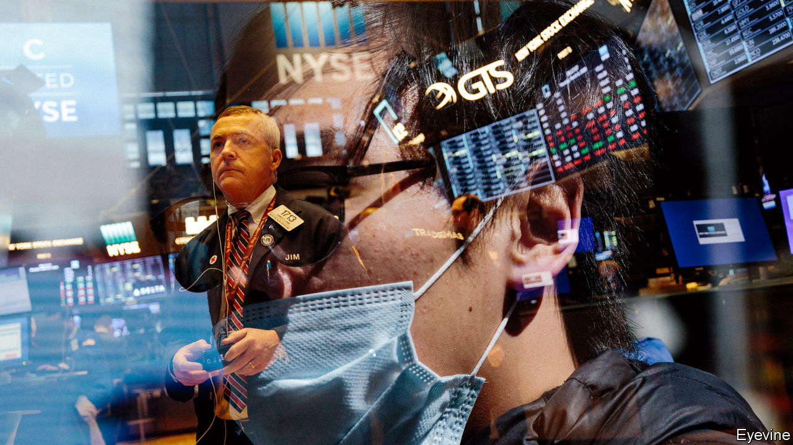
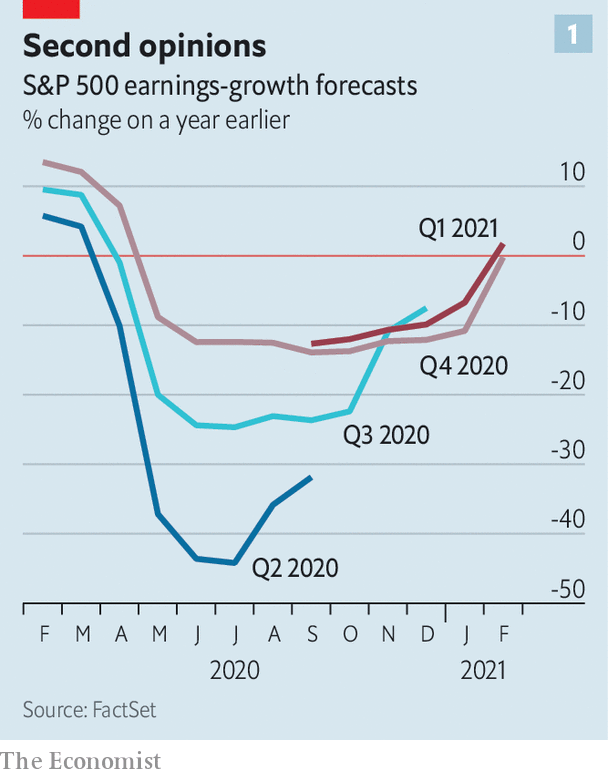
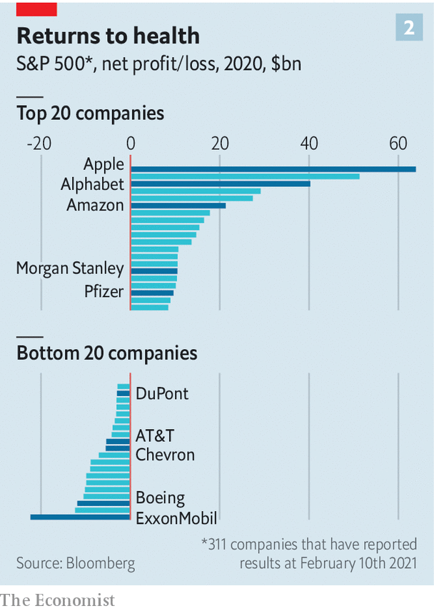
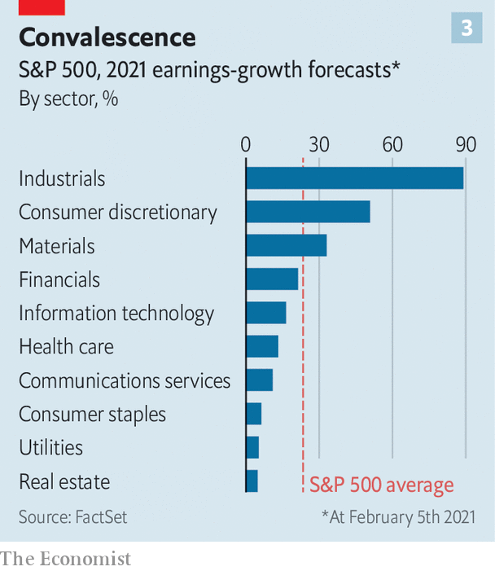
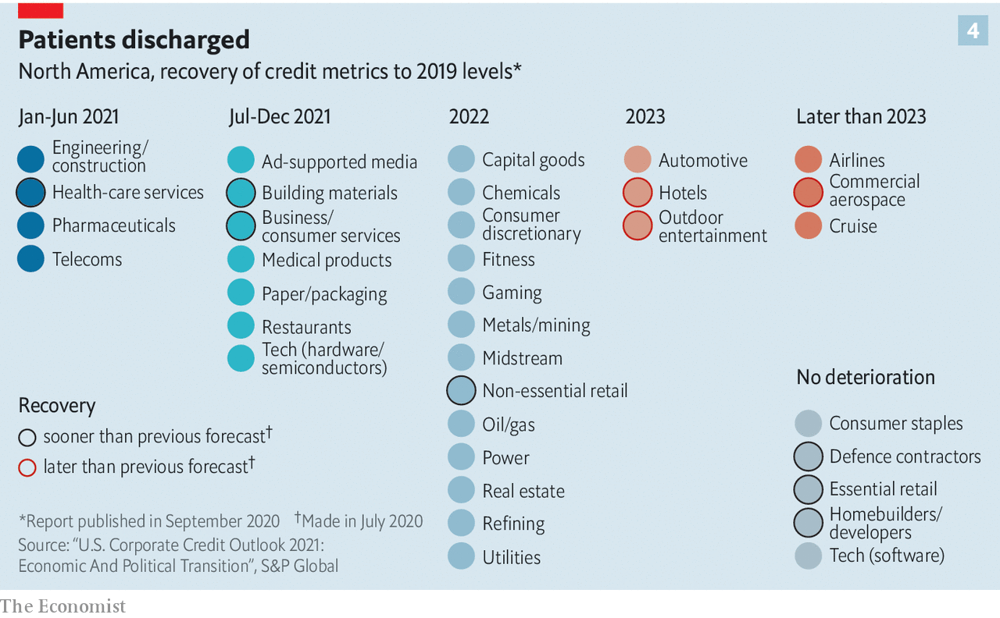

###### Harbingers of boom

# America Inc has survived the oddest year in modern times. What next? 

##### Stockmarkets are pricing in an economic snap-back and growth on top of it. That may be too rosy 

 

> Feb 9th 2021 


BEFORE THE covid-19 pandemic investors favoured companies with strong sales growth, low debt and high return on assets. In the past three months, they have been ploughing money into smaller, underperforming firms that have barely survived the coronavirus recession. A robust economic recovery, Wall Street seems to think, will pull the most covid-impaired away from the abyss and towards financial outperformance. Right now, says Jonathan Golub of Credit Suisse, an investment bank, “the market is rewarding failure”.


The bet on weaklings is the latest sign, if more were needed, that 2020 marked a weird year in corporate history. Far from imploding, as many feared after the virus clobbered stockmarkets in March, America Inc is looking astonishingly healthy. It did not take long for analysts to start revising their profit forecasts back up (see chart 1). Even then, four in five big firms that have reported their latest quarterly results beat projections. Their aggregate earnings exceeded estimates by nearly 17%.


The losers—chiefly in industries like hospitality, travel and energy, which rely on people mixing or moving about—lost a lot. Of the 311 S&amp;P 500 firms that have presented full-year results, 42 ended 2020 in the red, up from 17 the year before. Their losses added up to $173bn, nearly five times as much as the comparable figure in 2019. But the winners won big: $832bn, all told, just 13% below last year’s profit pool. The tech titans without whose products socially distant shopping, work, socialising and entertainment would be tough made more money than ever (see chart 2). Wall Street is wagering that both winners and losers have room for improvement (see chart 3).

 


Big firms are the most bullish. A survey last month by Corporate Board Member, a trade publication, found that overall confidence has risen at public companies. Two in three board members rated their firm’s outlook “very good” or “excellent”. Three-quarters of chief executives expect revenues and profits to increase, compared with less than two-thirds in December. Half predict increased investment.

 


Lacking the access to capital enjoyed by bigger firms, smaller ones in the Russell 2000 index were bleeding red ink mid-pandemic. Now things are looking up even for them. In the last quarter the Russell 2000 posted a gain of 31%, against 12% for the S&amp;P 500. The latest survey by Vistage, an executive-coaching outfit, found that 64% of bosses at small and medium-sized firms plan to expand their workforce this year, up by a fifth from the previous quarter. Two-thirds think sales will increase in 2021. Over half expect profitability to rise.

 


There are two main reasons for this perkiness. First, investors are pricing in the successful rollout of vaccines in America by the summer, which would help reopen the economy. Citigroup, a bank, calculates that Americans have squirrelled away $1.4trn in unspent income over the past year. All told, $5trn or so is sitting idle in money-market funds which could be spent—on everything from a new pair of shoes to new shares. Second, it is widely assumed that Democratic control of the White House and Congress will mean continued fiscal and monetary stimulus that could fuel demand further still.


This has led forecasters to project that S&amp;P 500 revenues in 2021 will match or surpass those in 2019 for most sectors, according to Goldman Sachs, an investment bank. By 2022 everyone bar America’s oilmen should be in rude health. Gregg Lemos-Stein of S&amp;P Global, a ratings agency, now foresees a speedier revival in health care, building materials, business services and non-essential retail (see chart 4). On this view, share prices have room to soar.

 


Two dangers lurk. If President Joe Biden fails to get something like his proposed $1.9trn stimulus through Congress, investors and bosses may start panicking, regardless of the views of economists, many of whom worry the plan is excessive. Given the uncertainty over post-pandemic demand for large industries such as air travel, now that CEOs can see that Zoom is often a decent alternative, understimulation is a bigger risk than overstimulation, says the boss of a big private-equity firm.


The other danger is the vaccine rollout. American states are jabbing arms at a decent clip; only Britain has done a better job so far among big countries. But nine in ten Americans have yet to receive a single dose, let alone the full two. A large share may refuse to be vaccinated. And the emergence of virulent new viral strains could mean the transition from pandemic to no pandemic will not be binary but gradual. American business may need to cope with a messier scenario of partial lockdowns and endemic disease for years.


In 2020 a strong stockmarket sat awkwardly on top of a sickly economy. In 2021 the opposite may be true, thinks Michael Wilson, of Morgan Stanley, a bank. The recovery will be “extraordinarily robust”, he believes, with both GDP and earnings growing briskly. But, he warns, the stockmarket has “already priced in too much good news”. Last year’s corporate champions may find that their sales included a lot that were pulled forward. The stragglers’ valuations already look rich. Disappointment is all too conceivable.


If the recovery slows, the gulf between Wall Street and Main Street may become untenable. Tobias Levkovich of Citigroup is confident that firms will find opportunities even under conditions of continued topsy-turviness. As for investors, the best ones “don’t try to predict the market”, says the private-equity boss. “They adapt quickly.” This year will offer them plenty of opportunities to shine in that department. ■


Dig deeper


All our stories relating to the pandemic and the vaccines can be found on our . You can also listen to , our new podcast on the race between injections and infections, and find trackers showing ,  and the virus’s spread across  and .

