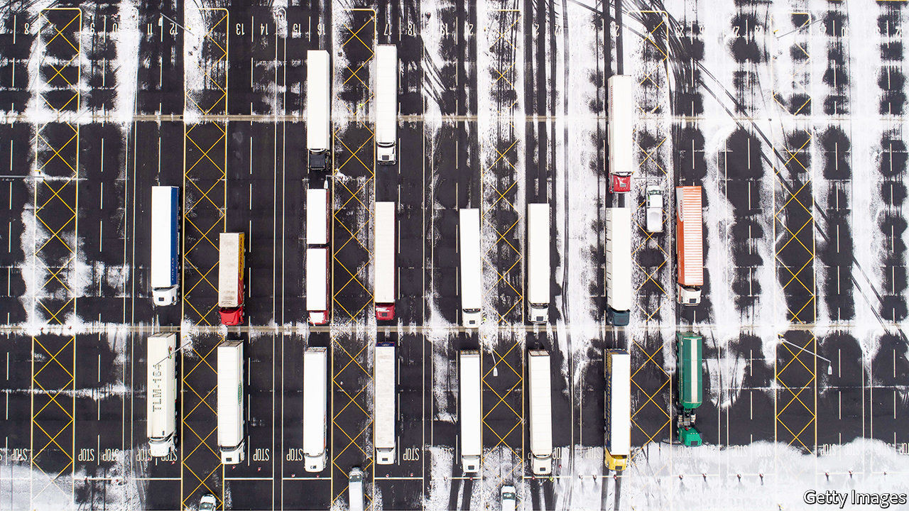

###### Anglo-German business ties

# For Deutschland AG, Brexit goes from bad to wurst 

##### Companies in Germany lament the effect of Britain’s departure from the EU 

 

> Feb 13th 2021 


“WE FEEL BETRAYED,” laments Petra Braun, a southern German who with her partner, Peter Wengerodt, runs Hansel &amp; Pretzel, a German deli and bakery in Richmond, a suburb of London. Since leaving the European Union just over a month ago, Britain’s once-welcoming government has made it hair-raisingly complicated and costly to import sausages, marzipan, quark cheese, apple sauce and other authentic staples. This year she has yet to receive any of the weekly deliveries of goods from her homeland.


The flipside of headaches for the likes of Ms Braun, whose small business employs 15 people, is a migraine for big German exporters, some of which furnish the ingredients for her fare. Deutschland AG was never a huge fan of Brexit. But the trade deal rushed through before the transition period ended at midnight on December 31st put German bosses’ minds at ease. A month into the new regime, “supply-chain problems are hitting German companies very hard”, says Joachim Lang of the BDI, the main association of German industry.


And it will get worse. Trade has slowed because of covid-19. As soon as it picks up again, commercial ties are in for a “massive stress test”, warns Mr Lang. In April British customs will introduce new rules (such as pre-notification and health paperwork for products of animal origin), followed in July by physical checks.


On February 9th the Association of German Chambers of Industry and Commerce said that 60% of the 1,200 German companies trading with Britain it surveyed consider their current business situation in Britain to be bad. Nearly as many expect further deterioration this year. One in six have either already shifted investments away from Britain or are planning to do so. They see the bureaucracy related to customs as their biggest business risk, followed by logistics and legal uncertainty.


Were it not for the pandemic these problems would make headlines in Germany, says Ulrich Hoppe, head of the German-British Chamber of Industry and Commerce in London. In January DB Schenker, a German logistics giant, stopped shipping consignments to Britain for a week. About 90% of them had incomplete or inaccurate customs forms, explains Maximilian Floegel of DB Schenker. The main stumbling block has been the proof of origin from the EU required under the trade agreement between the bloc and Britain. This is finicky to get for, say, a shoe made in Italy with a sole imported from China. DB Schenker set up a Brexit task-force to help clients with the customs bureaucracy. But, says Mr Floegel, “the problem remains acute.”


In December BMW, which pre-emptively moved engine production from Britain to Germany in 2019, warned that a no-deal Brexit would cost hundreds of millions of euros, which the carmaker would pass on to clients in Britain and on the continent. At least BMW had the resources to prepare for January’s customs checks and to stockpile car parts in Britain. The pocket multinationals of Germany’s Mittelstand face an even bigger cross-channel struggle.


Take Schott, a 250-year-old maker of sheet music for which Britain is the second-biggest market. The family company started to get anxious at the end of last year about tariffs levied on each classical piece. Delays at the border could leave British orchestras that rent its sheet music unable to get the scores in time for rehearsals, once these resume. This won’t be the last of Brexit’s unintended consequences. ■

