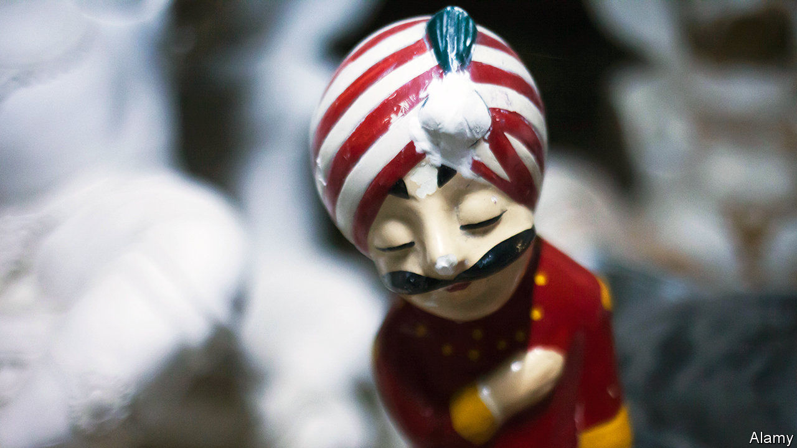

###### Flogging the family lead

# Narendra Modi promises to privatise Air India 

##### The state promises to unload its dusty companies. For real this time 

 

> Feb 13th 2021 


THE HINDU pantheon of gods has no shortage of deities with multiple arms. India’s government, with a hand in industries from energy and steel to finance and travel, would fit right in. A long infatuation with central planning transformed state-run business into a sprawling industrial empire encompassing 5% of the economy. But acquiring appendages is easier than managing them. Profits as a percentage of revenues are just over 1% at state-run companies, compared with 7-9% for the private sector. Many are a loss-making burden on the public purse—more family lead than family silver.


In 2016 the Indian government under the then newish administration of Narendra Modi reviewed the 331 firms under central-government control. It prepared a list of 28 that it believed could be sold without controversy. The most prominent were Air India, the flag carrier, steel- and cement-makers, big energy companies, a hotel operator and an assortment of entities whose time had passed, such as Scooters India (which last produced a scooter in 1997).


Five years later the number of companies controlled by the state, far from shrinking, has swelled to 348. In January Scooters India did fall off the list—by finally shutting down. The value of most survivors has shrivelled. State banks are saddled with bad loans. State energy companies have fallen victim to the shale and renewables revolutions. Air India’s rotten service has turned off customers. A note buried in the government’s 816-page survey of its holdings disclosed that production at the state-run condom-maker fell from 1.85bn units in 2018 to 820m in 2019.


This month India’s finance minister, Nirmala Sitharaman, has pledged to start offloading the leaden assets—in earnest this time. The initial list to be put on the block contains 13 companies, including two unnamed state banks. The biggest are Air India, Life Insurance Company of India (LIC, often seen as the government’s emergency bail-out provider) and Bharat Petroleum, a large refiner. Unviable companies that cannot be sold, Ms Sitharaman promised, will be shut down.


Such commitments make longtime India-watchers roll their eyes. Trade unions and bureaucrats have little to gain from transactions which undermine their jobs and authority. On the rare occasions where a past sale actually generated returns for the buyers, the bankers and officials involved were hauled before the authorities and grilled about selling too cheaply. Ms Sitharaman’s announcement has already led to an outcry from Mr Modi’s political opponents, for whom state ownership of the economy’s commanding heights is a point of pride—never mind that those heights look distinctly unHimalayan.


Government officials have been meeting business groups to say this time is different. People close to those encounters say the effort could be charitably described as sloppy. But that it is being done at all suggests a degree of sincerity on the part of Mr Modi’s administration that previous efforts lacked. The reason is India’s covid-battered finances. Without the $24bn Ms Sitharaman hopes to raise from the asset sales, the central government’s fiscal gap would expand from about 9.5% to 12% of GDP, putting India’s sovereign rating at greater risk of a downgrade.


Between LIC and Bharat Petroleum, which has a market capitalisation of $12bn and is half-owned by the state, the government could be two-thirds of the way towards its goal, bankers in Mumbai report. An accounting firm has been engaged to prepare LIC’s books, a necessary first step for a planned initial public offering. Tata Sons, a big conglomerate, is said to be interested in Air India, which it used to own before nationalisation in the 1950s. Three bidders have their eyes on Bharat, including two big global private-equity funds.


The first buyer in the new era of privatisation could be inadvertent. There is some speculation that the cash-strapped government may grant Cairn Energy, a British firm, a state-owned oilfield as part of a settlement over retroactive taxes. ■

