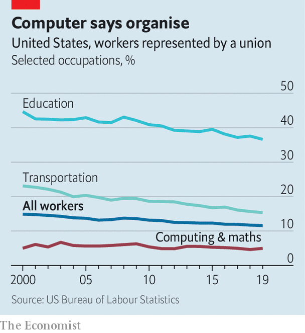

###### Labour coders

# Unions take on Amazon and Alphabet. Big tech watch out 

##### An old force wants to shake up a younger industry 

 

> Feb 13th 2021 


FOR DECADES America’s labour movement has been losing steam. Trade unions represent only 7% of private-sector workers. No significant piece of pro-union legislation has passed in recent years. Right-to-work laws, which undermine the clout of organised labour, have spread to 27 states. Now the union movement has been showing signs of life in, of all places, the technology industry.


Last month software engineers and other workers at Alphabet, Google’s parent company, announced a new Alphabet Workers Union (AWU), to “protect…workers, our global society, and our world”. The union has not sought official status but charges 1% of total compensation and has just collected the first round of dues from its 800 or so members—given their plush salaries, a good-size pot to spend on lawyers. And on February 8th union-eligible workers at an Amazon warehouse in Alabama were mailed 5,800 ballots. If a majority back the creation of a union by late March, the facility will become the e-commerce giant’s first unionised one in America.


Amazon’s and Alphabet’s unions seem worlds away. The warehouse staff hark back to labour’s blue-collar roots. The AWU looks to some as a vehicle for wokeness; it is certainly a rarity in computing (see chart). But the two strands of unionisation are interwoven. Google’s coddled coders are intent on improving conditions for lower-paid data-centre workers and other TVCs (temps, vendors and contractors). “No lone wolf should howl alone without a pack,” declares a developer on AWU’s website. On February 5th the union filed a labour complaint against Modis, an outsourcing unit of Adecco. AWU alleges that Modis illegally suspended a data-centre worker for questioning a ban on discussing pay.

 


Alphabet can afford to improve the lot of TVCs if it has to. It can also, up to a point, humour its progressive software engineers; no serious financial harm has come of having to abandon bidding for contracts such as one to provide cloud-computing services to the Pentagon, to which some peacenik Googlers objected.


Amazon has more to lose. A good deal for Alabaman workers may inspire others to clamour for the same rights. Collective-bargaining demands, on the timing of shifts, expanding capacity or automating jobs, may dent Amazon’s flexibility and speed, says Mark Shmulik of Bernstein, a broker. That could eat away at its already-thin profit margins on retail operations, possibly forcing it to pass extra costs onto customers, who could shop elsewhere.


AWU and the Alabaman workers are spurring others. “Workers across the digital economy are feeling the moment,” says Tom Smith, national organising director for Communications Workers of America (CWA), an 83-year-old union. The CWA recently formed the Campaign to Organise Digital Employees. CODE-CWA, as it is known for short, is targeting all of tech, including notoriously harsh conditions in the video-game industry, where 60-hour “crunch” weeks ahead of big releases are common. Mr Smith says more tech workers will unveil union labour efforts shortly. Geeks of the world are, it seems, uniting. ■

