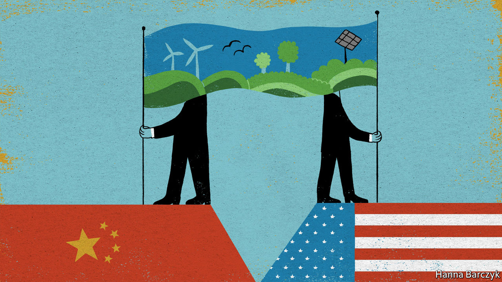

###### Chaguan

# China and America talk of co-operating on climate. It will be hard 

##### Asking China to show leadership cuts two ways 

 

> Feb 13th 2021 


FOR THE first decades of global wrangling about climate change, China’s foot-dragging caused alarm. Its self-interested approach to climate action—once summarised by a Beijing-based diplomat as seeking “maximum credit for the minimum effort”—frustrated governments that were ready to enact costly measures. Worse, China’s blame-shifting ways gave cover to politicians clinging to climate denial and inaction in America and elsewhere.


Soon, the most disruptive force in global climate politics may be China’s ambition. Its economy is being readied for a low-carbon world sooner than many expected. Its companies are under orders to develop world-beating clean-energy technologies, including by aggressively pushing foreign firms to share them. China says it wants to re-engage with America on climate matters.


Optimists see signs in China of high-level pragmatism in the return from semi-retirement of Xie Zhenhua. He is a well-connected climate negotiator who brokered the burden-sharing agreements between China and the Obama administration that made possible the Paris climate accords in 2015. Mr Xie, China’s new climate envoy, has known his American counterpart, John Kerry, for years. Gloomier sorts worry about the distrust and disdain shown by other Chinese officials and scholars who call America a jealous, declining power, bent on containing a rising China. Talks on such subjects as climate cannot prosper when bilateral relations are bad, said a foreign-ministry spokesman, after Mr Kerry promised that he would not trade away American criticisms of Chinese trade or human-rights abuses for climate-related concessions. Chinese co-operation is not like “flowers that can bloom in a greenhouse despite winter chill”, the spokesman sniffed.


China’s ambitions are disruptive because they are newly credible. They are credible, not because it has been converted to selfless acts of sacrifice, but precisely the opposite. To Communist Party leaders, greenery increasingly aligns with their economic and political interests. China, a populous country that is cruelly lacking in clean water and arable farmland, and which hates having to rely so heavily on imported energy, has a selfish interest in embracing what President Xi Jinping calls “ecological civilisation”. Though the Chinese public is not very focused on climate change, citizens care deeply about clean air and water. They stage frequent demonstrations against pollution. In the words of a European diplomat, Mr Xi is convinced that “ecology is key to China’s renaissance and is part of the social contract between the Communist Party and the people.” China also wants to enhance its global reputation, the diplomat adds: “China cannot be Number One, which is of course its aspiration, without being a climate leader.”


Last September, in a speech to the UN General Assembly, Mr Xi unexpectedly committed his country to carbon neutrality by 2060. That pledge to offset or capture all carbon dioxide emitted in China would require most fossil fuels to vanish from an economy that currently consumes more than half the coal burned worldwide. In December Mr Xi tweaked existing targets for the year 2030 to make them a bit more ambitious and cover such areas as fossil-fuel use, forest cover, and wind and solar installations. In a rare public humiliation, environmental inspectors reporting to China’s leaders recently accused officials at the National Energy Administration of a “deviation in ideological understanding” for allowing too much dirty coal to be burned.


The climate battle is not over. Fossil fuels still have powerful defenders in China. Some provinces approved fleets of new coal-fired power plants in 2020 while they still could. Chinese banks and businesses still invest in coal-powered plants overseas, from Pakistan to Africa. Still, signs may be glimpsed that China is planning for a different future. Research institutes close to Mr Xi’s inner circle, notably at Tsinghua University in Beijing, have laid out paths for the electricity sector to achieve net-zero emissions of carbon dioxide by 2050. Indications of seriousness could appear in the next five-year plan, to be unveiled in March. They could include an absolute cap on emissions, a step that China has so far refused, or a promise to advance to 2025 the date when emissions will peak. The current target for this will hardly be a stretch.


Previous high-level co-operation between China and America or the European Union, as in Paris in 2015, involved joint announcements of sweeping goals and targets, intended to prod other countries into action. In these low-trust times, such moments may prove hard to replicate. Instead, there is much talk in Beijing of confidence-building exchanges between experts. Wang Xin, who heads the research bureau of China’s central bank, cites promising areas for co-operation with America and other countries. These include joint work on important technologies such as carbon capture and storage, clean coal and hydrogen power, and on developing green financial instruments to fund such efforts. Climate co-operation is needed to tackle a threat to humanity, Mr Wang says. “In the process, it is only natural to strengthen mutual trust and improve relations.”

Asking China to show leadership cuts both ways


Obstacles loom. Other countries are wary of helping to strengthen China’s industrial policies. In order to sell climate-related measures to voters, Mr Biden talks of creating millions of well-paid jobs by making America an export champion in clean technologies. Li Shuo of Greenpeace, an environmental group, worries about calls to action that are framed as a competition to beat China in sectors like solar or wind power, where China “is so far ahead”. Mr Li thinks that China and America may have to settle for “climate engagement” as they pursue common goals in parallel.


China is a latecomer to climate seriousness. Western powers, especially in Europe, have long pushed it to do more. Now, at least when it comes to clean technologies, China’s price for saving the world may be asking to lead the world. ■


For more coverage of climate change, register for The Climate Issue, our fortnightly , or visit our 

