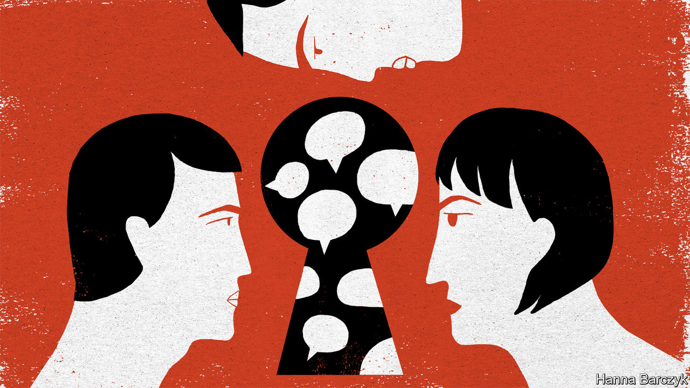

###### Suddenly, space for free-thinkers

# People from China flock to Clubhouse to enjoy calm, open debate 

##### The Chinese government is trying to block access to the app 

 

> Feb 13th 2021 


FOR MODERATE, open-minded critics of Communist Party rule in China, who also speak Mandarin, the past few days have been heady ones. Across the global Chinese diaspora, word has spread rapidly that Clubhouse, an audio social-networking app, is the place to be for unfettered, calm debate about contentious topics relating to China. People have been pouring into its “rooms” to discuss everything from the gulag in Xinjiang to the Tiananmen Square protests of 1989. Some are residents of mainland China, despite a hasty attempt by censors to block them.


Why the rush of enthusiasm? One reason is that Clubhouse, launched last April by an American firm, is not subject to the word-sniffing controls that stifle free speech on social-media apps such as WeChat and Weibo. It is also largely free of the nationalist rants and pro-party cheerleading that often crowd out liberal voices on such Chinese-language platforms. Rooms are set up by users who then act as moderators with the power to kick out the unruly and rein in the long-winded. Membership of Clubhouse is by invitation only: those admitted may recruit others. This may put a brake on access by trolls.


For users in China, this has been a deep breath of fresh air. But there are probably few who have enjoyed it. The Clubhouse app is available only on iPhones, and not to those with Apple IDs registered in China. Fang Kecheng of the Chinese University of Hong Kong reckons no more than 50,000 Clubhouse members live on the mainland. Since February 9th they have needed a VPN in order to leap over the “great firewall” and use the app. Also since that day, Chinese mobile operators have blocked verification codes sent by text message. Such measures may be turning some mainlanders away. But there is clearly pent-up demand. Before the great firewall began blocking Clubhouse, people in China were paying up to 500 yuan ($78) to buy an invitation code through Taobao, a retail platform.


Clubhouse has been a boon for people belonging to China’s ethnic minorities, and for residents of Hong Kong and Taiwan, whose views are rarely heard on the mainland. Rayhan Asat, an ethnic Uyghur who was born in Xinjiang and now lives in America, has spent hours on Clubhouse in rooms with up to 5,000 participants, most of them non-Uyghur Chinese, sharing her brother’s story. He is almost five years into a 15-year sentence in China on what she says is a trumped-up charge of inciting ethnic hatred.


On Twitter Ms Asat is often bombarded by hate messages from members of China’s ethnic-Han majority. But on Clubhouse she has received many supportive ones. She thinks the use of audio encourages more intimate discussion than exchanges by text on other social-media platforms. “People heard my voice, they heard my pain,” she says. “They messaged me privately afterwards saying they believed me, they silently supported me. I understand they can’t speak publicly because they fear the Chinese government will retaliate against their family still in China.”


Even before the great firewall was reinforced, some members suggested self-censoring in order to deter a government clampdown on the app. But one young user from the mainland pushed back. “We should take advantage of this brief opportunity to be human, to be normal for once, to talk about our feelings, to talk about what’s going on and whatever else we haven’t been allowed to say,” he said. Outside China, Mandarin speakers are still flocking to Clubhouse. But free speech in China appears as far away as ever. ■

