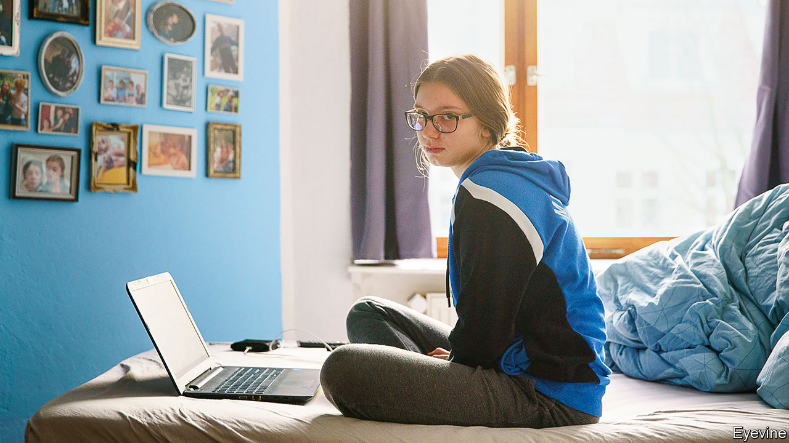

###### A tale of two colleges

# Covid-19 school closures are widening Europe’s class divisions 

##### And it will only get worse 

 

> Feb 13th 2021 


NO ONE IS ever truly ready for lockdown. But when the Netherlands closed its schools in December, the Herman Wesselink College, a high school in a well-off suburb of Amsterdam, was readier than most. About half its students have parents who completed higher education. Nearly all have their own bedroom to study in. The school has given its pupils laptops for years, and during the first lockdown last spring switched smoothly to remote learning. The director says students have not fallen behind a whit in terms of content, though their study skills have languished.


The Mundus College, a trade school in a poorer Amsterdam neighbourhood, has had it rougher. About a third of its students are new immigrants or refugees. Vocational education is hard to do remotely. Classes have stayed open at half-size under an exception for vulnerable students, but it is impossible to follow social-distancing rules for subjects like nursing, says Diana Brummelhuis, the director: “You can’t teach someone to handle a wheelchair by lecturing.” She estimates that her pupils are lagging at least a quarter behind their normal pace.


Such contrasts are playing out all over Europe. On a continent famous for its welfare systems, school closures threaten to widen divisions of education, ethnicity and class. Compared with the rest of the world, Europe has not done badly during the pandemic. Most of its schools reopened in the autumn, while in South America and South Asia they largely stayed shut. But covid-19’s second wave has forced many European schools to close again.


This hurts all pupils, but it hits the poor and vulnerable ones harder. France’s education ministry says that last spring’s lockdown increased the gap in exam scores between normal schools and ones in hard-up areas by several points. In Germany, that first lockdown cut studying time from 7.4 hours per day to 3.6. An analysis of last year’s national exam results in the Netherlands came up with the depressing finding that during the spring lockdown the average pupil had learned nothing at all. Those whose parents were poorly educated did even worse: they emerged from their first two months of schooling by internet knowing less than when they started.


France has been the most determined of any European country not to let schools close, arguing that the risks to educational attainment and social cohesion are greater than those to public health. Last spring President Emmanuel Macron overrode advice from epidemiologists and ordered schools reopened. They have stayed that way, though since November most high schools have worked in shifts. Germany closed its schools from December 16th until at least February 15th. Its state governments would like to start reopening them, but Chancellor Angela Merkel wants to wait until covid-19 caseloads fall by half from current levels. Northern Europe has roughly followed the German pattern (apart from contrarian Sweden, which closed only briefly in January).


In southern Europe closures have been less widespread. Spanish schools have stayed open since the autumn, though most high schools use some distance-learning. Some 35,000-40,000 new teachers and assistants have been hired to reduce class sizes. In Italy primary schooling has not been interrupted. High schools, shut in November, have reopened for most classes. Both countries have struggled with remote classrooms, thanks to dodgy internet connections and a lack of computers among poorer pupils.


Similar tech problems plague the continent’s poorer east. Nevertheless, the closures there have been stricter. In Poland schools have been shut since late October; schools for those aged up to eight reopened on January 18th. A survey of Polish teachers last summer found that most knew of pupils who had not turned up since instruction went online. Romania’s schools were shut almost continuously from March until they reopened on February 8th, yet more than a quarter of the country’s children are not equipped for online education, according to Save the Children, a charity. By January the government had distributed around 250,000 tablets, but said 287,000 more students still needed one.


Many experts worry about the emotional and developmental damage of lockdowns. But the data are ambiguous. A survey of Dutch social workers last year found that emotional neglect of the children they were responsible for was much more common than in the same period in 2017. But even though some children report less affection from their families, others say they are getting more, including a rise in hugs. Others worry about working parents forced to stay at home to care for children. About 150,000 Polish women have dropped out of the labour force since last March, says Piotr Lewandowski, an economist.


One issue has been what to do about Europe’s all-important national examinations. Germany is pressing ahead with the Abitur to ensure that this year’s graduates get equal respect. Dutch high schools have stayed open for students in their final year before the eindexamen. In France, the dreaded four-hour baccalauréat exams have been cancelled, apart from bits the country considers essential: French literature, the final oral exam and, of course, the written exam in philosophy.


At least the gravity of the threat to education has sunk in. Austria, Denmark and the Netherlands reopened their primary schools on February 8th; Romania reopened primary and most high schools as well. The question is what governments will do if infection rates rise in the spring: close schools again, or find other painful measures (such as curfews or bans on house visits) to compensate for keeping children in class. ■


Dig deeper


All our stories relating to the pandemic and the vaccines can be found on our . You can also listen to , our new podcast on the race between injections and infections, and find trackers showing ,  and the virus’s spread across  and .

