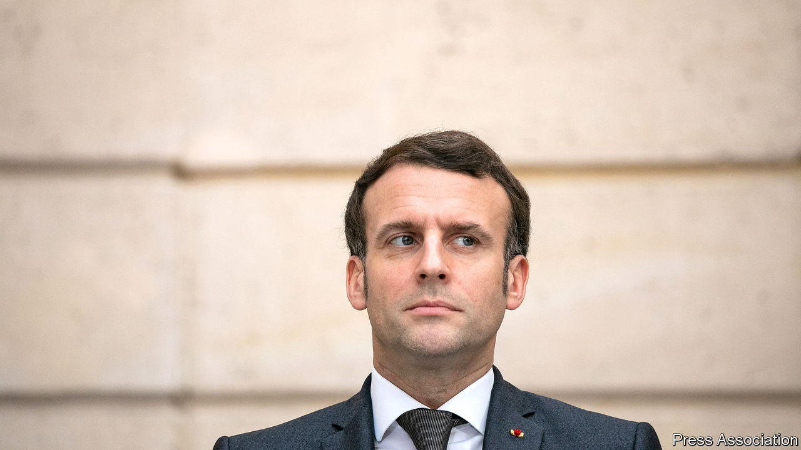
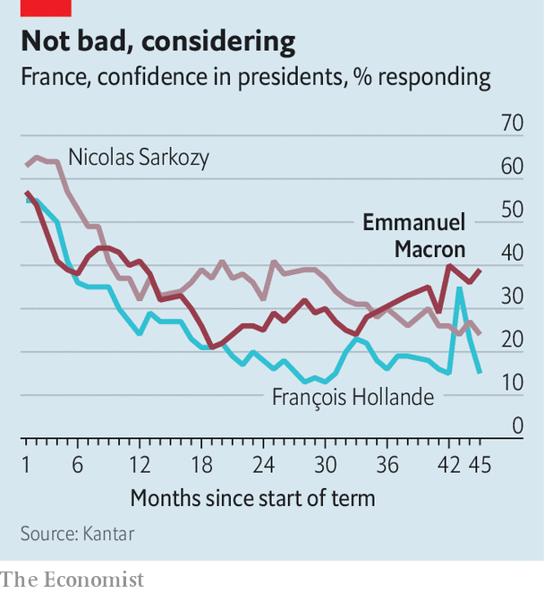

###### The president’s dilemma

# France’s Emmanuel Macron must decide how to fight next year’s election 

##### The pandemic favours the politics of caution over risk 

 

> Feb 9th 2021 


IN FEBRUARY 2016, just 14 months before the most recent French presidential election, not a single opinion poll of potential candidates bothered to test the name Emmanuel Macron. Weak party allegiances, anti-establishment distrust, a bold campaign—and a generous dose of luck—carried the electoral novice from nowhere to the presidency in record time. As France now turns its mind to the presidential contest in 2022, all polls and predictions therefore deserve caution. Yet the contours of the next campaign are beginning to emerge, and they present a peculiar challenge to Mr Macron as he thinks ahead to his re-election bid.


Two new polls suggest that 2022 will bring a repeat of the run-off between the centrist Mr Macron and the nationalist Marine Le Pen. But each also points to a far tighter race than in 2017, when Mr Macron beat Ms Le Pen squarely by 66% to 34%. One poll reduces the sitting president’s margin to 12 points. The other gives him an even narrower victory of 52% to 48%. The French, prone to malaise even in good times, give little credit to their president and are feeling anxious: about a possible third lockdown, the spread of le variant anglais, the reliability (and now the availability) of vaccines, the well-being of the young, and the livelihoods of all those furloughed chefs and waiters who sustain the French art de vivre.


Apprehension, as well as disease control, has bred a politics of reassurance and caution. Whereas once Mr Macron stood in an army tent and declared war on the virus, covid-19’s long effect on politics has been to emphasise protection. He promised to do “whatever it costs” to save jobs and lives. His government maintains a generous furlough system for millions of employees, as well as loans and grants to keep businesses afloat. It is shielding its supermarkets from foreign predators, has raised health workers’ salaries and has all but shelved its controversial pension reform. A nightly national curfew has been in place since mid-December. Even France’s glacial vaccine roll-out is justified as a measure to build trust in a vaccine-sceptical country; Britain’s approach, said a minister, carries “enormous risks”.

 


Such prudence may be justified by the pandemic, and in many ways matches the new global orthodoxy. Yet the broader message also works against Mr Macron’s reflexes, and what he stood for during his bid for the presidency in 2017. The candidate’s campaign then was based on an attempt both to free up initiative and risk-taking, and to build a modern system of rules and protections to encourage this to happen. Mr Macron’s defiant, disruptive side—reforms to the labour market, schools, training, the railways and taxes—marked his initial years in office. Covid-19 is crushing this flat.


“In all our societies the pandemic is leading us to protect more; that’s normal,” Mr Macron told The Economist at a recent meeting with foreign reporters, arguing that if he had not carried out his liberalising reforms before the pandemic the country would be less well placed to finance protection today. The recovery plan based on common European Union borrowing is, he pointed out, oriented towards investments that “build the future, and not from a perspective of protection”. But Mr Macron does not deny that the balance has shifted: “Two years ago I was told, ‘You are freeing up more than you are protecting’; today I am told, ‘You are protecting more than you are freeing up.’”


This poses a particular challenge in France, a country that has long had a strong central state and that has tended to long spells of conservatism interrupted by bursts of rebellion, some of them rather dramatic. Protection is in some ways the country’s default mode, and that mindset can be hard to alter. Mathieu Laine, a liberal writer and the author of a new book, “Infantilisation”, argues that the French state is now acting to entrench a dangerous form of risk aversion. All those rules and forms devised by overzealous bureaucrats during the pandemic—no more than one hour of exercise a day, at no more than one kilometre from home—are teaching people, he says, how to “unlearn what it means to exercise freedoms”.


It may yet be that this shift towards the politics of protection could in fact provide Mr Macron, a former investment banker, with a form of defence. The most disillusioned of his former supporters are on the left. Last year he lost his absolute parliamentary majority when a group of left-leaning deputies quit his party, La République en Marche. Instead of a nod in their direction, he then replaced one centre-right prime minister (Edouard Philippe) with another (Jean Castex). Some inside the party now want Mr Macron to tilt towards the left to recover such voters. If faced with another second-round choice between him or Ms Le Pen, they might otherwise abstain. Polls suggest that this is part of the reason for the closer run-off gap.


The chances are that Mr Macron, whose adage is en même temps (at the same time), will seek to forge a fresh balance in the run-up to 2022. He has shown that he is still ready to take risks, says one of his presidential aides, by keeping schools open since last May, and refusing—against scientific and ministerial advice—to put France into a third lockdown right away. Partly as a result, his poll rating among the young has risen 11 points in three months. For now, his greatest asset is that no single credible alternative candidate has yet emerged, on either the left or the right. But these are uncertain times. And nobody knows more about the volatility of electoral politics than the former outsider whom polls overlooked, Mr Macron. ■

