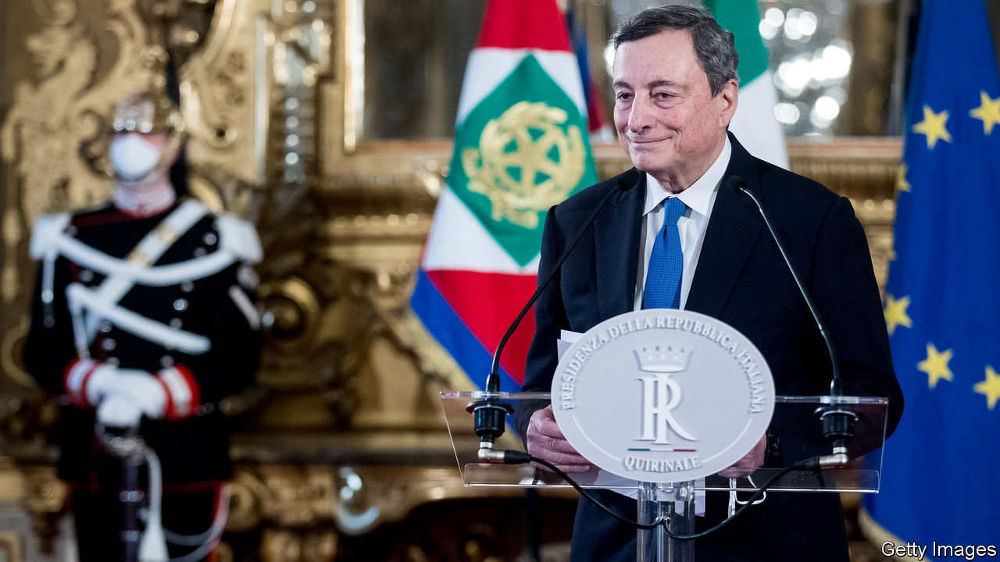
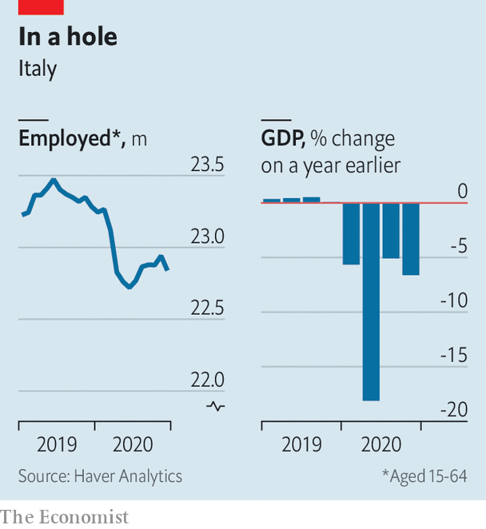

###### No time for foot-Draghing

# Mario Draghi looks set to become Italy’s next prime minister 

##### But once he has formed his government, he will have to move fast 

 

> Feb 13th 2021 


WAS THERE ever a luckier prime minister than Mario Draghi? Or an unluckier one? He looks set to come into office with around €200bn from the EU’s recovery funds to spend. But he will also take over Europe’s worst-performing economy in a pandemic and with a parliamentary majority hard put to agree on anything, let alone on controversial structural reforms the European Commission wants to see implemented as the largesse is disbursed.


By February 11th only the far-right Brothers of Italy party had declined the chance to climb aboard the “Super Mario” bandwagon. The ideologically variegated Five Star Movement (M5S), the biggest group in parliament, gave its approval following an online ballot of members (with a lukewarm 59% voting in favour of Mr Draghi). Even the hard-right Northern League hastily renounced its Euroscepticism to book a place in Italy’s next parliamentary majority, and perhaps its cabinet.


The former president of the European Central Bank faces both a daunting challenge and a unique opportunity. The challenge is to cope with the effects of covid-19 in a country hard hit by the virus; Italy is fourth in the EU in terms of deaths relative to population. Its economy shrank by 8.8% last year, compared with 5% in Germany. If a ban on sackings is lifted at the end of March, an estimated 250,000 more people will be dumped onto the labour market. Mr Draghi’s opportunity, though, is to use the recovery funds to start reversing two decades of economic decline. Even before the pandemic, Italians’ real GDP per person was lower than at the start of the century. Behind that woeful performance lies an array of obstacles to growth, held firmly in place by vested interests.

 


In consultations with the various parties, Mr Draghi has hinted at how he intends to deal with both the challenge and the opportunity. The priority areas he indicated were health (a central aim must be to speed up vaccination); education (he has suggested that the school year be extended to allow students to catch up); the protection of individuals and enterprises from the effects of the pandemic; and, less obviously, the environment (which squares with the priorities of the commission and the M5S). The prime minister-designate’s targets for reform are said to include Italy’s tax regime, its stultifying bureaucracy and a slow, unpredictable civil-justice system that discourages both domestic enterprise and foreign investment.


But these are tasks for a period of years, so the first question that arises is how Mr Draghi’s long-term aims can be reconciled with the EU’s exacting deadlines and—a point largely overlooked in the euphoria surrounding his appointment—the short life expectancy of his government. Contracts for 70% of the recovery funds must be awarded and signed by the end of 2022 and the remainder committed within the following year. In the meantime, a general election must be held by early 2023. But, given the parties’ aversion to winter campaigning, it is more likely in the first half of next year. Mr Draghi may want to step down even sooner if he is to run for president in a separate election due in February 2022. “I think he’ll set a working method for the next government,” says Veronica De Romanis, who teaches European economics at LUISS, a university in Rome.


A second question is how much unpopularity Mr Draghi is prepared to risk. When the outgoing government suggested a longer school year, it prompted an outcry from the unions. Tax reform usually favours some parts of society at the expense of others. And Mr Draghi’s approach to safeguarding enterprises may also prove controversial. Last year he co-chaired a working group of the Group of Thirty, an informal body of bankers and officials, that looked at restoring the corporate sector after the pandemic. It concluded that governments should focus on supporting viable firms and managing the pace of what his co-chair called “the needed creative destruction”.


Mr Draghi is popular. But Italy’s electorate and parliament are notoriously fickle. “If he starts immediately with these reforms we have been speaking about for 20 years, he will have a chance of success,” says Giuliano Noci, professor of strategy and marketing at Milan’s Politecnico University. “But if he waits for more than a month, the sentiment will change.” ■


This article has been updated since publication with the result of the vote by members of the Five Star Movement.

