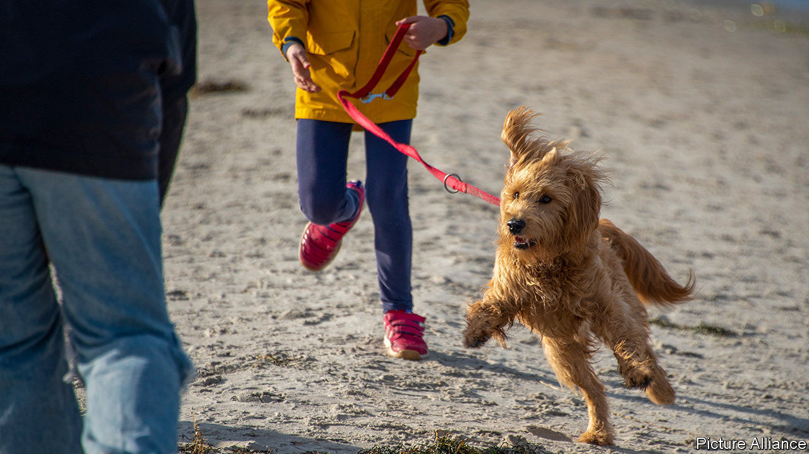

###### Canine crushes

# Shelters fear an influx of no-longer-wanted lockdown pets 

##### Dogs have made the pandemic more bearable. But what happens when it ends? 

 

> Feb 13th 2021 


ARTHUR SCHOPENHAUER owned a succession of pet poodles. Franz Kafka maintained that “all knowledge, the totality of all questions and all answers is contained in the dog.” Frederick the Great exclaimed: “The more I see of men, the better I like my dog.” Pets have been deeply embedded in Germanic culture for centuries, but never more so than now. As people seek a cure for covid-induced solitude and angst, demand has surged for dogs, budgies, snakes and even cats.


The German Kennel Club says dog sales increased by 20% in 2020. Prices for puppies sold on pets4homes, Britain’s largest online ad site for pets, more than doubled. A Yorkshire terrier pup can set you back £1,500 ($2,050), and some breeds cost twice that. Some dogs are no doubt enjoying the pandemic, since their owners are always home. Many are being pampered. The share price of Chewy, an online pet-supplies store, rose by more than 260% in 2020 as owners splurged on posh toys and organic food. Zoo Zajac, a huge pet shop based in Duisburg, says January was probably the best month in its 45-year existence.


Soaring profits, alas, attract crooks. The unspeakable crime of “dognapping” is on the rise. Pedigree pooches are preferred. The German Animal Welfare Federation (DTB) registered 75 illegal trades between January and October last year, more than in all of 2019, involving more than 800 animals (mainly dogs). The true number is surely much higher. Many take place online and are hard to spot. Puppy farms are mass-producing dogs, often in poor conditions. Thomas Schröder of the DTB demands a ban on the online sale of animals. Other activists argue that the internet helps find good homes for many pets, though they advocate stricter regulation of online sales.


When covid-19 eventually recedes, animal shelters expect another problem. Some new owners will tire of their lockdown pets and want to return them. Others will go back to work and find they have no time to look after them. Europe’s biggest animal shelter, in Berlin, which is the size of 22 football pitches and houses some 1,300 animals, including apes and a pig called Tinkerbell, is bracing for a post-pandemic crush.


Dig deeper


All our stories relating to the pandemic and the vaccines can be found on our . You can also listen to , our new podcast on the race between injections and infections, and find trackers showing ,  and the virus’s spread across  and .

