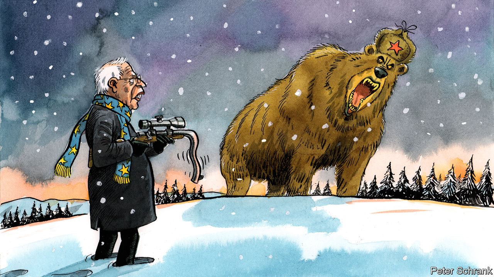

###### They told you so

# The European Union must face up to the real Russia 

##### Appeasement isn’t working 

 

> Feb 13th 2021 


WHEN ROBERT CONQUEST, a historian, was working on a new edition of “The Great Terror”, his seminal text on Stalin’s crimes, he was told to come up with a new title. The book had described the horrors of the Soviet Union at a time when apologism for it was still rife. By the time of the new version, freshly opened archives had vindicated Conquest’s account. His friend Kingsley Amis, a novelist, suggested a pithy new title: “I told you so, you fucking fools”.


Head east in Europe today and it is easy to find similar sentiments about Russia. The Baltic states and Poland warned Josep Borrell, the EU’s foreign-policy chief, against visiting Moscow in the wake of its imprisonment of Alexei Navalny, Russia’s leading opposition politician. They were right. Mr Borrell was humiliated. In a press conference Sergey Lavrov, the Russian foreign minister, dismissed the EU as an “unreliable partner”, while Mr Borrell stood alongside. European hypocrisy was mocked as he brought up the treatment of Catalan politicians by Spanish authorities, knowing that Mr Borrell is a staunch opponent of independence for the region. Mr Borrell did not even insist on visiting Mr Navalny in jail. While he was there, news leaked that the Russian government had expelled diplomats from Germany, Poland and Sweden for attending pro-Navalny rallies. Diplomats from eastern Europe may be politer than Amis, but the message is the same.


Dealing with Russia is the most pressing foreign-policy problem facing the EU. It is also where the bloc is least coherent. While national capitals may not always agree on how best to handle China or how close to remain to America, on Russia they are hopelessly split. Russia can be a potential or even necessary ally, a business opportunity or an existential threat, depending on whether you are in Paris, Berlin or Warsaw. The notion of an EU foreign policy is flimsy at the best of times, but especially on this topic. “Everybody knows that the big boys freelance on anything that matters,” says Radek Sikorski, a Polish MEP and former foreign minister. And Russia is among the things that matter most.


Doveish attitudes are based on pragmatism, pessimism and cynicism. France puts its accommodating strategy down to culture and geography: Russia is too large to push around and too near to ignore. It emphasises patience and engagement—a tactic its critics label “doing nothing”. When it comes to Russia, Emmanuel Macron, the French president, talks in terms of decades, and doubts whether tough action would do much good. Whereas such remarks may be wise from a policy wonk, they are less comforting coming from the mouth of the EU’s only hard power.


In Germany economics trumps geopolitics. Nord Stream 2, a pipeline running from Russia to Germany, undercuts the EU’s wider strategy of trying to rely less on Russia for energy but retains the support of the German government. (The fact that Gerhard Schröder, a former German chancellor, is the chairman of the scheme does not help.) Angela Merkel surprised critics by shepherding through—and sticking with—sanctions on Russia over its actions in Ukraine. Yet she is soon to leave office. Armin Laschet, the new leader of her Christian Democratic Union, is more doveish. Even direct attacks, such as Russian hackers breaking into the Bundestag’s computers in 2015, failed to budge opinion. Unfortunately for the EU’s band of eastern hawks, France and Germany are not alone. Spain and Italy, the EU’s other big countries, are similarly meek when it comes to Russia.


Each approach shares an assumption that there is not much the EU can do about Russia. But the EU forgets its power. It is a bloc of 450m people with a GDP that is nine times larger than that of its Russian neighbour; Russia’s economy is slightly larger than Spain’s and smaller than Italy’s. Collectively, EU countries spend almost three times as much as Russia on defence. Just France and Germany together spend roughly two-thirds more. Yet when dealing with Russia, the EU behaves like a supplicant. What Russia lacks in relative means, it makes up for in motivation: from the Sahel to Belarus, Russia is an enthusiastic troll, causing no end of trouble for the bloc. European governments have the tools to take a firmer line with Russia, whether sanctions on those close to Mr Putin, or scrapping Nord Stream 2. What they lack is the will to use them. In one multilingual intervention, Assita Kanko, a Belgian MEP, asked of Mr Borrell: “Dónde están los cojones de la UE?”

When doves cry


The ill-fated Moscow trip caps off a period in which Russia’s gangsterism has become impossible to ignore. Until recently, it was possible to argue that it was open to a constructive relationship with Europe. Now it is not. Sanctions require the unanimous support of all governments, which is tricky, even with new EU legislation that makes it easier to punish human-rights abusers. But such measures are more likely thanks to Russia’s recent actions. “Russia is usually its own worst enemy,” says one official from an eastern country.


This clarity leaves Europe’s doves in a bind. Their vision of a better relationship with Russia, working together on matters like climate, is appealing. In this world, Russia could be a well-behaved G8 member. Unfortunately, that Russia does not exist. Instead, European powers face a government that tries to murder its opponents, stokes proxy wars and hacks its neighbours. It is a country that deliberately chooses confrontation rather than partnership, and the EU—both its national capitals and its institutions—must recognise this.


The real Russia is much closer to the way it is described by the EU’s eastern countries than to the benign image conjured up by western ones. No one can force Mr Macron to give up his hope that Russia will eventually be a partner. Likewise, no one can force German politicians to take a short-term economic hit for geopolitical gain. But they cannot say they were not told. ■

