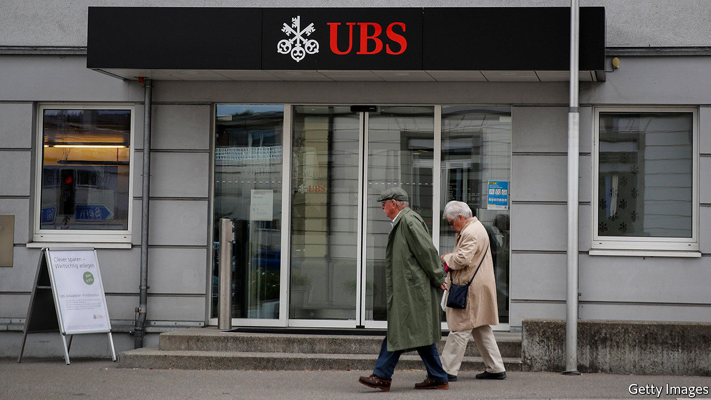

###### Fresh blood

# European banks need new chiefs 

##### But headhunters are struggling to find them 

 

> Feb 13th 2021 


EUROPEAN BANKS’ fourth-quarter earnings, releases of which are clustered around early February, have been surprisingly perky. Those with trading arms, such as UBS or BNP Paribas, rode on buoyant markets. State support helped contain bad loans; few banks needed to top up provisions. Markets should keep them busy and, as the economy recovers, loan volumes should rise. Many banks plan to resume dividends this year.


Yet the chronic illness that has dogged the industry for years remains. Interest rates are rock-bottom, compressing lending margins. Lenders must set aside lots of capital to placate watchdogs, which depresses returns. Costs are sky-high; hard-hit by the financial and euro-area crises, lenders have under-invested in digitisation. And Europe has too many banks, which constrains scale and profits. UBS forecasts the European sector’s return on tangible equity (ROTE) will hit 8% by 2022—above last year’s 5.6%, but still below its cost of capital of 10%. Its price-to-book ratio hovers around 0.5, below its lowest point in 2009.


Much of that has been outside bosses’ control. The current cohort, drafted in to restore lenders to health in the 2010s, has also managed to lift core capital ratios. But reviving profits and valuations—a must if banks are to raise capital on public markets—requires a strategic rethink that “wartime” CEOs have shown little will or skill for. A growing chorus of pundits, investors and board members want fresh faces to embrace the mission.


This is not to say that Europe’s bank bosses are entrenched (save some exceptions: Frédéric Oudéa has run Société Générale, a French lender, for 12 years). The average boss at a big European bank has been in post for four years, compared with seven in America. Succession planning at some banks, including Standard Chartered, is said to be under way. But the same tired cast seems to be shuffled around. Of the nine European banks that changed chiefs in 2020, seven picked either a male insider or a male banker from a local rival. Andrea Orcel, chosen to lead UniCredit, an Italian bank, last month, helped build it up decades ago. Ralph Hamers, UBS’s new boss, came from ING, a Dutch bank.


One problem is that the pool of candidates is drying up. When Mary-Caroline Tillman of Russell Reynolds Associates, a headhunter, worked on bank CEO searches ten years ago, her shortlists included 15-20 qualified candidates. Today she typically finds five or six. A lot of industry stars are now too old; a few others have lost their sheen. Many suitable executives do not want the top job, which comes with more scrutiny from the press than elsewhere. It is also less richly rewarded. Last year James Gorman, who runs Morgan Stanley, an American bank, was paid $33m. ING faced public criticism in 2018 when it proposed raising Mr Hamers’s pay to €3m ($3.6m).


Recruiting outsiders is also hard. Aspiring CEOs must be vetted by European regulators, implying a ton of banking experience, says Elena Carletti of Bocconi University, who also sits on UniCredit’s board. In America Wells Fargo is the only big bank subject to such rules. Language can create barriers, too. After falling out with Jean Pierre Mustier, its French boss who is due to step down in April, UniCredit’s board is said to have favoured Italian-speakers.


There is hope, however. Industry veterans praise a class of bankers climbing up the ranks, including Slawomir Krupa (head of Société Générale’s markets unit), Christian Meissner (Credit Suisse’s new wealth-management chief) and Nicolas Namias (the new boss of Natixis, an investment bank). Headhunters, meanwhile, are grooming bright executives in adjacent industries, such as payments or insurance.


Whether they make it to the top or not largely depends on banks’ boards, many of which pay lip service to transformation but plump for boring candidates. That partly reflects their own staid composition. Career bankers with little tech nous often dominate, even though regulators do not necessarily require that non-executive directors have banking expertise. To cure ailing banks, boards too need new blood. ■

