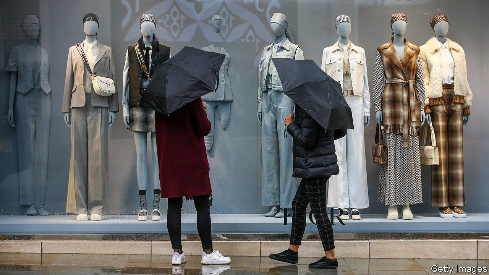
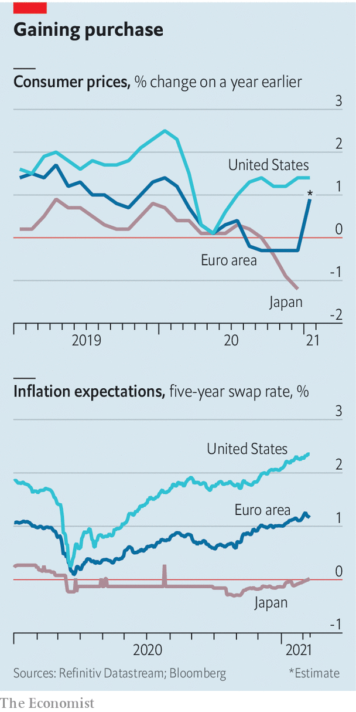

###### Picking up pace

# Inflation will rise in the coming months 

##### But will it be sustained? 

 

> Feb 13th 2021 

 


INFLATION IS likely to jump in the coming months, as last year’s oil-price drop falls out of the annual comparison. Prices spiked in the euro area in January, owing in part to the expiration of a temporary value-added-tax cut in Germany. Will the pickup be sustained? Investors are bullish in America, where a huge stimulus package is in the works. In the euro area and Japan, though, inflation is expected to stay subdued.

