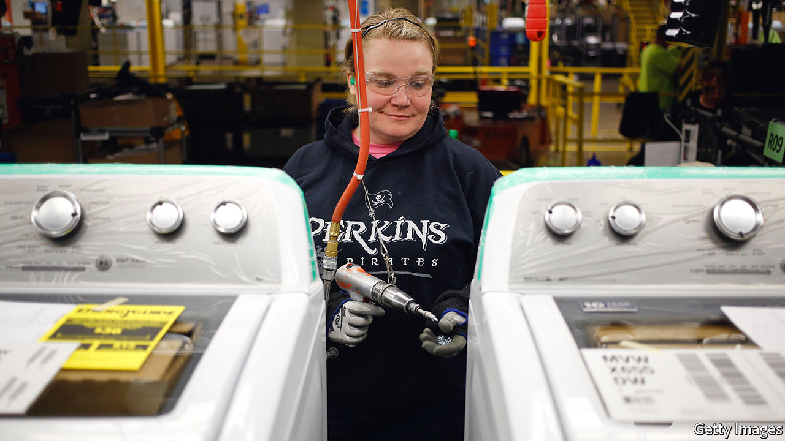

###### Rinse and repeat

# Washing machines reveal how trade and competition are linked 

##### The saga of Whirlpool’s efforts to secure protection 

 

> Feb 13th 2021 


AMERICAN WASHING-MACHINE makers received a parting gift from President Donald Trump. Days before leaving office, he extended tariffs on imported machines by two years. The move was a victory for Whirlpool, an appliance-maker that has sought protection for nearly a decade. The saga is a case study of the impact of protectionism on competition at home.


American businesses can ask the government for three types of protection from foreign rivals: anti-dumping duties, if imports are being sold below cost; countervailing duties, if foreign competition is subsidised; or safeguard tariffs, if imports are surging. Petitions succeed around 60% of the time; in 2016 just over 7% of America’s product lines were affected by a temporary trade barrier. (That compares with about 4% in the European Union.)


When Whirlpool first sought help in 2011, it accused its South Korean competitors, Samsung and LG, of selling at prices that were too low. (Its rivals said its failure to innovate was the problem.) The United States International Trade Commission (USITC), which follows trade-remedy law written to protect producers, not consumers, found for Whirlpool. That led to tariffs of up to 82% on some washing machines from South Korea and Mexico (where Samsung had a factory).


Only six years before that, Whirlpool had used the promise of competition from Samsung and LG to justify consolidation at home. Trustbusters had been suspicious of its acquisition of Maytag, an American rival, which united more than 70% of domestic production of household washing machines. But, partly because they were assured of stiff foreign competition, they let the deal go ahead. William Kovacic, then a member of the Federal Trade Commission, was so peeved by the case that he now argues that merger approvals should require companies to waive their right to seek tariff protection.


But the duties Whirlpool had secured were easy to dodge. When Samsung and LG started sending machines from their factories in China to America, Whirlpool asked the USITC to hit imports from there, too. Accused of undercutting again, the South Korean firms protested that “bundled pricing” distorted the facts. Washing machines often looked like they were sold at low margins, but in fact were being bundled together with driers, which were sold at high margins. When seen as an integrated unit, an apparently low-return washing-machine business could in fact be making adequate profits. But the commission ruled in favour of Whirlpool again.


The source of imports had already changed, though—to Thailand and Vietnam. So, rather than continue with the game of whack-a-mole, in 2017 Whirlpool made a bolder request: for a safeguard tariff, which hits imports whatever their source. (It is also temporary, to give domestic firms time to become competitive.) The USITC recommended tariffs of 20%, rising to 50% above a quota of 1.2m units in the first year, with the protection fading over three years. Presidents can veto such requests, but Mr Trump did not.


The new restrictions were implemented in February 2018. As the law intended, imports fell, and American production rose. According to a study by Aaron Flaaen of the Federal Reserve and Ali Hortaçsu and Felix Tintelnot of the University of Chicago, retail prices of washing machines also rose, by 12%—with those of dryers rising in step. Whirlpool made some investments, including in a new training centre in Clyde, Ohio. A review of the tariffs in 2019 found that its profitability increased.


Yet Whirlpool came back for more. In November last year its lawyers complained that the tariff was meant to give it three fat years of profits to recover from the harm caused by imports. But Samsung and LG had brought in machines before the tariff came in, dampening its effect. Then came covid-19. Had the USITC known what market conditions would be, Whirlpool’s lawyers argued, it would surely have recommended greater protection.


By then Samsung and LG had opened factories in America. (How much of this, and the resulting jobs, reflects the tariff is up for debate, but it may have speeded up the decision to set up shop in America.) The Korean firms argued that they were now part of the domestic industry—and did not need tariffs. They pointed out that the domestic industry was clearly thriving: around 80% of washing machines bought in America were now home-made. Still, the USITC decided that, without an extension, cheap imports would flood in. Mr Trump did not disagree, so the tariffs will remain until 2023. (Whirlpool says the decision reflects its efforts to ensure fair trade and to protect employees.)


The result will be close to a decade of protection, arguably at the cost of customers’ wallets. But Whirlpool has little recourse for protection left, and now faces stiff competition at home. In November a representative of LG said its new factory in Tennessee had in some cases shrunk the gap between order and delivery from 12 weeks to a few days. Canny use of tariffs might help some producers some of the time. But competition cannot be avoided for ever. ■

