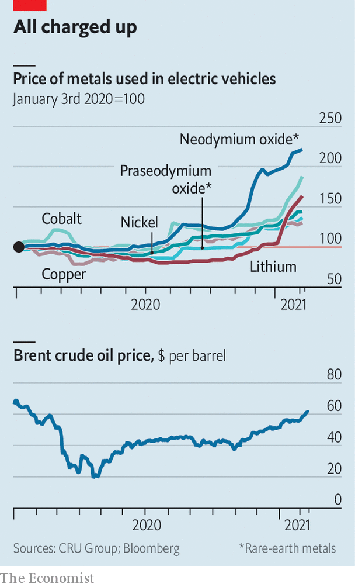

###### Twin peaks

# Why the prices of both oil and the metals that seek to replace it are rising 

##### For the first time in a year, oil prices top $60 a barrel 

 

> Feb 8th 2021 


OIL IS MAKING a comeback, at least on the face of it. On February 8th the price of Brent crude rose above $60 a barrel for the first time in more than a year. Battery metals, too, are enjoying a run-up. The prices of cobalt, lithium and some rare-earth metals have soared since late 2020, with copper and nickel enjoying a longer climb. It is tempting to see the surge as evidence of competing bets about the fuels of the future. For both oil and battery metals, the reality is more complex. 


Some of the rise in oil prices is, of course, linked to expectations about demand. Oil investors have taken hope that rising Chinese demand might be matched elsewhere. In India, consumption of liquefied petroleum gas, widely used as a cooking fuel, is up. In America, President Joe Biden’s proposed stimulus of $1.9trn may bring a jump in economic activity and therefore oil demand. However, the pace of economic recovery is not assured. The faltering roll-out of vaccines and the emergence of new, more contagious strains of covid-19 continue to weigh on oil markets. Indeed climbing oil prices have much more to do with constraints in supply than with confidence in demand. 


Most important, Saudi Arabia, the de facto leader of the Organisation of the Petroleum Exporting Countries, looks determined to support prices. In January the kingdom said it would cut production by an additional 1m barrels a day in February and March. Elsewhere, output continues to be restrained. Among some African producers, supply is starting to suffer from deferred investment in new projects and declining output from existing ones. In America, crude output in January was 13% lower than a year before, according to Goldman Sachs, a bank. Exports from Iran seem unlikely to pick up quickly. In an interview with CBS News aired on February 7th, Mr Biden said he had no immediate plans to lift sanctions on the country.


For battery metals, demand has helped boost prices. Much of the interest is coming from China: in December sales of plug-in electric vehicles there surpassed 224,000, a record high and 9.4% of total vehicle sales. That has supported demand for cobalt, lithium and rare-earth minerals such as neodymium and praseodymium. But constraints on supply have played an important role, too.

 


Covid-19 disrupted ports in South Africa, from where much of the world’s cobalt is shipped, and in China, the world’s biggest miner and exporter of rare-earth metals. Nickel mines in Indonesia were also pandemic-struck. In New Caledonia, a small group of Pacific islands that is the world’s fourth-biggest producer of nickel, protests in December demanding public control of national resources blockaded several mines that are part-owned by foreign firms.


As the 2020s continue, you might expect the prices of oil and battery metals to diverge, as demand for crude ebbs and that for electric cars and other green technologies jumps. However, there may well be a period when supply constraints mean that the values of oil and battery metals continue to rise in concert. 


Start with oil. In the past, higher prices prompted more spending on projects, which increased production and lowered prices. There are already signs that this mechanism is breaking down. In recent years dismal returns and fear of regulation have made investors wary of capital expenditures. Their disdain for spending has intensified, thanks to covid-19’s rapid depression of demand and the election of Mr Biden. Since taking office in January, he has announced a temporary moratorium on new drilling leases on federal lands, as well as plans for stricter regulation of methane emissions and greater scrutiny of pipelines. None of this has a huge, immediate effect on oil supply, but serves to make investors even more sceptical of any big increase in companies’ capital programmes. In January BlackRock, the world’s largest asset manager, urged companies to disclose how their strategies align with a carbon-neutral economy by 2050. Little wonder that in recent weeks ExxonMobil and other oil supermajors, shaken by large annual losses, have reiterated pledges of capital discipline.


Meanwhile a wave of green enthusiasm is sweeping the markets. Tesla, an electric-vehicle maker, is more valuable than the eight next-biggest carmakers combined. JPMorgan Chase, a bank, reckons the share of electric vehicles (excluding hybrids) in global new vehicle sales will rise from 3% in 2020 to 15% in 2030. Electric cars account for about a quarter of demand for cobalt, a similar share for neodymium and praseodymium, and nearly half of the demand for lithium, according to CRU Group, a consultancy. Other green technologies are supporting prices, too. Copper is essential not only for electric cars, but also for solar panels, wind turbines and 5G infrastructure. The recent rally may therefore be a sign of a strange pattern to come: higher prices for both oil and the metals that may help replace it. ■


For more coverage of climate change, register for The Climate Issue, our fortnightly , or visit our 

