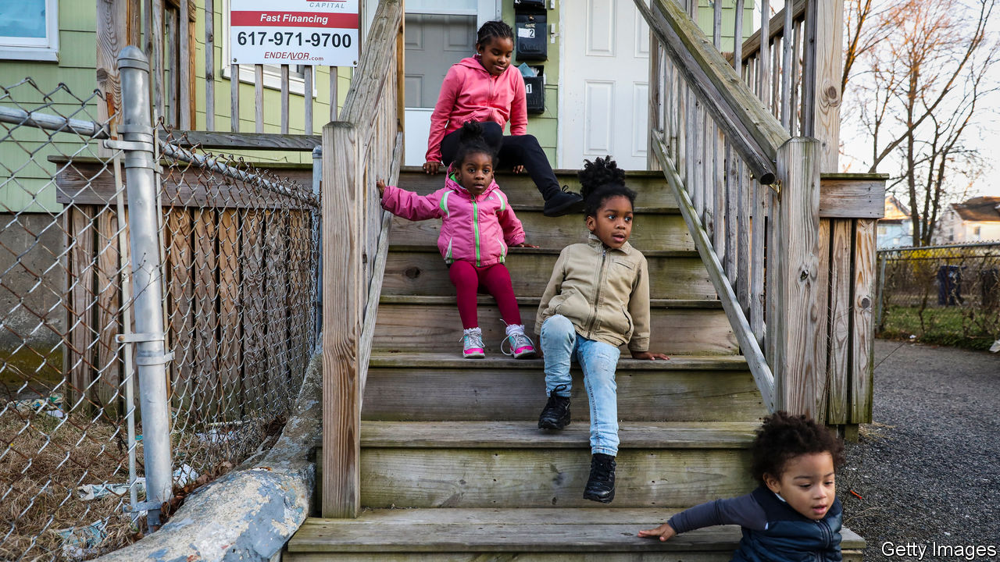

###### An end to exceptionalism

# Reducing child poverty in America 

##### The White House and a prominent Republican senator propose copying a European scheme 

 

> Feb 13th 2021 


AMERICAN EXCEPTIONALISM takes many forms. One, alas, is a shockingly high rate of child poverty. According to the OECD’s measure, which defines as poor those families living on less than half of median family income, 21% of American children are in poverty. This is double the rate in France and nearly triple that in Poland. This grim statistic is cause to welcome two proposals to reduce child poverty, one from Joe Biden’s administration, the other from Mitt Romney, a Republican senator.


Helping poor Americans involves balancing a complicated set of trade-offs. The more people who receive help, the more money it costs. The solution to this is usually to means-test aid, which does the most good per dollar spent. Yet help that is narrowly targeted at a small group of Americans can easily be dismissed as aid to the undeserving, eroding the political support it requires to exist. Highly targeted schemes are also more complicated to administer. Much of the help to poor families comes in the form of tax credits, which are confusing and go unclaimed by many of those who are eligible to receive them.


It is so hard to get right that the last serious attempt at change was a quarter of a century ago. The Biden and Romney plans both balance competing imperatives by making monthly payments per child ($350 at the top end for Mr Romney, $300 for the White House version). The thresholds at which these payments are withdrawn are set so high that most Americans with children would receive them. This helps with the politics and also avoids punishing low-income people with high effective marginal tax rates if they receive a pay rise. Mr Romney’s plan involves starting payments before a child is born, which ought to please pro-life conservatives, and it pays for itself by cutting other programmes, which ought to please fiscal conservatives. Mr Biden’s plan does not pay for itself with cuts elsewhere.


Mr Romney’s plan would probably cut child poverty by a third; Mr Biden’s by a half. One reason this can be said with confidence is that many other developed countries already have similar schemes. Canada, a country not too dissimilar from its southern neighbour, introduced a child benefit in 2015 that decreased poverty by 20% in just two years. Many European countries began paying cash child benefits after the second world war. Programmes enjoyed support from the left, which saw them as a plank in the expanding welfare state, and also from the right, which saw them as strengthening the family (and, in pre-feminist days, as sparing women from having to work). As the international comparisons attest, they still make a difference.


The main economic worry associated with child benefits paid in cash (as opposed to tax breaks) is the risk of discouraging women, who tend to be the chief caregivers, from taking a job. In Germany a reform of 1996 that made benefits more generous led many low-income women with partners to shift from full-time to part-time work. In Poland the initial version of one scheme reduced women’s labour-force participation by one percentage point. But that was largely because poor families lost eligibility for their first child when they crossed the poverty threshold, reducing their income. When the programme was expanded to cover all first children in 2019, the labour-force effect disappeared. Canada has seen very little drop-off.

Suffer the little children


In a country that has only a threadbare social safety-net and a political system which is plagued by extreme polarisation, crafting good anti-poverty policies is a struggle. Against that background, the proposals for direct monthly payments per child are a big step forward. They deserve to win broad support.■


