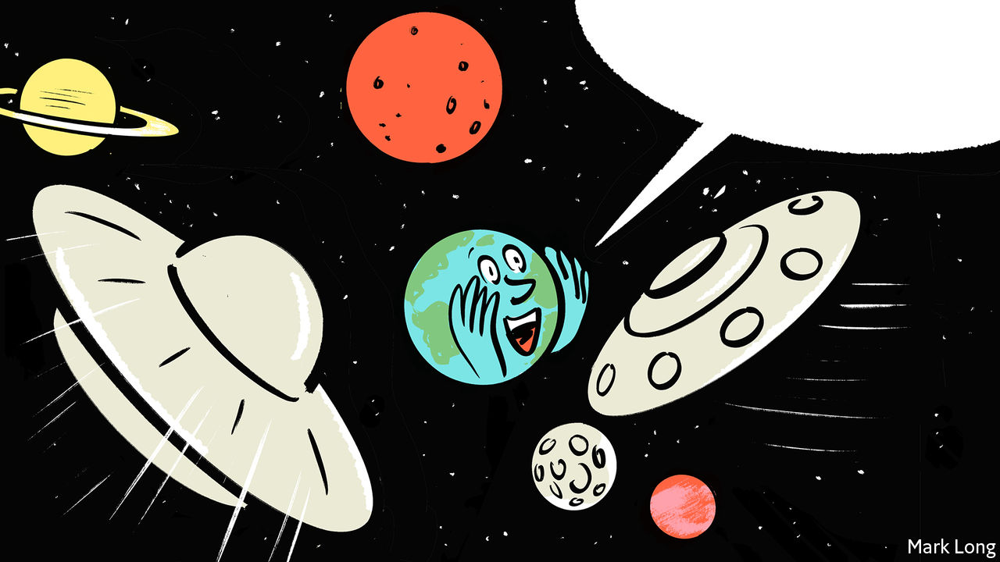

###### Life, the universe and everything

# The search for ET may soon yield an answer 

##### Whether there is intelligence out there is a different matter 

 

> Feb 13th 2021 


MOST SCIENTIFIC research has practical ends. But some still pursues goals better described by the field’s original name: “natural philosophy”. One of its most philosophical questions is, “Is there life elsewhere in the universe?”


It is philosophical for two reasons. One is its grand sweep. If there is life elsewhere, particularly of the intelligent sort, that raises the question of whether humans might ever encounter it, or its products (see ). If there is not—if all the uncountable stars in creation waste their light on sterile, lifeless worlds—then life on Earth must be the result of a stroke of the most astronomically improbable good luck. As Arthur C. Clarke, a science-fiction author, is reputed to have said: “Two possibilities exist. Either we are alone in the cosmos or we are not. Both are equally terrifying.”


The other reason the question is philosophical is that there has, historically, been too little evidence to settle it. Arguments about life in the cosmos must extrapolate from a single example that is itself poorly understood. Biologists still lack a bulletproof theory of how earthly life began. Other planets are far away and hard to study. That leaves room for all sorts of theories. Perhaps life is rare. Perhaps it is common, but intelligence is not. Or perhaps even intelligent life is common, but the technology that lifts it up ends by destroying it (a popular line of thinking after the development of nuclear weapons).


This paucity of data will soon change. A variety of telescopes and spacecraft are, or soon will be, looking for signs of life in places ranging from the moons and planets of the solar system to other stars in Earth’s corner of the Milky Way (see ). In particular, this search will employ powerful telescopes to try to find chemical signatures of life in the atmospheres of planets orbiting stars other than the sun. An alien astronomer looking at Earth, for instance, would be struck by the persistence of both oxygen and something that it reacts with in the atmosphere, and might conclude—correctly—that living organisms were responsible for keeping them there.


An unambiguous detection of alien life would count as one of the momentous discoveries in the history of science. Exactly what would happen next would depend on what was found. News of a “biosignature” on a planet dozens of light-years away would shake the world. It would be strong evidence that life is indeed common in the cosmos. That conclusion could upend humanity’s understanding of its place in the universe.


A few adventurous scientists might suggest using a radio telescope to beam a message, in the hope that, if anything intelligent lives there, it will, decades later, send a reply. Still, the sheer distances involved mean that there would be few immediate, practical consequences. By contrast, finding life closer to home—beneath the Martian regolith, say, or in the oceans under the frozen surfaces of the solar system’s icy moons—would lead to a flurry of action. A sample-return mission would give biologists the ability to compare earthly life with the unearthly sort, a process that could shed new light on the workings and origins of both.


And if nothing is found? That too would be a piece of data, albeit of a less dramatic sort. It would not prove that no life exists elsewhere in the cosmos, but it would be evidence that it is, at least, rather uncommon.


Half a century ago, returning from the arid and sterile lunar surface, the Apollo astronauts found a new appreciation for Earth’s joyous blooms of life and colour. If there are no aliens nearby, such sentiments might grow stronger. A jewel is all the more valuable for being rare. ■


Dig Deeper


The search for life elsewhere in the universe is  and may even . In addition to our coverage, learn about Avi Loeb, , in our sister publication, 1843, and read our review of his book, .

