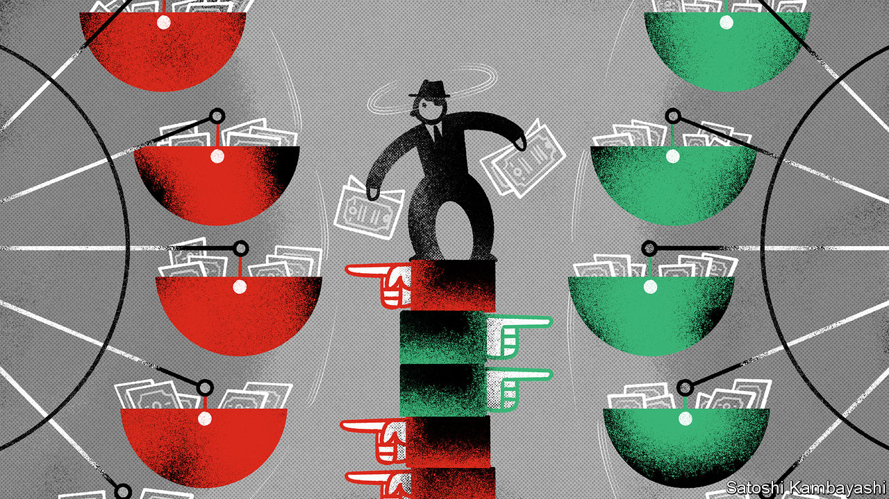

###### On Scotland, GameStop, Jack Dorsey, markets, innovation, primaries, baseball, Rizlas

# Letters to the editor 

##### A selection of correspondence 

 

> Feb 13th 2021 


Impatient nationalists


Rather than the patient strategists that Bagehot portrayed them to be (), the Scottish National Party are constant opportunists. If nationalists were truly patient they would not be talking about plans for independence during a pandemic. In 2014 they campaigned for separation from the United Kingdom based on a high oil price, knowing that leaving the UK would automatically have meant leaving the EU. Now, with the oil price less than half of what it was in 2014, they claim Brexit as the new reason for independence. The circumstances change, but the SNP’s solution is always the same.


In the current nationalist narrative, there is no waiting to see how Brexit will pan out, no consideration that the post-covid world might be very different, and no acknowledgment of a future change in the British government. Even covid-19 is claimed as a reason for breaking away. John Swinney, Nicola Sturgeon’s deputy, recently asserted that a second independence referendum is an “essential priority”. I am not sure these are the words of a patient pragmatist.


ALASTAIR CAMERON

Director

Scotland in Union

Glasgow

 


As you say, in May the SNP will probably win a mandate at the Holyrood elections to hold a further independence referendum (“”, January 30th). If so, it would be the will of the Scottish people and the Westminster government should not try to prevent a referendum.


However, it is absurd to think that a single vote could determine the outcome of such a significant constitutional question. A narrow win for either side would simply lead to rancour, bitterness and division. It is common sense that a matter of this magnitude should require at least 60-65% of the vote to settle the matter. Moreover, it should be made clear at the outset how long before a further referendum can be held. After all, both nationalists and unionists may have an interest in another re-run.


JAMES MAYBEEFarr, Scottish Highlands

 


GameStop’s real winners


Greed is fine. It is the juice that keeps our financial system going. That’s why I find the narrative that r/wallstreetbets and other armies of retail investors were sticking it to the establishment disingenuous (“”, January 30th). Call me a cynic, but exactly which part of Wall Street was being punished? Was it the private-equity stakeholders of AMC that converted debt into a profit of hundreds of millions of dollars? Or perhaps BlackBerry executives who sold their shares at a five-year high? And let’s not forget Ryan Cohen, whose stake in GameStop swelled to a billion dollars.


NISHAD TRIVEDI

New York


Big tech and censorship* Your article on Uganda’s election (“”, January 16th) might have called out the tone deaf hypocrisy of Jack Dorsey and Twitter. When President Museveni shut down Facebook in the country, accusing them of taking sides (Facebook said there were many government-sponsored fake accounts along with fake news), Mr Dorsey grumbled that “public conversation on social media platforms is never more important than during the democratic process”. This just days after he shut down (then) President Trump. His partisan thinking and hypocrisy has never been more fully on public display.


JEFFREY RAM

Miami Beach, FL

 


The sage of Oologah


Buttonwood’s paraphrasing () of the advice that Will Rogers offered on market timing did not fully capture his impeccable logic concerning the arrangement of events in the correct order. Rogers said “Don’t gamble; take all your savings and buy some good stock and hold it till it goes up, then sell it. If it don’t go up, don’t buy it.”


EMMETT GRINER

Potomac, Maryland

 


Three points on innovation


The role of innovation in economic growth evolves as markets and technologies change. Your briefing on government investment in research and development provided useful pointers, but underplayed three important changes in the landscape (“”, January 16th). First, R&amp;D creates and deepens knowledge and the talent to use it in new fields: what economists call absorptive capacity. To be effective, government R&amp;D and investment in talent should align. Second, data analytics induces fundamental changes in R&amp;D, potentially speeding up innovation, creating new businesses. Artificial intelligence and data analytics have become a universal part of the scientific infrastructure, requiring new investment and policies.


Third, universities became more entrepreneurial after the financial crisis in 2008. Students want to participate with social purpose and stakeholders are rightly focused on impact. Governments that invest in talent, digital infrastructure and entrepreneurial universities will gain a higher return from their R&amp;D spending.


PROFESSOR DAVID GANN

Pro-vice-chancellor

Development and External Affairs

University of Oxford

Ditching party primaries


The suggestion from William Horns to reform party primaries by adopting non-partisan blanket elections (, January 23rd) has already been set in place in California. It is called a “top two” system where, regardless of party, the candidates who come first and second in a primary for Congress face off against each other in the general election. California also has a citizens’ commission to draw the boundaries of state legislative districts. Though personally happy about the reform, I can’t say that it has made a lot of difference. California is so solidly Democratic that Republicans barely have a voice. Most of the time the top-two vote winners are both Democrats.


SUSAN GIEGERICH

Berlin

 


Fields of dreams


Minor-league baseball grew from the desire of people to have access to a community-based game, which created a loyalty to and identity with their local club. The economics and demographics may have changed over the years, but the clubs’ success is based on providing affordable family entertainment in a clean and safe environment. An owner once told me that he believed 80% of people left his park after a game not having any idea who won, but it didn’t matter. The fun and sense of community did.


The squeeze that major-league baseball is putting on minor-league clubs is an act of civic vandalism (“”, January 16th). In its quest for control it is destroying years of identity-building in towns small and large. Trenton is the best example of a kneecapped franchise now saddled with a questionable future that it did not deserve. With all the problems in the country, I doubt this outrage will gain much attention.


BOB GOLON

Little Egg Harbor Township, New Jersey

 


Pass us a ziggie


Although Rizla is synonymous with cigarette rolling-paper in much of the world, asking for a pack in America would be met with a blank stare (“, January 16th). Zig-Zag dominates the American market. Its parent company has just had its best quarter ever, in a country where tens of millions of people can smoke pot legally, and have had plenty of time and reason to do so recently.


TONY RUTTPortland, Oregon


Your article reignited memories of craving for a smoke when battling around the New Hebrides in the 1960s. The rice-paper pages of the airmail edition of The Economist made an excellent substitute for Rizlas.


PETER GILLOTT

Sydney


* Letters appear online only

