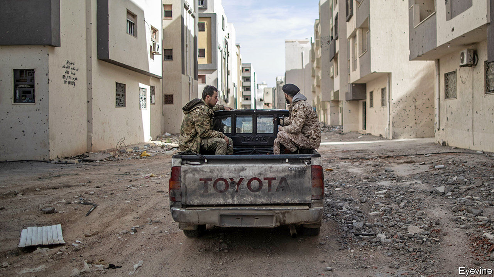
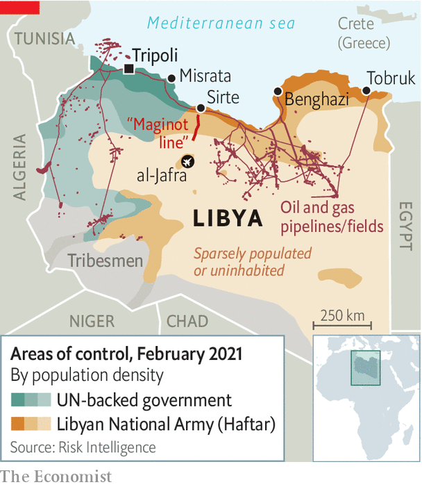

###### Fourth time lucky

# Can a new administration reunite war-torn Libya? 

##### Warlords and foreign powers will try to scuttle the UN’s fourth attempt to establish a government 

 

> Feb 13th 2021 


THE DRIVE from Benghazi to Tripoli, Libya’s capital, should take ten hours. But the coastal road connecting the two cities has been impassable for most of the past decade because of an on-and-off civil war. Since Libyans toppled Muammar Qaddafi, their old dictator, in 2011, various groups have fought for control of the country—and for parts of the road. Today, near the road’s mid-point outside Sirte, militias, boulders and landmines block the way.


Opening that road is one of many tasks facing the new Libyan administration unveiled in Geneva on February 5th. Holding presidential and parliamentary elections in December is its primary job. The body, led by a three-person presidential council and a prime minister, was chosen by 74 Libyans in a forum representing the country’s regions at talks sponsored by the United Nations. It was the UN’s fourth attempt to establish a unified government in Libya since the revolution. But the new administration faces some old problems.


The biggest of these is meddling by foreign powers. Turkey and Qatar back the Government of National Accord (GNA) and its allied militias, which control the west (see map). The GNA was the UN’s third attempt at a unified government. But it has been challenged by the self-styled Libyan National Army (LNA) led by Khalifa Haftar, a renegade general who dominates the east. He is backed by Egypt, France, Russia and the United Arab Emirates. Even so, the general’s siege of Tripoli was broken last year by forces loyal to the GNA, which then pushed the LNA back to Sirte.

 


Some of these foreign powers probably do not want the new administration to succeed. But there has been cause for hope in the past six months. A ceasefire negotiated by the UN in October has largely held and prisoners have been exchanged. In September General Haftar lifted a blockade on oil exports, the country’s main source of income. A separate government in the east, allied to the general, agreed with the GNA on a single exchange rate for the Libyan dinar and the resumption of flights between east and west. Countries are reopening their embassies in Tripoli.


When the UN created the GNA in 2015, it met behind closed doors and imposed Fayez al-Serraj, a largely unknown politician, as prime minister. It was more inclusive and transparent when setting up the new administration. The proceedings of the 74-member forum were broadcast live on the UN’s website, as were interviews with candidates for the presidential council and prime minister, who ran on four-person lists (and who agreed not to stand for office in December). “When we began the process in November, the delegates were cursing each other,” says a UN official. “By February they stayed up after midnight laughing and chatting together.”


The delegates took observers by surprise, rejecting a list of powerful politicians from east and west in favour of people who had never held high office. The presidential council will be led by Muhammad al-Menfi, a former diplomat. The new prime minister is one of the country’s richest men, Abdul Hamid Dabaiba. During the Qaddafi era he ran the state-owned Libyan Investment and Development Company, responsible for some of the country’s biggest public-works projects. His brother-in-law, Ali Dabaiba, has been investigated for allegedly embezzling millions of dollars from public funds, perhaps with the help of his family. Ali sat on the forum and is accused of trying to buy votes for Abdul Hamid. He denies all of these claims.


Critics of the Dabaiba family believe it will use its influence to hog contracts and increase its wealth. “He’ll try to get as much as he can,” says a UN official, referring to Abdul Hamid. Others, though, liken him to Rafiq al-Hariri, the businessman who led and rebuilt Lebanon after its long civil war—and who also was dogged by corruption allegations.


General Haftar and militia leaders in the west encouraged their representatives on the forum to choose the winning list because they reckoned it would make for a weak administration. It will certainly struggle to persuade the warlords to give up their arms. It may also have trouble winning over Libyans in the east, many of whom distrust the new prime minister because he comes from the western city of Misrata. Abdullah al-Thani, head of the eastern government, says he is waiting for instructions from the old parliament, which sits in the eastern city of Tobruk.


The foreign powers pay lip-service to the political process, but they ignored the UN’s deadline of January 23rd to withdraw. Turkey wants to maintain influence in Libya. In 2019 it signed a deal with the GNA that supposedly gives Turkey the right to drill for oil and gas in waters off Greek islands. It views Mr Dabaiba, who has business interests in Turkey, as an ally.


Russia, meanwhile, wants to preserve its access to air bases and ports facing NATO’s underbelly. It dispatched more mercenaries to Libya shortly after the new government was voted in. And it continues to help General Haftar dig his “Maginot line”, a fortified trench running from Sirte into the desert. That will not make the new government’s job any easier. ■

