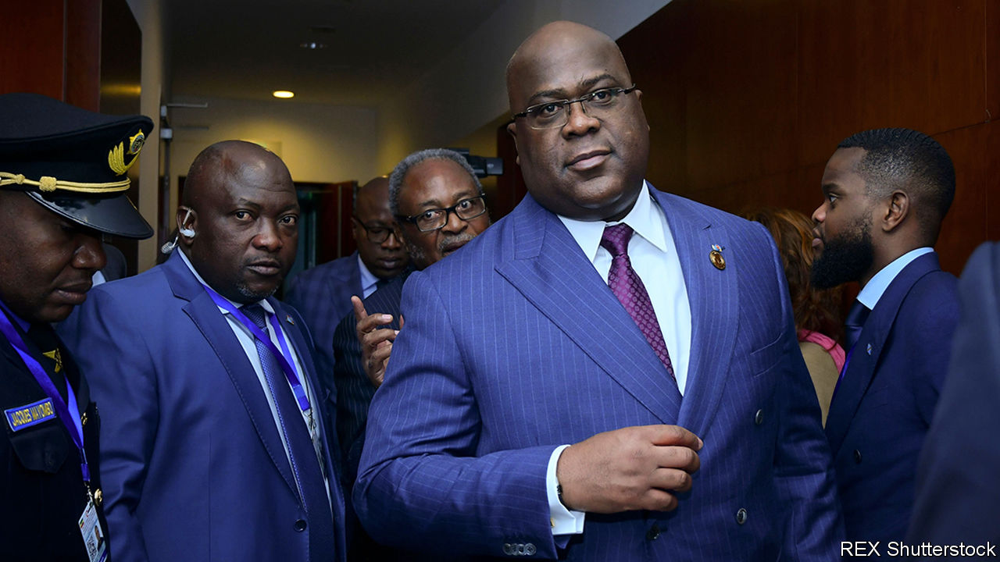
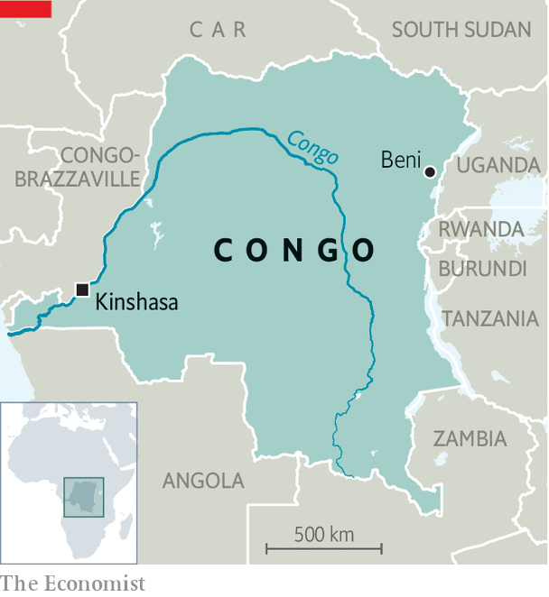

###### The big men still eat

# Congo’s president cuts free of his would-be puppetmaster 

##### Two years after a rigged election, Félix Tshisekedi is asserting himself 

 

> Feb 9th 2021 


IN THE LAWLESS eastern parts of the Democratic Republic of Congo, nomads and sedentary folk often clash. Cattle-rearing groups rub up against crop-growers over access to land. In the absence of a strong state, disputes can quickly turn violent. By contrast another type of nomadism obsesses the population in Gombe, the wealthy core of Congo’s capital, Kinshasa: that of elected officials.


Few politicians are loyal to ideas or people. Instead they head for the best grazing. “The Congolese politician is the most unstable human ever to exist,” says Félix Momat Kitenge, until recently a government minister. “He will change with the breeze.” Others call it, in French, transhumance politique (political nomadism).


On January 27th several hundred members of Congo’s parliament put on their metaphorical walking boots and took a hike. They left the majority political grouping, the Front Commun pour le Congo (FCC), which is affiliated with Joseph Kabila, Congo’s president until 2019. Most joined two of the largest opposition parties in supporting a new majority called the “Sacred Union” set up by Félix Tshisekedi, who has been president for the past two years. The prime minister, Sylvestre Ilunga Ilukamba, an ally of Mr Kabila’s, resigned. So did his ministers, including Mr Momat. A new government will now be appointed that will be closer to Mr Tshisekedi.


Mr Tshisekedi’s ascent to the presidency, in rigged elections at the end of 2018, was unexpected. For much of his adult life he had lived in Belgium. He was given a place on the ballot largely because of the reputation of his late father, Étienne, a firebrand opposition leader who died in 2017. Electoral tallies compiled by the Catholic church suggested that Mr Tshisekedi came second, with under 20% of the vote, well behind Martin Fayulu, a charismatic anti-corruption campaigner. Yet Mr Tshisekedi, to the astonishment of many Congolese, was declared the winner, seemingly as part of a last-minute deal with the former president. The quid pro quo, allegedly, was that Mr Kabila kept control of much of the state.

 


Yet power has steadily flowed to Mr Tshisekedi as he has appointed allies to key posts. He appears to have routed Mr Kabila more quickly and comprehensively than almost anyone predicted. “We thought it would be closer to 50/50,” says Manya Riche, a Congolese political analyst. “This totally surpassed that.”


Exactly how Mr Tshisekedi achieved this is unclear. Supporters of Mr Kabila (or at least those who did not swap sides) mutter that bribery must have been involved. There are whispers that some MPs took payouts of $7,000-15,000 to join the new coalition. One leading MP who changed sides admits that although “money circulated”, people were offered much more to stay. Other MPs may simply have been unnerved enough to change their allegiance by Mr Tshisekedi’s threat to call new elections. He has also targeted allies of Mr Kabila with an anti-corruption drive. Faced with the chance of lucrative positions under Mr Tshisekedi on the one hand, and prosecution on the other, many opted to migrate to the president’s greener pastures.


Mr Tshisekedi made big promises on coming to office, including providing free primary schooling, building infrastructure and reforming the electoral system. Almost none of that has happened. Most Congolese remain extremely poor. In a park near the parliament, a group of men playing backgammon with bottle tops say that jobs remain scarce. “The poor in Congo still suffer, while the rich continue to eat,” complains Eric Kayado, a petrol vendor. (“Eat”, in Congo, implies “embezzle”.)


Mr Tshisekedi has long argued that Mr Kabila’s control of parliament was a problem. “The system of Mr Kabila was to block [progress],” says Jacquemain Shabani, an official in Mr Tshisekedi’s party, the UDPS. Outside the party’s offices, a crowd of his supporters argue that their president has “chased away” Mr Kabila and will now bring them the changes they hope for. “Now he can work for the people,” says Darcin Mukendi.


Yet a new majority may not make reform easier. The new government will not necessarily be stable, notes Ms Riche. The president’s new allies will be competing for ministerial positions. Not every aisle-crosser will stay loyal. The economy remains weak and, for the moment, Mr Kabila retains his grip on a large part of it.


Some fear that Mr Tshisekedi may end up emulating Mr Kabila, whose final years in office were characterised by grotesque corruption and the suppression of dissent. On coming to office Mr Tshisekedi released political prisoners and promised freedom of the press. Now he appears to be backtracking. On January 28th Human Rights Watch, a watchdog, accused Mr Tshisekedi’s government of having arbitrarily detained and prosecuted journalists and activists. It is too early to conclude that the new boss is the same as the old boss. But ordinary Congolese have cause to worry. ■

