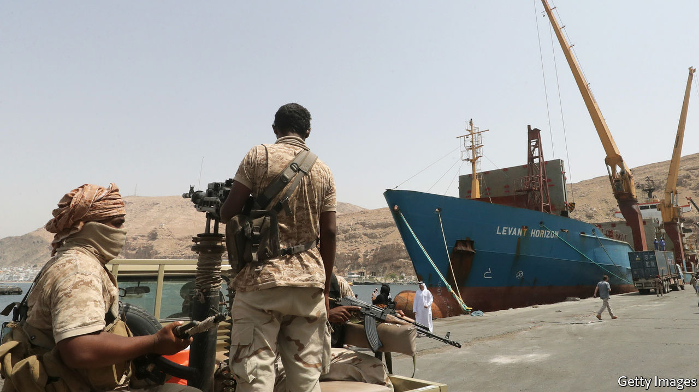
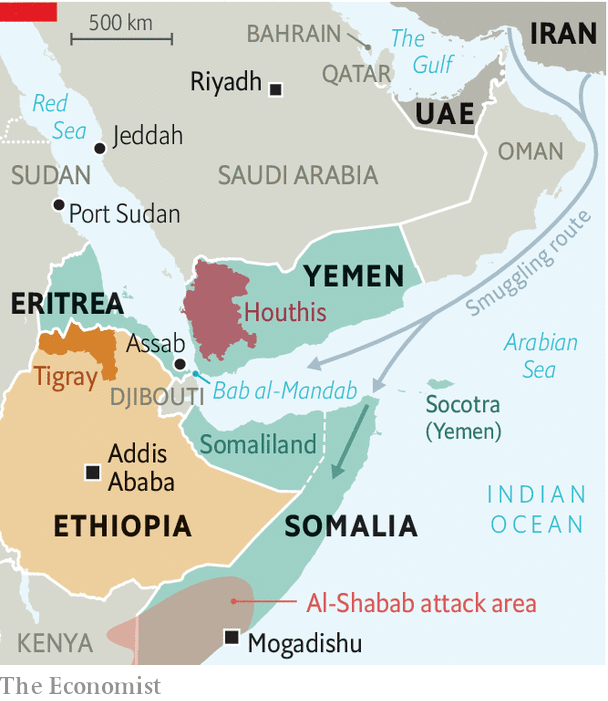

###### Adding to the chaos

# Gulf rivalries are spilling into Africa’s Horn 

##### Foreign meddling is unsettling an already fragile region 

 

> Feb 13th 2021 


THE NARROW waters separating the Arabian peninsula from the Horn of Africa have never served as much of a moat. Goods and people routinely cross. Iran and the United Arab Emirates (UAE), in particular, are increasingly active in the Horn. Tensions between them rose after the UAE established diplomatic ties with Israel last year, a move that Iran furiously condemned. A string of recent arrests shows how the rivalry between the two is adding volatility to an already unstable region.


In recent weeks Ethiopia arrested 15 people for allegedly plotting to attack the UAE’s embassies in Ethiopia and Sudan. The authorities said that those arrested were working for a “foreign terrorist group”, but did not say which. Around the same time Sweden said it was holding two men, a Swede and an Eritrean, on suspicion of planning a terrorist offence in an unnamed foreign country. Western intelligence sources say the arrests were linked and Iran was behind the planned attacks.


That would be nothing new for Iran. It has a history of plotting attacks in Africa, often unsuccessfully. Western spies believe it may be looking for soft targets so that it can retaliate against its rivals, namely America, Israel and the Gulf states.

 


Iran is destabilising the Horn in other ways, too. Since 2013 UN experts have voiced concerns to the Security Council about a flow of weapons from Yemen and Iran into Somalia. In recent years as many as four shipments every month have been arriving. Western and local forces have intercepted several boats heading for Somalia and Yemen, loaded with weapons made in Iran or North Korea. Some of these arms may go to al-Shabab, a Somali jihadist group. Others may be destined for Houthi rebels in Yemen. Last June, for instance, Saudi Arabia seized a dhow carrying anti-tank missiles and thousands of assault rifles made in Iran on their way to Yemen via smuggling networks in Somalia.


In January al-Shabab released a video commemorating its attack last year on an American air base in Manda Bay on Kenya’s coast. Its fighters can be seen carrying Iranian-made rocket launchers. But they are also carrying rifles stolen from the Somali army—originally supplied by the UAE.


From 2014 to 2018 the UAE trained part of Somalia’s army. But the countries fell out after Somalia resisted Emirati pressure to cut ties with Qatar following a dispute between the Gulf states. Somalia, for its part, was angry with the UAE for making deals with Somaliland, a breakaway region.


Nowadays the UAE is more active in Eritrea and perhaps Ethiopia. It has provided weapons to Eritrea’s army in defiance of a UN arms embargo. And it has used an air and naval base in the port city of Assab to launch air strikes in Yemen. That base, claim Ethiopian rebels, has also been used to launch drone attacks against them. Eritrea is fighting alongside Ethiopia’s government against the Tigrayan People’s Liberation Front (TPLF), the ousted rulers of Ethiopia’s northern Tigray region.


Iran and the UAE are not the only Middle Eastern powers operating in the Horn. Israeli journalists have long reported the existence of secret Israeli intelligence facilities in Eritrea, which occupies a strategic position, overlooking the Bab al-Mandab strait at the mouth of the Red Sea.


Is any of this good for the Horn? Somalia’s fragile attempts at state-building were set back earlier this month, when presidential elections were indefinitely delayed. Ethiopia, meanwhile, is at risk of splintering into warring ethnic groups. The region needs outsiders to douse these flames. Instead, many are fanning them. ■

