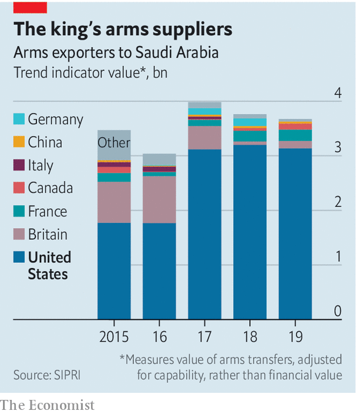

###### New sheriff in town

# Joe Biden looks to end the war in Yemen 

##### His decision may say more about America’s troubled relationship with Saudi Arabia 

 

> Feb 13th 2021 


FOR THE previous two American presidents, the war in Yemen seemed like an afterthought. Barack Obama backed the Saudi-led coalition fighting on behalf of Yemen’s government against the Houthi rebels. But it was a cynical decision meant to blunt Saudi anger over the nuclear deal he reached with Iran in 2015. Then came Donald Trump, who resisted calls to curtail American support for the war. Instead he signed huge arms deals with Saudi Arabia.


Joe Biden has promised a different approach. In a wide-ranging speech at the State Department on February 4th, Mr Biden excoriated the “humanitarian and strategic catastrophe” of the war in Yemen, now in its seventh year. There was no hyperbole in his diagnosis. More than 112,000 people have been killed in the fighting. With the economy devastated, four out of five Yemenis rely on aid to survive. Collapsing health and sanitation systems caused a years-long cholera outbreak; the United Nations warns of incipient famine.


To take Mr Biden at his word, America will no longer be complicit in this. It will continue to sell defensive arms to Saudi Arabia, which the Houthis have targeted scores of times with drones and missiles, including an attack on February 10th that targeted the airport in Abha. But Mr Biden pledged to end “all American support for offensive operations”, including arms sales. He also reversed the Trump administration’s eleventh-hour decision to label the Houthis a terrorist group and tapped a respected diplomat, Timothy Lenderking, to serve as his special envoy for Yemen.


Much will depend on the details of his policy. If America merely cuts off the flow of “smart” bombs, the Saudis can continue dropping dumber ones. If it goes further, though, it could hobble the Saudi war machine. Between 2015 and 2019 the kingdom was the world’s largest arms importer, according to figures collected by the Stockholm International Peace Research Institute, a think-tank. Around three-quarters of that came from America, with another 13% from Britain (see chart).

 


Years of lavish spending mean the kingdom has all the tanks and warplanes it needs. But it still needs other things from America, such as munitions and spare parts. Mr Biden has already paused a $478m deal for 7,500 guided missiles announced in the waning days of the Trump administration. And the Saudis still rely on American help for everything from identifying targets on the battlefield to keeping their kit in shape. If America stops maintaining Saudi jets, half of the kingdom’s air force could be affected, estimates Tom Beckett of the International Institute for Strategic Studies, a think-tank in London.


At best, though, this would ease a conflict that had reached an impasse anyway. The United Arab Emirates (UAE) had been the most effective partner in the coalition. But it largely withdrew from the war in 2019, leaving the Saudis to muddle along against an intransigent foe. The Houthis have been fighting the Yemeni state for decades and have shown little appetite for compromise. Other Yemeni groups are also vying for power. Months of UN-backed peace talks have not produced a deal.


America’s about-face on Yemen may matter more for the future of its partnership with Saudi Arabia. Forged in 1945, when Franklin Roosevelt met King Abdulaziz aboard an American cruiser in Egypt’s Great Bitter Lake, it has grown dysfunctional since the turn of the century. The attacks of September 11th 2001—overseen by the Saudi-born Osama bin Laden and carried out by mostly Saudi hijackers—led many Americans to associate the kingdom with terrorism. Eighteen months later George W. Bush invaded Iraq, over the objections of some Saudi officials, who feared (correctly) that it would destabilise the region.


Still, the Saudis remained friendly with Mr Bush. Not so with his successor. They were furious in 2011 when, as revolution brewed in Egypt, Mr Obama called on Hosni Mubarak, its longtime dictator, to step down. It seemed to them a hasty betrayal of an American partner—one that left them worried about their own status. A far bigger rupture came in 2015, when Mr Obama signed the deal under which Iran curbed its nuclear programme in exchange for sanctions relief. For Mr Obama it was a legacy-defining achievement. For the Saudis it was a reckless boost to their arch-nemesis, one that offered Iran the prospect of legitimacy and economic growth.


No surprise, then, that the Saudis were happy to see Mr Obama go. They spared no effort to charm Mr Trump. Unusually for an American president, he made his first foreign trip to Saudi Arabia, where his hosts feted him with a traditional sword dance and a bizarre glowing orb. The president’s decision to withdraw from the nuclear deal was well received in the kingdom. After the murder in 2018 of Jamal Khashoggi, a Saudi journalist dismembered by Saudi agents inside the kingdom’s consulate in Istanbul, Mr Trump helped shield the government from consequences.


Yet Mr Trump was hardly a reliable partner either. The Saudis (and other Gulf states) were shaken in 2019 when he did not retaliate for an Iranian attack on their oil facilities. And his embrace turned Saudi Arabia into a partisan issue in Washington. Many Democrats, and some Republicans, want to see the kingdom punished for the carnage in Yemen and Mr Khashoggi’s murder. Mr Biden himself said in a presidential debate that he would treat it like a “pariah”.


That is unlikely. Americans may be exasperated with Saudi Arabia, but it remains a big oil producer and a useful intelligence partner. Mr Biden cannot simply cut ties. Nor, however, can he avoid confrontation. He plans to re-enter the nuclear deal with Iran. And he will probably keep up his criticism of the kingdom’s human-rights record, as it seems to have produced a result: the release on February 10th of Loujain al-Hathloul, a women’s rights activist. Mr Biden’s challenge will be to find a path that neither indulges the kingdom’s worst impulses nor reinforces its worst fears. ■


